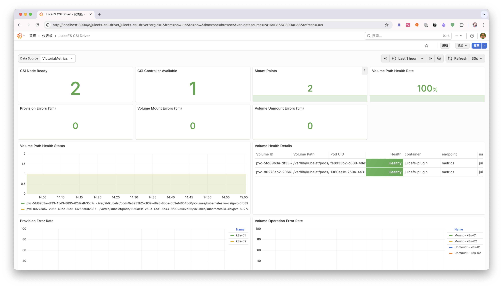

JuiceFS CSI Driver exposes internal state and metrics through [Prometheus](https://prometheus.io) for monitoring and alerting.

## How to Expose and Scrape Metrics

Both the Controller and Node services of JuiceFS CSI Driver expose a `/metrics` HTTP endpoint. The default port is `9567`, which can be changed through helm values:

```yaml
node:
  metricsPort: "9567"
controller:
  metricsPort: "9567"
```

### Configure Prometheus Scraping

After enabling the metrics endpoint, you need to configure Prometheus to scrape these metrics. This is typically done by creating a `ServiceMonitor` or `PodMonitor` CRD (if Prometheus Operator is installed in your cluster), or by adding scrape jobs directly to the Prometheus configuration file.

Here's an example using `PodMonitor`:

```yaml
# csi-podmonitor.yaml
apiVersion: monitoring.coreos.com/v1
kind: PodMonitor
metadata:
  name: juicefs-csi
  namespace: juicefs
  labels:
    app: juicefs-csi
spec:
  selector:
    matchLabels:
      app.kubernetes.io/name: juicefs-csi-driver
  podMetricsEndpoints:
  - port: metrics
    interval: 15s
```

If Prometheus Operator is not installed, you can directly modify Prometheus' scraping configuration:

This example assumes that the Prometheus service is running in a Kubernetes cluster. If it is running outside the cluster, please refer to [Collecting Monitoring Metrics](./going-production.md#collect-metrics) for configuration.

```yaml
# prometheus-scrape-config.yaml
  - job_name: 'csi'
    kubernetes_sd_configs:
      - role: pod
    relabel_configs:
      - source_labels: [__meta_kubernetes_pod_phase]
        separator: ;
        regex: (Failed|Succeeded)
        replacement: $1
        action: drop
      - source_labels: [__meta_kubernetes_pod_label_app_kubernetes_io_name, __meta_kubernetes_pod_labelpresent_app_kubernetes_io_name]
        separator: ;
        regex: (juicefs-csi-driver);true
        replacement: $1
        action: keep
      - source_labels: [__meta_kubernetes_pod_container_port_name]
        separator: ;
        regex: metrics
        replacement: $1
        action: keep
      - separator: ;
        regex: (.*)
        target_label: endpoint
        replacement: metrics
        action: replace
      - source_labels: [__address__]
        separator: ;
        regex: (.*)
        modulus: 1
        target_label: __tmp_hash
        replacement: $1
        action: hashmod
      - source_labels: [__tmp_hash]
        separator: ;
        regex: "0"
        replacement: $1
        action: keep
```

After applying the above YAML file to your cluster, Prometheus will automatically start scraping metrics from JuiceFS CSI Driver.

## Metrics Description

The metrics exposed by JuiceFS CSI Driver are primarily used to track error counts of CSI operations.

### Controller Metrics

These metrics are exposed by the `juicefs-csi-controller` Pod.

| Metric Name                | Type    | Description                                      |
| :------------------------- | :------ | :----------------------------------------------- |
| `juicefs_provision_errors` | Counter | Total number of volume provision failures.       |

- **`juicefs_provision_errors`**: This is a counter that records the number of failed CSI `Provision` operations. If this value continues to grow, it indicates issues with the dynamic volume creation process. Possible causes include:
  - JuiceFS filesystem authorization failure.
  - Network issues accessing object storage or metadata engine.

### Node Metrics

These metrics are exposed by the `juicefs-csi-node` DaemonSet Pods.

| Metric Name                 | Type    | Description                                      |
| :-------------------------- | :------ | :----------------------------------------------- |
| `juicefs_volume_errors`     | Counter | Total number of volume mount failures.           |
| `juicefs_volume_del_errors` | Counter | Total number of volume unmount failures.         |
| `juicefs_volume_path_health` | Gauge   | Health status of the volume path, 1 for healthy, 0 for unhealthy. |

- **`juicefs_volume_errors`**: This is a counter that records the number of errors that occurred when mounting JuiceFS volumes to nodes. This corresponds to CSI's `NodePublishVolume` operations. If this value continues to grow, it may indicate:
  - JuiceFS client on the node cannot start normally.
  - Mount point directory creation failed or incorrect permissions.
  - Invalid JuiceFS authentication information retrieved from Secret.
  - Bind mount failure.

- **`juicefs_volume_del_errors`**: This is a counter that records the number of errors that occurred when unmounting JuiceFS volumes from nodes. This corresponds to CSI's `NodeUnpublishVolume` operations. If this value continues to grow, it may indicate:
  - Unmount operation is blocked (e.g., volume still in use).
  - Mount point information is missing or inconsistent.

- **`juicefs_volume_path_health`**: This is a Gauge type metric used to indicate the health status of the volume path. Labels include `volume_id`, `volume_path`, and `pod_uid` (the business Pod UID). When the volume path is healthy, the value is 1; if a problem is detected, the value is 0, indicating that the volume path is unhealthy. Possible indications include:
  - Missing mount point.
  - mountpod is running, but the mount point is in an abnormal state.
  - Access timeout.

In addition to the above custom metrics, Prometheus will also scrape standard Go process metrics (such as `go_goroutines`, `go_memstats_*`, etc.) and process metrics (such as `process_cpu_seconds_total`, `process_resident_memory_bytes`, etc.).

## Dashboard example

Below is an example of a JuiceFS CSI Driver monitoring [Dashboard](https://github.com/juicedata/juicefs-csi-driver/blob/master/deploy/monitor/dashboard.json):



You can adjust and extend this Dashboard according to your needs to better monitor the running status of the JuiceFS CSI Driver.
