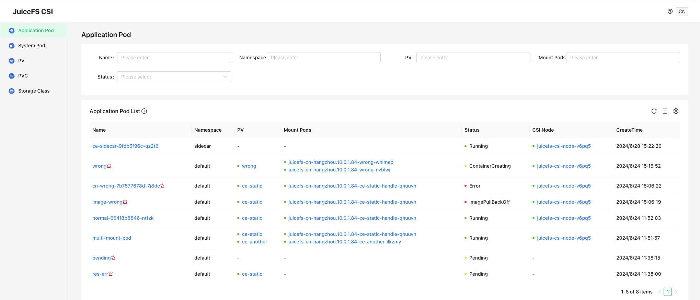

Read this chapter to learn how to troubleshoot JuiceFS CSI Driver, to continue, you should already be familiar with [the JuiceFS CSI Architecture](../introduction.md#architecture), i.e. have a basic understanding of the roles of each CSI Driver component.

## Troubleshooting tools {#tools}

### CSI dashboard {#csi-dashboard}

CSI dashboard is installed along with JuiceFS CSI Driver, it provides a web interface to view the status of JuiceFS CSI Driver components. Also, you can see all PVs, PVCs, and Pods that are using JuiceFS PVs. With CSI dashboard, you can easily debug and troubleshoot. Strongly recommended to use dashboard.

Access the dashboard and you can see the following interface:



As shown in the figure, all the related resources are displayed in the dashboard, you can click on the resource to view detailed information.

### kubectl plugin {#kubectl-plugin}

JuiceFS provides a kubectl plugin to help you easily debug and troubleshoot in Kubernetes.

#### Installation {#kubectl-jfs-plugin-installation}

The one-click installation script is available for Linux and macOS systems. It automatically downloads and installs the latest version of the plugin based on your hardware architecture. Here is how to use it:

```shell
# default installation path is /usr/local/bin
curl -sSL https://d.juicefs.com/kubectl-jfs-install | sh -
```

If [krew](https://github.com/kubernetes-sigs/krew) has been installed in cluster, you can also install the plugin via `krew`:

```shell
kubectl krew update
kubectl krew install jfs
```

#### Usage {#kubectl-jfs-plugin-usage}

```shell
# show all application pods using JuiceFS PV quickly
$ kubectl jfs po
NAME                       NAMESPACE  MOUNT PODS                                             STATUS             AGE
cn-wrong-7b7577678d-7j8dc  default    juicefs-cn-hangzhou.10.0.1.84-ce-static-handle-qhuuvh  CrashLoopBackOff   10d
image-wrong                default    juicefs-cn-hangzhou.10.0.1.84-ce-static-handle-qhuuvh  ImagePullBackOff   10d
multi-mount-pod            default    juicefs-cn-hangzhou.10.0.1.84-ce-another-ilkzmy,       Running            11d
                                      juicefs-cn-hangzhou.10.0.1.84-ce-static-handle-qhuuvh
normal-664f8b8846-ntfzk    default    juicefs-cn-hangzhou.10.0.1.84-ce-static-handle-qhuuvh  Running            11d
pending                    default    <none>                                                 Pending            11d
res-err                    default    <none>                                                 Pending            11d
terminating                default    <none>                                                 Terminating        10d
wrong                      default    juicefs-cn-hangzhou.10.0.1.84-wrong-nvblwj             ContainerCreating  10d

# show all JuiceFS Mount Pods quickly. By default, Mount Pod is in kube-system, you can specify the namespace where Mount Pod is located with the -m parameter
$ kubectl jfs mount
NAME                                                   NAMESPACE    APP PODS                            STATUS   CSI NODE                AGE
juicefs-cn-hangzhou.10.0.1.84-ce-another-ilkzmy        kube-system  default/multi-mount-pod             Running  juicefs-csi-node-v6pq5  11d
juicefs-cn-hangzhou.10.0.1.84-ce-static-handle-qhuuvh  kube-system  default/cn-wrong-7b7577678d-7j8dc,  Running  juicefs-csi-node-v6pq5  11d
                                                                    default/image-wrong,
                                                                    default/multi-mount-pod,
                                                                    default/normal-664f8b8846-ntfzk
juicefs-cn-hangzhou.10.0.1.84-wrong-nvblwj             kube-system  default/wrong                       Running  juicefs-csi-node-v6pq5  10d

# show all JuiceFS PV / PVC quickly
$ kubectl jfs pv
$ kubectl jfs pvc
```

For problematic application pods, PVCs, and PVs, you can use the following commands for preliminary diagnosis, and the JuiceFS plugin will suggest the next steps for troubleshooting:

```shell
# troubleshooting application pod
$ kubectl jfs debug pod wrong
Name:        wrong
Namespace:   default
Start Time:  Mon, 24 Jun 2024 15:15:52 +0800
Status:      ContainerCreating
Node:
  Name:    cn-hangzhou.10.0.1.84
  Status:  Ready
CSI Node:
  Name:       juicefs-csi-node-v6pq5
  Namespace:  kube-system
  Status:     Ready
PVCs:
  Name   Status  PersistentVolume
  ----   ------  ----------------
  wrong  Bound   wrong
Mount Pods:
  Name                                        Namespace    Status
  ----                                        ---------    ------
  juicefs-cn-hangzhou.10.0.1.84-wrong-nvblwj  kube-system  Error
Failed Reason:
  Mount pod [juicefs-cn-hangzhou.10.0.1.84-wrong-nvblwj] is not ready, please check its log.

# troubleshooting JuiceFS PVC
$ kubectl jfs debug pvc <pvcName>
$ kubectl jfs debug pv <pvName>
```

Furthermore, there are quick ways to obtain access log of Mount Pod and warmup cache:

```shell
# Get Mount Pod access log: kubectl jfs accesslog <pod-name> -m <mount-namespace>
$ kubectl jfs accesslog juicefs-cn-hangzhou.10.0.1.84-ce-static-handle-qhuuvh
2024.07.05 14:09:57.392403 [uid:0,gid:0,pid:201] open (9223372032559808513): OK [fh:25] <0.000054>
#

# Warmup cache: kubectl jfs warmup <pod-name> <subpath> -m <mount-namespace>
$ kubectl jfs warmup juicefs-cn-hangzhou.10.0.1.84-ce-static-handle-qhuuvh
2024/07/05 14:10:52.628976 juicefs[207] <INFO>: Successfully warmed up 2 files (1090721713 bytes) [warmup.go:226]
```

### Diagnostic script {#csi-doctor}

:::note
Please use [kubectl plugin](#kubectl-plugin) first. If it cannot meet your needs, try using the diagnostic script again.
:::

It is recommended to use the diagnostic script [`csi-doctor.sh`](https://github.com/juicedata/juicefs-csi-driver/blob/master/scripts/csi-doctor.sh) to collect logs and related information, without this script, you'll have to manually execute a series of commands (introduced in other sections in this chapter) to obtain information.

To install this script, choose any node in the cluster that can execute `kubectl`, run:

```shell
wget https://raw.githubusercontent.com/juicedata/juicefs-csi-driver/master/scripts/csi-doctor.sh
chmod a+x csi-doctor.sh
```

If kubectl is renamed in your environment (folks use this method to manage multiple Kubernetes clusters), or put elsewhere other than `PATH`, you can easily match this by editing the script, and change the `$kbctl` variable:

```shell
# Faced with two different clusters, their corresponding kubectl aliased to kubectl_1 / kubectl_2
KBCTL=kubectl_1 ./csi-doctor.sh debug my-app-pod -n default
KBCTL=kubectl_2 ./csi-doctor.sh debug my-app-pod -n default
```

A commonly used feature is obtaining Mount Pod information. Assuming application pod being `my-app-pod` in namespace `default`, to obtain the Mount Pod that accompanies the application pod:

```shell
# Get mount pod for specified application pod
$ ./csi-doctor.sh get-mount my-app-pod
kube-system juicefs-ubuntu-node-2-pvc-b94bd312-f5f7-4f46-afdb-2d1bc20371b5-whrrym

# Get all application pods that's sharing the specified mount pod
$ ./csi-doctor.sh get-app juicefs-ubuntu-node-2-pvc-b94bd312-f5f7-4f46-afdb-2d1bc20371b5-whrrym
default my-app-pod
```

Once you become familiar with ["Basic principles for troubleshooting"](#basic-principles), there's a handy `csi-doctor.sh debug` command that can quickly print important information like components' version and logs. You can easily find troubleshooting clues within the command output:

```shell
./csi-doctor.sh debug my-app-pod -n default
```

Run above command and thoroughly check its output, try to debug using the troubleshooting principles introduced below. Also, this command consciously controls output sizes so that you can easily copy the content and send to our open source community or Juicedata team.

## Basic principles for troubleshooting {#basic-principles}

In JuiceFS CSI Driver, most frequently encountered problems are PV creation failures (managed by CSI Controller) and pod creation failures (managed by CSI Node / Mount Pod).

### PV creation failure

Under [dynamic provisioning](../guide/pv.md#dynamic-provisioning), after PVC has been created, CSI Controller will work with kubelet to automatically create PV. During this phase, CSI Controller will create a sub-directory in JuiceFS named after the PV ID (naming pattern can be configured via [`pathPattern`](../guide/configurations.md#using-path-pattern)).

#### Check PVC events

Usually, CSI Controller will pass error information to PVC event:

```shell {7}
$ kubectl describe pvc dynamic-ce
...
Events:
  Type     Reason       Age                From               Message
  ----     ------       ----               ----               -------
  Normal   Scheduled    27s                default-scheduler  Successfully assigned default/juicefs-app to cluster-0003
  Warning  FailedMount  11s (x6 over 27s)  kubelet            MountVolume.SetUp failed for volume "juicefs-pv" : rpc error: code = Internal desc = Could not mount juicefs: juicefs auth error: Failed to fetch configuration for volume 'juicefs-pv', the token or volume is invalid.
```

#### Check CSI Controller {#check-csi-controller}

If no error appears in PVC events, we'll need to check if CSI Controller is alive and working correctly:

```shell
# Check CSI Controller aliveness
$ kubectl -n kube-system get po -l app=juicefs-csi-controller
NAME                       READY   STATUS    RESTARTS   AGE
juicefs-csi-controller-0   3/3     Running   0          8d

# Check CSI Controller logs
$ kubectl -n kube-system logs juicefs-csi-controller-0 juicefs-plugin
```

### Application pod failure

Due to the architecture of the CSI Driver, JuiceFS Client runs in a dedicated Mount Pod, thus, every application pod is accompanied by a Mount Pod.

CSI Node will create the Mount Pod, mount the JuiceFS file system within the pod, and finally bind the mount point to the application pod. If application pod fails to start, we shall look for issues in CSI Node, or Mount Pod.

#### Check application pod events

If error occurs during the mount, look for clues in the application pod events:

```shell {7}
$ kubectl describe po dynamic-ce-1
...
Events:
  Type     Reason       Age               From               Message
  ----     ------       ----              ----               -------
  Normal   Scheduled    53s               default-scheduler  Successfully assigned default/ce-static-1 to ubuntu-node-2
  Warning  FailedMount  4s (x3 over 37s)  kubelet            MountVolume.SetUp failed for volume "ce-static" : rpc error: code = Internal desc = Could not mount juicefs: juicefs status 16s timed out
```

If error event indicates problems within the JuiceFS space, follow below guide to further troubleshoot.

#### Check CSI Node {#check-csi-node}

Verify CSI Node is alive and working correctly:

```shell
# Application pod information will be used in below commands, save them as environment variables.
APP_NS=default  # application pod namespace
APP_POD_NAME=example-app-xxx-xxx

# Locate worker node via application pod name
NODE_NAME=$(kubectl -n $APP_NS get po $APP_POD_NAME -o jsonpath='{.spec.nodeName}')

# Print all CSI Node pods
kubectl -n kube-system get po -l app=juicefs-csi-node

# Print CSI Node pod closest to the application pod
kubectl -n kube-system get po -l app=juicefs-csi-node --field-selector spec.nodeName=$NODE_NAME

# Substitute $CSI_NODE_POD with actual CSI Node pod name acquired above
kubectl -n kube-system logs $CSI_NODE_POD -c juicefs-plugin
```

Or simply use this one-liner to print logs of the relevant CSI Node pod (the `APP_NS` and `APP_POD_NAME` environment variables need to be set):

```shell
kubectl -n kube-system logs $(kubectl -n kube-system get po -o jsonpath='{..metadata.name}' -l app=juicefs-csi-node --field-selector spec.nodeName=$(kubectl get po -o jsonpath='{.spec.nodeName}' -n $APP_NS $APP_POD_NAME)) -c juicefs-plugin
```

#### Check Mount Pod {#check-mount-pod}

If no errors are shown in the CSI Node logs, check if Mount Pod is working correctly.

You can easily acquire Mount Pod name using the [diagnostic script](#csi-doctor), but if you need to debug without the script, here's a series of commands to help you with this process:

```shell
# In less complex situations, use below command to print logs for all mount pods
kubectl -n kube-system logs -l app.kubernetes.io/name=juicefs-mount | grep -v "<WARNING>" | grep -v "<INFO>"

# Application pod information will be used in below commands, save them as environment variables.
APP_NS=default  # application pod namespace
APP_POD_NAME=example-app-xxx-xxx

# Find Node / PVC / PV name via application pod
NODE_NAME=$(kubectl -n $APP_NS get po $APP_POD_NAME -o jsonpath='{.spec.nodeName}')
# If application pod uses multiple PVs, below command only obtains the first one, adjust accordingly.
PVC_NAME=$(kubectl -n $APP_NS get po $APP_POD_NAME -o jsonpath='{..persistentVolumeClaim.claimName}'|awk '{print $1}')
PV_NAME=$(kubectl -n $APP_NS get pvc $PVC_NAME -o jsonpath='{.spec.volumeName}')
PV_ID=$(kubectl get pv $PV_NAME -o jsonpath='{.spec.csi.volumeHandle}')

# Find mount pod via application pod
MOUNT_POD_NAME=$(kubectl -n kube-system get po --field-selector spec.nodeName=$NODE_NAME -l app.kubernetes.io/name=juicefs-mount -o jsonpath='{range .items[*]}{.metadata.name}{"\n"}{end}' | grep $PV_ID)

# Check mount pod state
kubectl -n kube-system get po $MOUNT_POD_NAME

# Check mount pod events
kubectl -n kube-system describe po $MOUNT_POD_NAME

# Print mount pod logs, which contain JuiceFS Client logs.
kubectl -n kube-system logs $MOUNT_POD_NAME

# Print mount pod command, an easily ignored troubleshooting step.
# If you define mount options in an erroneous format, the resulting mount pod start-up command will not work correctly.
kubectl get pod -o jsonpath='{..containers[0].command}' $MOUNT_POD_NAME

# Find all mount pod for give PV
kubectl -n kube-system get po -l app.kubernetes.io/name=juicefs-mount -o wide | grep $PV_ID
```

Or simply use below one-liners:

```shell
# APP_NS and APP_POD_NAME environment variables need to be set

# Print mount pod name
kubectl -n kube-system get po --field-selector spec.nodeName=$(kubectl -n $APP_NS get po $APP_POD_NAME -o jsonpath='{.spec.nodeName}') -l app.kubernetes.io/name=juicefs-mount -o jsonpath='{range .items[*]}{.metadata.name}{"\n"}{end}' | grep $(kubectl get pv $(kubectl -n $APP_NS get pvc $(kubectl -n $APP_NS get po $APP_POD_NAME -o jsonpath='{..persistentVolumeClaim.claimName}' | awk '{print $1}') -o jsonpath='{.spec.volumeName}') -o jsonpath='{.spec.csi.volumeHandle}')

# Enter the mount pod to start a interactive shell
kubectl -n kube-system exec -it $(kubectl -n kube-system get po --field-selector spec.nodeName=$(kubectl -n $APP_NS get po $APP_POD_NAME -o jsonpath='{.spec.nodeName}') -l app.kubernetes.io/name=juicefs-mount -o jsonpath='{range .items[*]}{.metadata.name}{"\n"}{end}' | grep $(kubectl get pv $(kubectl -n $APP_NS get pvc $(kubectl -n $APP_NS get po $APP_POD_NAME -o jsonpath='{..persistentVolumeClaim.claimName}' | awk '{print $1}') -o jsonpath='{.spec.volumeName}') -o jsonpath='{.spec.csi.volumeHandle}')) -- bash
```

#### Debug Mount Pod {#debug-mount-pod}

A pod in `CrashLoopBackOff` state cannot be easily debugged, in such case, use `kubectl debug` to create an environment that's available for interactive debugging:

```shell
kubectl -n <namespace> debug <mount-pod> -it  --copy-to=jfs-mount-debug --container=jfs-mount --image=<mount-image> -- bash
```

In the above demonstration, set `<mount-image>` to the mount image, and the `debug` command will create a pod dedicated for interactive debugging, you'll try to reproduce and resolve the issue in this debug pod.

After troubleshooting, don't forget to clean up:

```shell
kubectl -n <namespace> delete po jfs-mount-debug
```

### Performance issue

When performance issues are encountered when using CSI Driver, with all components running normally, refer to the troubleshooting methods in this section.

#### Check Real-time statistics and access logs {#accesslog-and-stats}

Under JuiceFS file system root, there are some pseudo files that provide special debugging functionality, assuming JuiceFS is mounted on `/jfs`:

* `cat /jfs/.accesslog` prints access logs in real time, use this to analyze file system access patterns. See [Access log (Community Edition)](https://juicefs.com/docs/community/fault_diagnosis_and_analysis/#access-log) and [Access log (Cloud Service)](https://juicefs.com/docs/cloud/administration/fault_diagnosis_and_analysis/#oplog)
* `cat /jfs/.stats` prints real-time statistics for this JuiceFS mount point. When performance isn't ideal, use this to find out the culprit. See [Real-time statistics (Community Edition)](https://juicefs.com/docs/community/performance_evaluation_guide/#juicefs-stats) and [Real-time statistics (Cloud Service)](https://juicefs.com/docs/cloud/administration/fault_diagnosis_and_analysis/#real-time-statistics)

Obtaining file system access log for application pods can be wearisome, you'll need to first locate the Mount Pod for the application pod, and then enter the Mount Pod to run the corresponding commands, use [`csi-doctor.sh get-oplog APP_POD_NAME`](#csi-doctor) command to avoid the toil below.

Inside Mount Pod, JuiceFS root is mounted at a directory that looks like `/var/lib/juicefs/volume/pvc-xxx-xxx-xxx-xxx-xxx-xxx`, and then bind to container via the Kubernetes bind mechanism. So for a given application pod, you can find its JuiceFS mount point on host using below commands, and access its pseudo files:

```shell
# Application pod information will be used in below commands, save them as environment variables.
APP_NS=default  # application pod namespace
APP_POD_NAME=example-app-xxx-xxx

# If application pod uses multiple PVs, below command only obtains the first one, adjust accordingly.
PVC_NAME=$(kubectl -n $APP_NS get po $APP_POD_NAME -o jsonpath='{..persistentVolumeClaim.claimName}' | awk '{print $1}')
PV_NAME=$(kubectl -n $APP_NS get pvc $PVC_NAME -o jsonpath='{.spec.volumeName}')

# Find host mount point via PV name
df -h | grep $PV_NAME

# one-liner to enter host mount point
cd $(df -h | grep $PV_NAME | awk '{print $NF}')

# print pseudo files to start debugging
cat .accesslog
cat .stats
```

This sections only covers finding pseudo files in JuiceFS CSI Driver, troubleshooting using these information is a separate topic, see:

* CSI Driver troubleshooting case: [Bad read performance](./troubleshooting-cases.md#bad-read-performance)
* [Access log (Community Edition)](https://juicefs.com/docs/community/fault_diagnosis_and_analysis/#access-log) and [Access log (Cloud Service)](https://juicefs.com/docs/cloud/administration/fault_diagnosis_and_analysis/#oplog)
* [Real-time statistics (Community Edition)](https://juicefs.com/docs/community/performance_evaluation_guide/#juicefs-stats) and [Real-time statistics (Cloud Service)](https://juicefs.com/docs/cloud/administration/fault_diagnosis_and_analysis/#real-time-statistics)

## Seeking support

If you are not able to troubleshoot, seek help from the JuiceFS community or the Juicedata team. You should collect some information so others can further diagnose.

Use the [diagnostic script](#csi-doctor) to collect related information, assuming the application pod being `my-app-pod`, in namespace `default`, run:

```shell
$ ./csi-doctor.sh collect my-app-pod -n default
Results have been compressed to my-app-pod.diagnose.tar.gz
```

All related Kubernetes resources, logs, and events are collected and packaged into a tar file, send this file to relevant people for further support.
