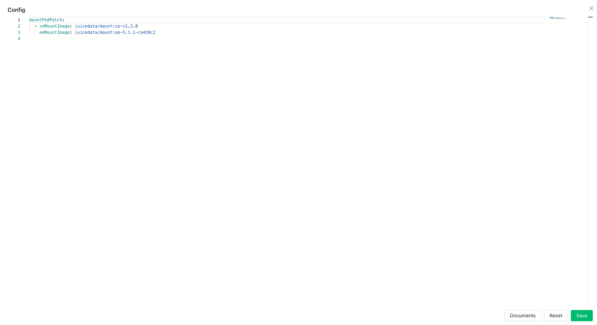
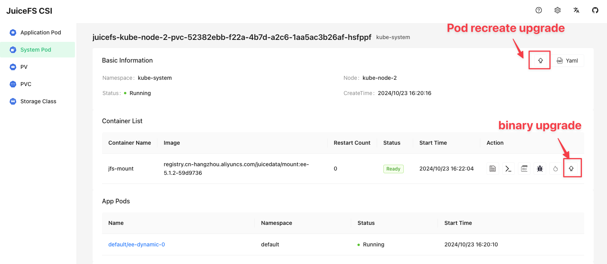
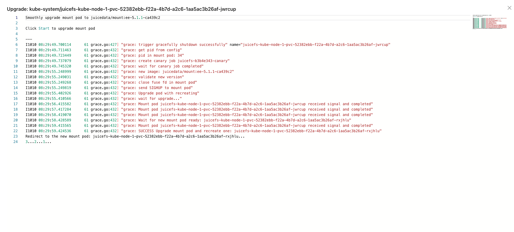

Upgrade JuiceFS Client to the latest version to enjoy all kinds of improvements and fixes, read [release notes for JuiceFS Community Edition](https://github.com/juicedata/juicefs/releases) or [release notes for JuiceFS Cloud Service](https://juicefs.com/docs/cloud/release) to learn more.

As a matter of fact, [upgrading JuiceFS CSI Driver](./upgrade-csi-driver.md) will bring upgrade to JuiceFS Client along the way, because every release includes the current latest [mount pod image](../guide/custom-image.md#ce-ee-separation), but if you'd like to use the latest JuiceFS Client before CSI Driver release, or even before mount pod image release, refer to methods introduced in this chapter.

## Upgrade container image for mount pod {#upgrade-mount-pod-image}

There are currently two methods for upgrading mount pod container images:

- [Smooth upgrade mount pod](#smooth-upgrade): This method allows you to upgrade an already created mount pod without rebuilding the application pod.
Lossy upgrade mount pod
- [Lossy upgrade mount pod](../guide/custom-image.md#overwrite-mount-pod-image): This method requires that the application pod be rebuilt in order to upgrade an already created mount pod.

Refer to [document](../guide/custom-image.md#ce-ee-separation) to find the tag of the new version of the mount pod container image in Docker Hub, and then select different upgrade method based on the CSI Driver version and mount mode you are using:

|                    | Version 0.25.0 and above | Version before 0.25.0   |
|:------------------:|:------------------------:|:-----------------------:|
| **Mount pod mode** | Smooth upgrade mount pod | Lossy upgrade mount pod |
| **Sidecar mode**   | Lossy upgrade mount pod  | Lossy upgrade mount pod |

Pay attention that, with mount pod image overwritten, upgrading CSI Driver will no longer affect mount pod image.

### Smooth upgrade mount pod <VersionAdd>0.25.0</VersionAdd> {#smooth-upgrade}

Starting from JuiceFS CSI Driver v0.25.0, smooth upgrades for Mount Pods are supported. This allows Mount Pods to be upgraded without interrupting the service.

:::tip
Smooth upgrades are only applicable to mount pod mode.
:::

:::warning Requirements for smooth upgrades
To perform a smooth upgrade, `preStop` of the Mount Pod should not be configured with `umount ${MOUNT_POINT}`. Ensure that `umount` is not configured in [CSI ConfigMap](./../guide/configurations.md#configmap).
:::

Smooth upgrade mount pod has two upgrade methods: "Pod upgrade" and "Binary upgrade". The difference is:

- Pod upgrade: The mount pod will be rebuilt, and the minimum version requirement of mount pod is 1.2.1 (Community Edition) or 5.1.0 (Enterprise Edition);
- Binary upgrade: The mount pod is not rebuilt, only the binary is upgraded, and other configurations cannot be changed. After the upgrade is completed, what you see in the YAML of the mount pod is still the original image. The minimum version requirement of mount pod is 1.2.0 (Community Edition) or 5.0.0 (Enterprise Edition).

Both upgrade methods are smooth upgrades, and the service does not need to be stopped. Please choose according to the actual situation.

Smooth upgrade can only be triggered in [CSI dashboard](./troubleshooting.md#csi-dashboard) or [JuiceFS kubectl plugin](./troubleshooting.md#kubectl-plugin).

#### Trigger a smooth upgrade in CSI dashboard {#smooth-upgrade-via-csi-dashboard}

1. In CSI dashboard, click the **Configuration** button in the upper right corner to update and save the new image version for the Mount Pod that needs to be upgraded:

   :::tip
   Compared to manually modifying [CSI ConfigMap configuration](./../guide/configurations.md#configmap), modifications on the CSI dashboard take effect immediately.
   :::

   

2. In the Mount Pod details page, there are two upgrade buttons. One is for a pod upgrade and the other one is for a binary upgrade:

   

3. Click **upgrade button** to trigger a smooth upgrade for the Mount Pod:

    

#### Trigger a smooth upgrade in the kubectl plugin {#smooth-upgrade-via-kubectl-plugin}

:::tip
The minimum version requirement for the JuiceFS kubectl plugin is 0.3.0.
:::

1. Update the image version for the Mount Pod in [CSI ConfigMap configuration](./../guide/configurations.md#configmap) using kubectl:

    ```yaml
    apiVersion: v1
    kind: ConfigMap
    data:
       config.yaml: |
          mountPodPatch:
             - ceMountImage: juicedata/mount:ce-v1.2.0
               eeMountImage: juicedata/mount:ee-5.1.1-ca439c2
    ```

2. Trigger a smooth upgrade for the Mount Pod using the JuiceFS kubectl plugin:

    ```bash
    # Pod upgrade
    kubectl jfs upgrade juicefs-kube-node-1-pvc-52382ebb-f22a-4b7d-a2c6-1aa5ac3b26af-ebngyg --recreate

    # Binary upgrade
    kubectl jfs upgrade juicefs-kube-node-1-pvc-52382ebb-f22a-4b7d-a2c6-1aa5ac3b26af-ebngyg
    ```

## Upgrade JuiceFS client temporarily (not recommended)

:::warning
You are strongly encouraged to upgrade JuiceFS CSI Driver to v0.10 and later versions, the method demonstrated below are not recommended for production use.
:::

If you're using [Mount by process mode](../introduction.md#by-process), or using CSI Driver prior to v0.10.0, and cannot easily upgrade to v0.10, you can choose to upgrade JuiceFS Client independently, inside the CSI Node Service pod.

This is only a temporary solution, if CSI Node Service pods are recreated, or new nodes are added to Kubernetes cluster, you'll need to run this script again.

1. Use this script to replace the `juicefs` binary in `juicefs-csi-node` pod with the new built one:

   ```bash
   #!/bin/bash

   KUBECTL=/path/to/kubectl
   JUICEFS_BIN=/path/to/new/juicefs

   $KUBECTL -n kube-system get pods | grep juicefs-csi-node | awk '{print $1}' | \
       xargs -L 1 -P 10 -I'{}' \
       $KUBECTL -n kube-system cp $JUICEFS_BIN '{}':/tmp/juicefs -c juicefs-plugin

   $KUBECTL -n kube-system get pods | grep juicefs-csi-node | awk '{print $1}' | \
       xargs -L 1 -P 10 -I'{}' \
       $KUBECTL -n kube-system exec -i '{}' -c juicefs-plugin -- \
       chmod a+x /tmp/juicefs && mv /tmp/juicefs /bin/juicefs
   ```

   :::note
   Replace `/path/to/kubectl` and `/path/to/new/juicefs` in the script with the actual values, then execute the script.
   :::

2. Restart the applications one by one, or kill the existing pods.
