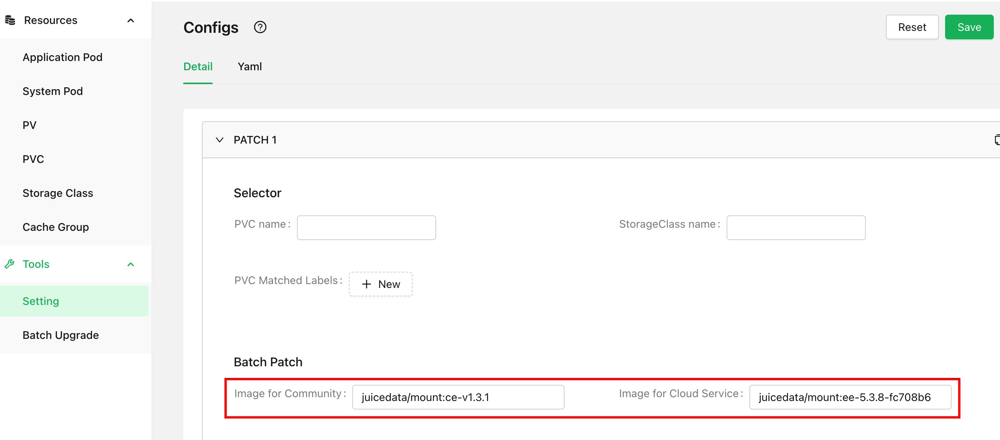
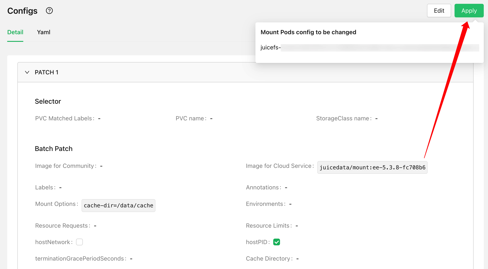
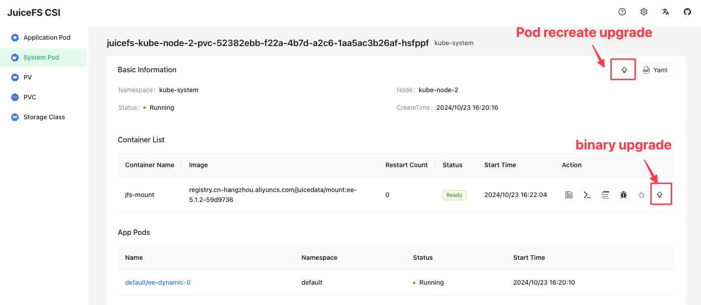

Upgrade the JuiceFS client (also known as the mount image) to enjoy the latest features and bug fixes. For detailed release notes, please refer to the community edition and enterprise edition release information:

* [Community Edition Client Release Notes](https://github.com/juicedata/juicefs/releases)
* [Enterprise Edition Client Release Notes](https://juicefs.com/docs/zh/cloud/release)

JuiceFS CSI uses a decoupled architecture where the driver components and Mount Pod (or Sidecar) run completely independently. Therefore, upgrading the mount image involves 2 phases:

1. Modify the CSI driver's ConfigMap configuration to update the mount image. For older CSI driver versions that don't yet support ConfigMap, you need to update environment variables and restart the CSI driver components.
1. Update the JuiceFS mount points in the cluster. Depending on the scenario and version, this step supports two upgrade methods: smooth upgrade and application restart upgrade:
   - [Smooth Upgrade](#smooth-upgrade): Only applicable to Mount Pod scenarios, requires CSI driver v0.25.0 or later, and has specific requirements for the currently running JuiceFS client version: community edition 1.2.1 or later, enterprise edition 5.1.0 or later. This method allows upgrading already-created Mount Pods without rebuilding application Pods, which is our most recommended upgrade approach.
   - [Application Restart Upgrade](#downtime-upgrade): This method requires rebuilding the application Pod to upgrade the mount image and is suitable for older CSI driver versions. Additionally, if your cluster uses Sidecar mode to mount JuiceFS, this mode does not support smooth upgrade and must use the application Pod rebuild method.

## Phase 1: Modify Configuration and Update Mount Image {#update-mount-image}

First, determine the version you want to upgrade to, find the tag for the new Mount Pod container image on [Docker Hub](https://hub.docker.com/r/juicedata/mount/tags), and then choose one of the following suitable methods to update the configuration based on your environment.

### Update Mount Image via CSI Dashboard {#update-mount-image-csi-dashboard}

If you have already installed [CSI Dashboard](../guide/dashboard.md) in your cluster, then updating the configuration directly through the Web UI is the most convenient method.

Click "Tools" → "Settings" in the left sidebar to enter the graphical form for editing ConfigMap. Click "Edit" in the top right corner to directly modify the community edition or cloud service edition mount image:



After saving the changes, the Phase 1 configuration update is complete. If your running JuiceFS client version is recent enough (community edition 1.2.1 or later, enterprise edition 5.1.0 or later), you can directly click "Apply" in the top right corner to initiate a smooth upgrade. You can then skip the "Phase 2" section below and perform the upgrade directly through the CSI Dashboard web interface.

If the client version running in your cluster does not yet support smooth upgrade, please continue reading the "Phase 2" section below and choose an appropriate method to update the mount point.

### Update Mount Image via ConfigMap {#update-mount-image-configmap}

If CSI Dashboard is already installed in your cluster, please prioritize using the method described in the previous section and operate through the web UI, which is more convenient and less error-prone. If you don't have the option to use CSI Dashboard, you can run a command similar to the one below to manually edit the ConfigMap:

```shell
# Modify the namespace according to your actual situation
kubectl -n kube-system edit cm juicefs-csi-driver-config
```

Edit the corresponding fields in the YAML. When editing the text, pay extra attention to the YAML hierarchy as misaligned indentation will cause errors.

```YAML {9-10}
apiVersion: v1
kind: ConfigMap
metadata:
  name: juicefs-csi-driver-config
  namespace: kube-system
data:
  config.yaml: |
    mountPodPatch:
      - eeMountImage: "juicedata/mount:ee-5.3.8-fc708b6"
        ceMountImage: "juicedata/mount:ce-v1.3.1"
```

After saving and exiting, for safety, check the CSI Node logs to ensure there are no YAML format errors or typos in the ConfigMap:

```shell
# Modify the namespace according to your actual situation
kubectl -n kube-system logs juicefs-csi-node-xxx --tail 100 -f
```

When the ConfigMap is reloaded, you will see a log message similar to the following:

```
"config file updated, reload config" logger="config" config file="/etc/config/config.yaml"
```

If loading fails, you will see a log message similar to the following. In this case, you need to recheck the ConfigMap and carefully compare it with our [YAML example](../guide/configurations.md#configmap) to check for spelling errors or YAML format errors.

```
"fail to reload config" err="error converting YAML to JSON: yaml: line 2: mapping values are not allowed in this context" logger="config"
```

### Update Mount Image via Environment Variables (Deprecated) {#update-mount-image-csi-env}

The CSI driver controls the default mount image through two environment variables: `JUICEFS_CE_MOUNT_IMAGE` and `JUICEFS_EE_MOUNT_IMAGE`. When ConfigMap or other configurations are missing, these environment variables serve as default fallback values. For older CSI driver versions that don't yet support ConfigMap (versions before v0.24), you need to update these two environment variables in the CSI driver and restart both the CSI Node and CSI Controller components.

:::tip
After overriding the mount image, note the following:

* Existing Mount Pods will not be affected. You need to either perform a rolling upgrade of the application Pod or delete and recreate the Mount Pod for it to use the new image.
* Each time the CSI driver releases a new version, it routinely uses the current latest stable mount image as the value for this environment variable. Therefore, when [upgrading the CSI driver](./upgrade-csi-driver.md), it will automatically upgrade to the latest stable version of the mount image. However, if you override the mount image in Values, this becomes a fixed configuration. Upgrading the CSI driver later will not bring along a mount image upgrade.

:::

If you installed the CSI driver using Helm, modifying environment variables is very simple—just define them in Values:

```yaml name="values-mycluster.yaml"
defaultMountImage:
  # Community edition
  ce: "juicedata/mount:ce-v1.3.1"
  # Enterprise edition
  ee: "juicedata/mount:ee-5.3.8-fc708b6"
```

After updating, use Helm to upgrade the installation. This field will be rendered and written to the CSI Node and CSI Controller definitions, which will then be restarted:

```shell
helm upgrade juicefs-csi-driver juicefs/juicefs-csi-driver -n kube-system -f ./values-mycluster.yaml
```

If the CSI driver was not installed using Helm but directly using Kubectl, you need to manually set the environment variables in the CSI driver components:

```shell
# Community edition
kubectl -n kube-system set env daemonset/juicefs-csi-node -c juicefs-plugin JUICEFS_CE_MOUNT_IMAGE=juicedata/mount:ce-v1.3.1
kubectl -n kube-system set env statefulset/juicefs-csi-controller -c juicefs-plugin JUICEFS_CE_MOUNT_IMAGE=juicedata/mount:ce-v1.3.1

# Enterprise edition
kubectl -n kube-system set env daemonset/juicefs-csi-node -c juicefs-plugin JUICEFS_EE_MOUNT_IMAGE=juicedata/mount:ee-5.3.8-fc708b6
kubectl -n kube-system set env statefulset/juicefs-csi-controller -c juicefs-plugin JUICEFS_EE_MOUNT_IMAGE=juicedata/mount:ee-5.3.8-fc708b6
```

After making the changes, don't forget to add these configurations to `k8s.yaml` as well to avoid losing the configuration on the next installation. Because managing configurations with Kubectl installation method is inconvenient, we recommend using the [Helm installation method](../getting_started.md#helm) for production clusters and planning a [migration to Helm](./upgrade-csi-driver.md#migrate-to-helm).

### Update Mount Image in StorageClass (Deprecated) {#update-mount-image-sc}

Starting from v0.24, the CSI driver supports customizing Mount Pod images in [ConfigMap](#update-mount-image-configmap), consolidating all related configurations in one place, making it very convenient. Therefore, the method described in this section is no longer recommended.

The CSI driver allows you to override configurations in StorageClass. If you need to configure different Mount Pod images for different applications, you need to create multiple StorageClasses, each with its own specified Mount Pod image.

```yaml {11}
apiVersion: storage.k8s.io/v1
kind: StorageClass
metadata:
  name: juicefs-sc
provisioner: csi.juicefs.com
parameters:
  csi.storage.k8s.io/provisioner-secret-name: juicefs-secret
  csi.storage.k8s.io/provisioner-secret-namespace: default
  csi.storage.k8s.io/node-publish-secret-name: juicefs-secret
  csi.storage.k8s.io/node-publish-secret-namespace: default
  juicefs/mount-image: juicedata/mount:ce-v1.3.1
```

After configuration is complete, you can specify different StorageClasses in different PVCs using `storageClassName` to set different Mount Pod images for different applications.

### Update Mount Image in PV Definition (Deprecated)

Starting from v0.24, the CSI driver supports customizing Mount Pod images in [ConfigMap](#update-mount-image-configmap), consolidating all related configurations in one place, making it very convenient. Therefore, the method described in this section is no longer recommended.

For ["static provisioning"](../guide/pv.md#static-provisioning) usage, you can configure the Mount Pod image in the PV definition:

```yaml {22}
apiVersion: v1
kind: PersistentVolume
metadata:
  name: juicefs-pv
  labels:
    juicefs-name: ten-pb-fs
spec:
  capacity:
    storage: 10Pi
  volumeMode: Filesystem
  accessModes:
    - ReadWriteMany
  persistentVolumeReclaimPolicy: Retain
  csi:
    driver: csi.juicefs.com
    volumeHandle: juicefs-pv
    fsType: juicefs
    nodePublishSecretRef:
      name: juicefs-secret
      namespace: default
    volumeAttributes:
      juicefs/mount-image: juicedata/mount:ce-v1.3.1
```

## Phase 2: Upgrade Mount Points {#upgrade-mount-point}

### Smooth Upgrade of Mount Pod <VersionAdd>0.25.0</VersionAdd> {#smooth-upgrade}

CSI driver version 0.25.0 and later support smooth upgrade of Mount Pod (Sidecar and process mount modes do not support this feature), allowing you to upgrade Mount Pod without interrupting services. Since smooth upgrade actually leverages the JuiceFS client's own smooth restart capability, this feature additionally allows Mount Pod smooth restart and recovery. See [Automatic Recovery](../guide/configurations.md#automatic-mount-point-recovery) for details.

Before performing a smooth upgrade, you must ensure that the Mount Pod's YAML definition does **not** have `umount` configured in `preStop`. For example:

```yaml
# If you have similar configuration, smooth upgrade cannot be performed
preStop:
  exec:
    command:
    - sh
    - -c
    - +e
    - umount -l ${MOUNT_POINT}; rmdir ${MOUNT_POINT}; exit 0
```

Smooth upgrade requires that Mount Pod's `preStop` does not configure `umount ${MOUNT_POINT}`. You must ensure that [CSI ConfigMap](./../guide/configurations.md#configmap) does not have `umount` configured. For clusters that already have `umount` configured, you must first modify the configuration, remove the relevant `preStop` code, and complete the rolling update by rebuilding the application Pod. Only then will smooth upgrade functionality be supported.

There are two methods for smooth upgrade of Mount Pod: "Pod Rebuild Upgrade" and "Binary Upgrade". The differences are:

- Pod Rebuild Upgrade: The Mount Pod will be rebuilt. Minimum version requirement for Mount Pod is 1.2.1 (community edition) or 5.1.0 (enterprise edition).
- Binary Upgrade: The Mount Pod is not rebuilt, only the binary is upgraded. Other configurations cannot be changed, and after the upgrade, the image shown in the Mount Pod's YAML remains the original image. Minimum version requirement for Mount Pod is 1.2.0 (community edition) or 5.0.0 (enterprise edition).

Both upgrade methods are smooth upgrades and allow services to continue without interruption. Choose based on your actual situation.

Smooth upgrade can be triggered in [CSI Dashboard](./troubleshooting.md#csi-dashboard) or [JuiceFS kubectl plugin](./troubleshooting.md#kubectl-plugin). Choose the appropriate method for your scenario in the sections below.

#### Trigger Smooth Upgrade in CSI Dashboard {#smooth-upgrade-via-csi-dashboard}

CSI Dashboard not only supports graphical management of ConfigMap, but is also much more convenient than editing YAML in plain text and less error-prone. Additionally, after saving the configuration, you can directly trigger a smooth upgrade through the CSI Dashboard.



Triggering the upgrade directly from the settings page will default to using the Mount Pod rebuild upgrade method. If you need to use the binary update method, go to the Mount Pod detail page where there are two upgrade buttons: "Pod Rebuild Upgrade" and "Binary Upgrade":



Click the corresponding button to trigger the smooth upgrade of the Mount Pod.

#### Trigger Smooth Upgrade in Kubectl Plugin {#smooth-upgrade-via-kubectl-plugin}

Kubectl plugin requires minimum version 0.3.0. If your version is lower, please [reinstall](./troubleshooting.md#kubectl-plugin).

```shell
# Mount Pod rebuild upgrade
kubectl jfs upgrade juicefs-kube-node-1-pvc-52382ebb-f22a-4b7d-a2c6-1aa5ac3b26af-ebngyg --recreate

# Binary upgrade
kubectl jfs upgrade juicefs-kube-node-1-pvc-52382ebb-f22a-4b7d-a2c6-1aa5ac3b26af-ebngyg
```

### Trigger Mount Point Upgrade by Restarting Application Pod {#downtime-upgrade}

If your environment does not meet the prerequisites for ["Smooth Upgrade"](#smooth-upgrade) above, or if you are using Sidecar mode for mounting, you need to rebuild the application Pod to trigger the upgrade of the Mount Pod or Sidecar.

The operation is straightforward: perform a rolling rebuild (note: not container restart) of all application Pods that have JuiceFS PV mounted. The associated Mount Pod (or Sidecar) will be rebuilt accordingly.

Since the application Pod will need to restart and service will be interrupted, please arrange a suitable maintenance window.

### Trigger Mount Point Upgrade by Rebuilding Mount Pod (Deprecated) {#downtime-upgrade-delete-mount-pod}

:::warning
If you plan to trigger an upgrade by directly deleting and rebuilding the Mount Pod, make sure the CSI driver version is at least v0.24. Otherwise, even if you delete the Mount Pod, the rebuilt Mount Pod will still be created with the old image, failing to achieve the upgrade goal.
:::

If you cannot use smooth upgrade for some reason and the application Pod cannot be easily rebuilt, then under certain conditions, you can directly delete and rebuild the Mount Pod to trigger the upgrade with the new image. This operation may cause the mount point to be temporarily inaccessible.

Before performing this operation, please confirm the following:

* The application Pod has ["Automatic Mount Point Recovery"](../guide/configurations.md#automatic-mount-point-recovery) configured. Otherwise, after the Mount Pod is rebuilt, the mount point in the application Pod will be permanently lost.
* If the application Pod does not have `mountPropagation` configured, but is already using CSI driver v0.25 or later with JuiceFS client 1.2.1 (community edition) or 5.1.0 (enterprise edition) or later, and the CSI Node is running normally, then even without `mountPropagation`, theoretically the mount point can automatically recover service after the Mount Pod is rebuilt. However, since this approach carries greater risk, it is Deprecated for production environments.

### Upgrade JuiceFS Client in Process Mount Mode (Deprecated)

:::warning
We strongly recommend upgrading the JuiceFS CSI driver to v0.10 or later. The client upgrade method described here is for demonstration purposes only and is Deprecated for long-term use in production environments.
:::

If you are using process mount mode or have difficulty upgrading to a version after v0.10, but need to use a newer version of JuiceFS for mounting, you can use the following method to upgrade the JuiceFS client in CSI Node Service without upgrading the CSI driver.

Since this is a temporary upgrade of the JuiceFS client in the CSI Node Service container, it is completely a temporary solution. As expected, if the CSI Node Service Pod is rebuilt or new nodes are added, you will need to execute this upgrade process again.

1. Use the following script to replace the `juicefs` client in the `juicefs-csi-node` Pod with a newer version:

   ```bash
   #!/bin/bash

   # Please replace with the correct path before running
   KUBECTL=/path/to/kubectl
   JUICEFS_BIN=/path/to/new/juicefs

   $KUBECTL -n kube-system get pods | grep juicefs-csi-node | awk '{print $1}' | \
       xargs -L 1 -P 10 -I'{}' \
       $KUBECTL -n kube-system cp $JUICEFS_BIN '{}':/tmp/juicefs -c juicefs-plugin

   $KUBECTL -n kube-system get pods | grep juicefs-csi-node | awk '{print $1}' | \
       xargs -L 1 -P 10 -I'{}' \
       $KUBECTL -n kube-system exec -i '{}' -c juicefs-plugin -- \
       chmod a+x /tmp/juicefs && mv /tmp/juicefs /bin/juicefs
   ```

2. Restart the applications one by one or kill the existing Pods.
