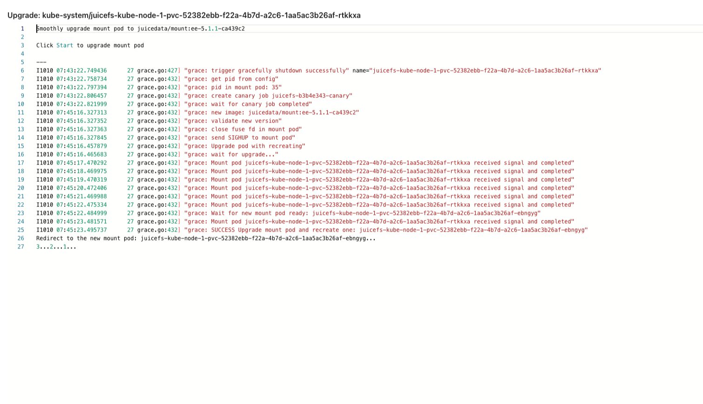

Upgrade JuiceFS Client to the latest version to enjoy all kinds of improvements and fixes, read [release notes for JuiceFS Community Edition](https://github.com/juicedata/juicefs/releases) or [release notes for JuiceFS Cloud Service](https://juicefs.com/docs/cloud/release) to learn more.

As a matter of fact, [upgrading JuiceFS CSI Driver](./upgrade-csi-driver.md) will bring upgrade to JuiceFS Client along the way, because every release includes the current latest [mount pod image](https://hub.docker.com/r/juicedata/mount/tags?page=1&name=v), but if you'd like to use the latest JuiceFS Client before CSI Driver release, or even before mount pod image release, refer to methods introduced in this chapter.

## Upgrade container image for mount pod {#upgrade-mount-pod-image}

Find the latest mount pod image in [Docker Hub](https://hub.docker.com/r/juicedata/mount/tags?page=1&name=v), and then [overwrite mount pod image](../guide/custom-image.md#overwrite-mount-pod-image).

Pay attention that, with mount pod image overwritten, [upgrading CSI Driver](./upgrade-csi-driver.md) will no longer affect mount pod image.

## Smoothly upgrade for mount pod {#smooth-upgrade}

JuiceFS CSI Driver v0.25.0 and later versions supports smoothly upgrade for mount pod, which means upgrading mount pod without stopping the service.

:::tip Prerequisites

* Smooth upgrade is only applicable to mount pod mode.
* Mount pod image version should be v1.2.1 (Community Edition) or v5.1.0 (Enterprise Edition) and later.

:::

:::warning Requirements for smoothly upgrade
Smoothly upgrade requires that `preStop` of mount pod should not be configured with `umount ${MOUNT_POINT}`, please make sure that `umount` is not configured in [CSI ConfigMap](./../guide/configurations.md#configmap).
:::

So far, smoothly upgrade can only be triggered in CSI Dashboard or JuiceFS kubectl plugin.

### Trigger smoothly upgrade in Dashboard {#dashboard}

1. In CSI Dashboard, click the "Configuration" button, update the new image version for mount pod that needs to be upgraded.

   

2. In the details page of mount pod, there are two upgrade buttons, "Pod Upgrade" and "Binary Upgrade". "Pod Upgrade" means mount pod will be rebuilt, requires version v1.2.1 (Community Edition) or v5.1.0 (Enterprise Edition) and later; "Binary Upgrade" means mount pod will not be rebuilt, only the binary will be upgraded, requires version v1.2.0 (Community Edition) or v5.0.0 (Enterprise Edition) and later. Both upgrades are smooth upgrades, services can be kept running.

   

3. Click the upgrade button to trigger smoothly upgrade for mount pod.

   

### Trigger smoothly upgrade in kubectl plugin {#kubectl-plugin}

It requires kubectl JuiceFS plugin version is v0.3.0 and later.

1. Update the image version for mount pod in CSI ConfigMap configuration using kubectl.

   ```yaml
   apiVersion: v1
   data:
      config.yaml: |
         mountPodPatch:
            - ceMountImage: juicedata/mount:ce-v1.2.0
              eeMountImage: juicedata/mount:ee-5.1.1-ca439c2
   kind: ConfigMap
   ```
  
2. Trigger smoothly upgrade for mount pod using JuiceFS kubectl plugin.

   ```bash
   # Upgrade Pod with recreate
   kubectl jfs upgrade juicefs-kube-node-1-pvc-52382ebb-f22a-4b7d-a2c6-1aa5ac3b26af-ebngyg --recreate
   # Upgrade binary
   kubectl jfs upgrade juicefs-kube-node-1-pvc-52382ebb-f22a-4b7d-a2c6-1aa5ac3b26af-ebngyg
   ```

## Upgrade JuiceFS Client temporarily

:::tip
You are strongly encouraged to upgrade JuiceFS CSI Driver to v0.10 and later versions, the method demonstrated below are not recommended for production use.
:::

If you're using [Mount by process mode](../introduction.md#by-process), or using CSI Driver prior to v0.10.0, and cannot easily upgrade to v0.10, you can choose to upgrade JuiceFS Client independently, inside the CSI Node Service pod.

This is only a temporary solution, if CSI Node Service pods are recreated, or new nodes are added to Kubernetes cluster, you'll need to run this script again.

1. Use this script to replace the `juicefs` binary in `juicefs-csi-node` pod with the new built one:

   ```bash
   #!/bin/bash

   KUBECTL=/path/to/kubectl
   JUICEFS_BIN=/path/to/new/juicefs

   $KUBECTL -n kube-system get pods | grep juicefs-csi-node | awk '{print $1}' | \
       xargs -L 1 -P 10 -I'{}' \
       $KUBECTL -n kube-system cp $JUICEFS_BIN '{}':/tmp/juicefs -c juicefs-plugin

   $KUBECTL -n kube-system get pods | grep juicefs-csi-node | awk '{print $1}' | \
       xargs -L 1 -P 10 -I'{}' \
       $KUBECTL -n kube-system exec -i '{}' -c juicefs-plugin -- \
       chmod a+x /tmp/juicefs && mv /tmp/juicefs /bin/juicefs
   ```

   :::note
   Replace `/path/to/kubectl` and `/path/to/new/juicefs` in the script with the actual values, then execute the script.
   :::

2. Restart the applications one by one, or kill the existing pods.
