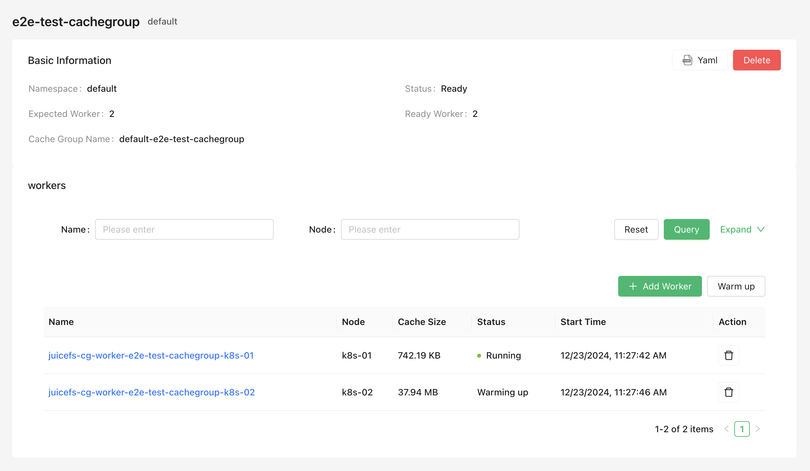

Enterprise users can use the "Cache Group Operator" to create and manage [distributed cache clusters](https://juicefs.com/docs/cloud/guide/distributed-cache). Compared to other deployment methods, the Cache Group Operator is more convenient to use (supports both GUI and CLI), and also supports advanced features such as different node configurations, smooth scaling, and automatic cache cleaning.

## Install Cache Group Operator {#install-cache-group-operator}

Install Helm, add the JuiceFS Helm chart repo:

```shell
helm repo add juicefs https://juicedata.github.io/charts/
helm repo update
```

Before installation, read [`values.yaml`](https://raw.githubusercontent.com/juicedata/charts/refs/heads/main/charts/juicefs-cache-group-operator/values.yaml) to learn all available configuration items, if you need to override any config, create a new values file (e.g. `values-mycluster.yaml`) and put any customizations there, and when you need to install operator on multiple Kubernetes clusters, you will create multiple values file to use different settings.

```shell
# Modify values-mycluster.yaml as needed
helm upgrade --install juicefs-cache-group-operator juicefs/juicefs-cache-group-operator -n juicefs-cache-group --create-namespace -f values-mycluster.yaml
```

You can use `kubectl wait` to wait for the Operator to be ready:

```shell
kubectl wait -n juicefs-cache-group --for=condition=Available=true --timeout=120s deployment/juicefs-cache-group-operator
```

Once the Cache Group Operator is installed, you can start creating and managing cache groups. The operations introduced in the following sections can be completed through both the CSI Dashboard (version 0.25.3 and above) and `kubectl`. Choose the method you prefer. To simplify the documentation examples, only the `kubectl` method will be introduced.



## Create Cache Group {#create-cache-group}

Refer to the following example to save the cache group configuration as a YAML file (e.g., `juicefs-cache-group.yaml`). This example deploys a distributed cache on all nodes with the `juicefs.io/cg-worker: "true"` label (you can also set any label you like). For more configuration options, refer to the [Cache Group Configurations](#cache-group-configs) section.

```yaml name="juicefs-cache-group.yaml"
apiVersion: v1
kind: Secret
metadata:
  name: juicefs-secret
  namespace: juicefs-cache-group
type: Opaque
stringData:
  name: juicefs-xx
  token: xx
  access-key: xx
  secret-key: xx
---
apiVersion: juicefs.io/v1
kind: CacheGroup
metadata:
  name: cachegroup-sample
spec:
  secretRef:
    name: juicefs-secret
  worker:
    template:
      nodeSelector:
        juicefs.io/cg-worker: "true"
      image: juicedata/mount:ee-5.1.1-1faf43b
      opts:
        - cache-size=204800
        - free-space-ratio=0.01
        - group-weight=100
      resources:
        requests:
          cpu: 100m
          memory: 128Mi
        limits:
          cpu: 1
          memory: 1Gi
```

Then create the cache group using the `kubectl apply` command:

```shell
kubectl apply -f juicefs-cache-group.yaml
```

If the Kubernetes nodes do not have the `juicefs.io/cg-worker: "true"` label, add this label:

```shell
kubectl label node node1 juicefs.io/cg-worker=true
```

## Get Cache Group Status {#get-cache-group-status}

Use the following command to get the cache group status and confirm that the cache group is in the "Ready" state:

```sh
$ kubectl get cachegroups
NAME                CACHE GROUP NAME                        PHASE   READY   AGE
cachegroup-sample   juicefs-cache-group-cachegroup-sample   Ready   1/1     10s
```

## Use Cache Group {#use-cache-group}

After completing the above steps, a JuiceFS distributed cache cluster has been started in K8s, with the cache group name `juicefs-cache-group-cachegroup-sample`. To allow the JuiceFS client of the application to use this cache cluster, the JuiceFS client needs to join this cache group and add the `--no-sharing` mount option. This way, the JuiceFS client of the application joins the cache group but does not participate in cache data construction, avoiding cache data instability caused by frequent client creation and destruction.

For dynamic configuration, modify the mount options as shown below. For more information on how to adjust mount configurations, see [Mount Options](../guide/configurations.md#mount-options).

```yaml {6-7}
apiVersion: storage.k8s.io/v1
kind: StorageClass
metadata:
  name: juicefs-sc
mountOptions:
  - cache-group=juicefs-cache-group-cachegroup-sample
  - no-sharing
```

## Add and Delete Cache Nodes {#add-and-delete-cache-node}

The Cache Group Operator supports smooth scaling of cache nodes, ensuring that adjustments do not significantly impact cache hit rates.

In the [Create Cache Group](#create-cache-group) example, Kubernetes nodes must have the `juicefs.io/cg-worker: "true"` label. Therefore, adding or deleting cache nodes involves adding or removing this label from Kubernetes nodes. For example, use the `kubectl` command to add or delete nodes:

```sh
# Add nodes
kubectl label node node1 juicefs.io/cg-worker=true
kubectl label node node2 juicefs.io/cg-worker=true

# Delete nodes
kubectl label node node1 juicefs.io/cg-worker-
```

When nodes change, the Cache Group Operator will smoothly add or delete nodes. The specific logic is as follows:

- When adding nodes, the Cache Group Operator will automatically create new Worker Pods and add the [`group-backup`](https://juicefs.com/docs/cloud/guide/distributed-cache#group-backup) mount option. If the new Worker Pod receives an application request and finds a cache miss, it will forward the request to other cache nodes to ensure cache hits. By default, the `group-backup` mount option will be removed after 10 minutes, which can be controlled by the `spec.backupDuration` field:

  ```yaml {6}
  apiVersion: juicefs.io/v1
  kind: CacheGroup
  metadata:
    name: cachegroup-sample
  spec:
    backupDuration: 10m
  ```

- When removing nodes, the Cache Group Operator will first attempt to migrate the cache data on the node to other nodes before deleting the node. The maximum waiting time is 1 hour by default, which can be controlled by the `spec.waitingDeletedMaxDuration` field:

  ```yaml {6}
  apiVersion: juicefs.io/v1
  kind: CacheGroup
  metadata:
    name: cachegroup-sample
  spec:
    waitingDeletedMaxDuration: 1h
  ```

## Cache Group Configurations {#cache-group-configs}

All supported cache group configurations can be found in the [complete example](https://github.com/juicedata/juicefs-cache-group-operator/blob/main/config/samples/v1_cachegroup.yaml).

### Update Strategy {#update-strategy}

When updating the cache group configuration, you can specify the update strategy for the worker nodes under the cache group using the `spec.updateStrategy` field.

Currently supported strategies are:

- `RollingUpdate` (default): This is the default update strategy. When using the `RollingUpdate` strategy, after updating the cache group template, the old Worker Pods will be terminated, and new Worker Pods will be automatically created. The number of updates at a time follows the `spec.updateStrategy.rollingUpdate.maxUnavailable` configuration, which defaults to 1.
- `OnDelete`: When using the `OnDelete` strategy, after updating the cache group template, new Worker Pods will only be created when you manually delete the old Worker Pods.

```yaml {6-9}
apiVersion: juicefs.io/v1
kind: CacheGroup
metadata:
  name: cachegroup-sample
spec:
  updateStrategy:
    type: RollingUpdate
    rollingUpdate:
      maxUnavailable: 1
```

### Cache Directory {#cache-directory}

The cache directory can be set using the `spec.worker.template.cacheDirs` field. Supported types are `HostPath` and `PVC`.

```yaml {12-16}
apiVersion: juicefs.io/v1
kind: CacheGroup
metadata:
  name: cachegroup-sample
  namespace: default
spec:
  worker:
    template:
      nodeSelector:
        juicefs.io/cg-worker: "true"
      image: juicedata/mount:ee-5.1.1-1faf43b
      cacheDirs:
        - type: HostPath
          path: /var/jfsCache-0
        - type: PVC
          name: juicefs-cache-pvc
```

### Specify Different Configurations for Different Nodes {#specify-different-configurations-for-different-nodes}

Cache nodes may have heterogeneous configurations (e.g., different cache disk sizes). In this case, you can specify different configurations for different nodes using the `spec.worker.overwrite` field:

```yaml {17-29}
apiVersion: juicefs.io/v1
kind: CacheGroup
metadata:
  name: cachegroup-sample
spec:
  worker:
    template:
      nodeSelector:
        juicefs.io/cg-worker: "true"
      image: juicedata/mount:ee-5.1.1-1faf43b
      hostNetwork: true
      cacheDirs:
        - path: /var/jfsCache-0
          type: HostPath
      opts:
        - group-weight=100
    overwrite:
      - nodes:
          - k8s-03
        # You can also use nodeSelector
        # nodeSelector:
        #   kubernetes.io/hostname: k8s-02
        opts:
          - group-weight=50
        cacheDirs:
        - path: /var/jfsCache-1
          type: HostPath
        - path: /var/jfsCache-2
          type: HostPath
```

### Mount Options {#mount-options}

Mount options can be set using the `spec.worker.template.opts` field. Refer to the [documentation](https://juicefs.com/docs/cloud/reference/commands_reference/#mount) for all mount options.

```yaml {12-13}
apiVersion: juicefs.io/v1
kind: CacheGroup
metadata:
  name: cachegroup-sample
  namespace: default
spec:
  worker:
    template:
      nodeSelector:
        juicefs.io/cg-worker: "true"
      image: juicedata/mount:ee-5.1.1-1faf43b
      opts:
        - group-weight=100
```

### Cache Group Name {#cache-group-name}

The default cache group name format generated by the Cache Group Operator is `${NAMESPACE}-${NAME}`. If you want to customize the cache group name, you can set it using the `spec.cacheGroup` field:

```yaml {6}
apiVersion: juicefs.io/v1
kind: CacheGroup
metadata:
  name: cachegroup-sample
spec:
  cacheGroup: jfscachegroup
```

### Clean Cache When Deleting a Node {#clean-cache-when-deleteing-a-node}

When deleting a node, you can specify whether to clean the cache using the `spec.cleanCache` field:

```yaml {6}
apiVersion: juicefs.io/v1
kind: CacheGroup
metadata:
  name: cachegroup-sample
spec:
  cleanCache: true
```

## Delete Cache Group {#delete-cache-group}

Use the following command to delete the cache group. All Worker nodes under the cache cluster will be deleted:

```sh
kubectl delete cachegroup cachegroup-sample
```
