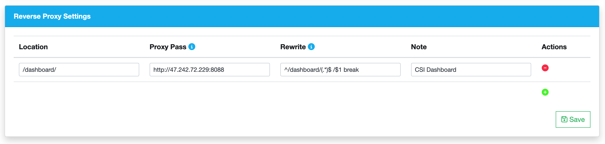
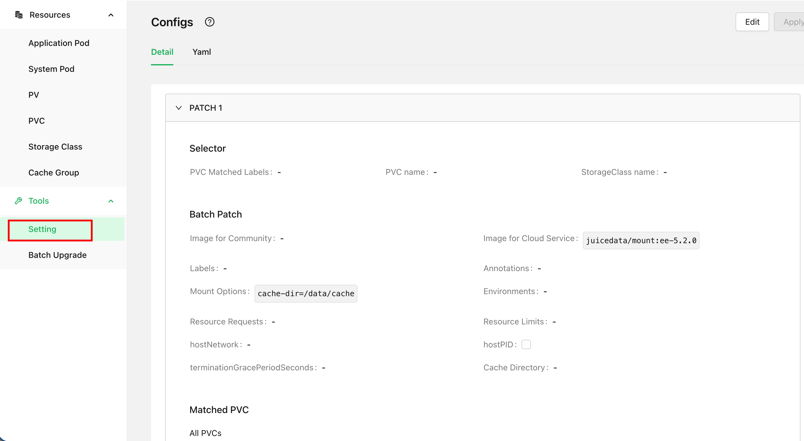

CSI Dashboard is a web-based graphical management interface provided by the CSI Driver, offering powerful management and troubleshooting capabilities. It is recommended for all CSI Driver users to install it.

* View the correspondence between all JuiceFS PVs, PVCs, Mount Pods, and application Pods at a glance without needing to manually extract information using `kubectl` commands
* Manage [various Mount Pod configurations](./configurations.md) in ConfigMap through a graphical form, eliminating the frustration of unfamiliar YAML fields and misaligned indentation
* Preview Mount Pod logs and file system access logs for mount points
* Troubleshoot mount points in Mount Pods, preview performance metrics, extract DEBUG information, etc.


## Installation

:::warning Expose Web Service

If your environment does not support exposing a web service via node port or Ingress, CSI Dashboard is not an option. In such cases, we recommend the [`kubectl jfs`](../administration/troubleshooting.md#kubectl-plugin) plugin, which is also very powerful. You can use it to run many similar management and troubleshooting commands in the terminal.

:::

When installing the CSI Driver, the CSI Dashboard is installed by default:

```YAML title="values.yaml"
dashboard:
  enabled: true
```

After installation with [Helm](../getting_started.md#helm), you can check the Dashboard Pod status with the following command:

```shell
kubectl get po -n kube-system -l app=juicefs-csi-dashboard
```

## Service Exposure

CSI Dashboard is a web-based graphical interface, so it requires appropriate service exposure methods. Generally, two approaches are considered: host node port or Ingress.

### Host Port (NodePort) {#expose-via-node-port}

You need to enable hostNetwork to allow CSI Dashboard to listen directly on the host node port and pin it to a specific node:

```YAML title="values-mycluster" {3}
dashboard:
  enabled: true
  hostNetwork: true
  nodeSelector:
    kubernetes.io/hostname: csi-dashboard-node-name
```

After updating the installation with Helm, CSI Dashboard will restart and listen on port 8088. If you can access the node IP directly, you can access the dashboard service port directly through a browser, However, internal network node IPs are often not directly accessible, you can use the following method to forward the port to your local computer:

```shell
ssh -L 8088:localhost:8088 csi-dashboard-node-name
```

Accessing CSI Dashboard through SSH port forwarding is not a long-term solution. Therefore, for customers using JuiceFS Enterprise Edition in an on-premises environment with internal network connectivity, we recommend establishing proxy access through the JuiceFS Web Console:

Go to the settings page in the upper right corner of the console, scroll down to find the proxy access rules, and click the add button on the right. Following the examples in the text input fields, correctly enter the access address for CSI Dashboard.



For the fields shown in the image, except for the CSI Dashboard access address which needs to be modified, the rest can be directly copied and pasted from the code block below:

```
# Location
/dashboard/

# Rewrite
^/dashboard/(.*)$ /$1 break

# Note
CSI Dashboard
```

After saving, you can jump directly to access CSI Dashboard through the "Proxy" button in the top bar of the JuiceFS Web Console.

### Ingress

In the default [Helm Values](https://github.com/juicedata/charts/blob/main/charts/juicefs-csi-driver/values.yaml) of the CSI Driver, Ingress configuration for CSI Dashboard has already been reserved:

```YAML title="values-mycluster.yaml"
dashboard:
  ...
  ingress:
    enabled: false
    className: "nginx"
    annotations: {}
    # kubernetes.io/ingress.class: nginx
    # kubernetes.io/tls-acme: "true"
    hosts:
    - host: ""
      paths:
      - path: /
        pathType: ImplementationSpecific
    tls: []
```

Fill in the Ingress configuration in your cluster configuration, and then you can access CSI Dashboard through the domain name.

### Adding Authentication

For JuiceFS Enterprise Edition private deployment customers, we recommend setting CSI Dashboard to be accessed [through the JuiceFS Web Console](#expose-via-node-port) and properly configure security group filtering rules to prevent users from directly accessing CSI Dashboard through the NodePort. If you have configured according to this strategy, accessing CSI Dashboard must go through Web Console authentication, so CSI Dashboard does not need additional authentication.

If you cannot configure proxy access, you can also enable username and password access for CSI Dashboard:

```YAML title="values-mycluster.yaml"
dashboard:
  ...
  auth:
    enabled: false
    # Set existingSecret to indicate whether to use an existing secret. If it is empty, a corresponding secret will be created according to the plain text configuration.
    existingSecret: ""
    username: admin
    password: admin
```

## Managing ConfigMap through CSI Dashboard {#manage-cm-in-dashboard}

[CSI ConfigMap](./configurations.md#configmap) can be managed either through Helm Values or through CSI Dashboard, but you must choose one or the other. We recommend managing it through CSI Dashboard to avoid common YAML editing errors such as typos and indentation mistakes.

If your cluster is currently managing ConfigMap through Values, you can follow the steps below to switch to using CSI Dashboard for management.

Before performing any operations, back up the current ConfigMap with the following command:

```shell
kubectl -n kube-system get cm -oyaml juicefs-csi-driver-config > juicefs-csi-driver-config-bak.yaml
```

Make the following settings in your cluster-specific Values:

```YAML title="mycluster-values.yaml" {3-4}
globalConfig:
  enabled: true
  # On first installation, ConfigMap will be rendered and applied, but subsequent helm upgrades will not update ConfigMap
  manageByHelm: false
```

Then run the Helm command to update the configuration:

```shell
helm upgrade --install juicefs-csi-driver juicefs/juicefs-csi-driver -n kube-system -f ./values-mycluster.yaml
```

After the update is complete, access CSI Dashboard, click the "Tools - Settings" button in the left sidebar, and verify that the contents of ConfigMap are displayed correctly in the CSI Dashboard webpage.


