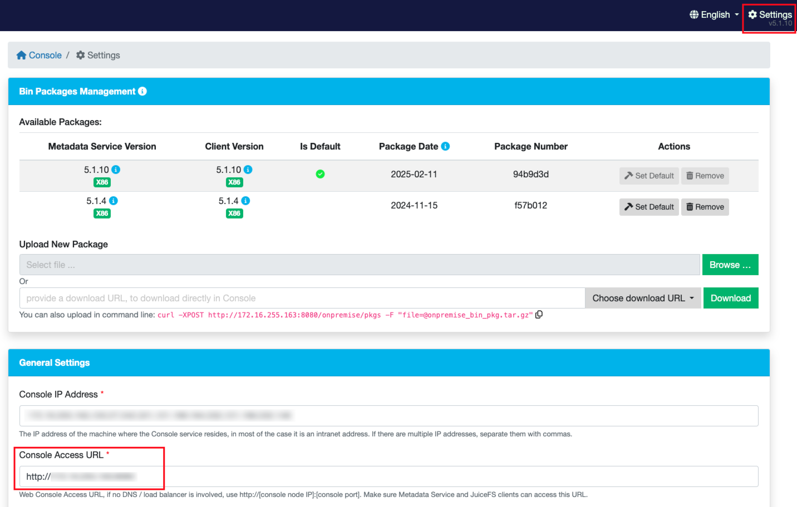

## Volume credentials {#volume-credentials}

In JuiceFS, a Volume is a file system. With JuiceFS CSI Driver, Volume credentials are stored inside a Kubernetes Secret, note that for JuiceFS Community Edition and JuiceFS Cloud Service, meaning of volume credentials are different:

* For Community Edition, volume credentials include metadata engine URL, object storage keys, and other options supported by the [`juicefs format`](https://juicefs.com/docs/community/command_reference#format) command.
* For Cloud Service, volume credentials include Token, object storage keys, and other options supported by the [`juicefs auth`](https://juicefs.com/docs/cloud/reference/commands_reference/#auth) command.

Although in the examples below, secrets are usually named `juicefs-secret`, they can actually be freely named, and you can create multiples to store credentials for different file systems. This allows using multiple different JuiceFS volumes within the same Kubernetes cluster. Read [using multiple file systems](#multiple-volumes) for more.

:::tip

* If you're already [managing StorageClass via Helm](#helm-sc), you can skip this step as the Kubernetes Secret is already created along the way.
* After modifying the volume credentials, you need to perform a rolling upgrade or restart the application Pod, and the CSI Driver will recreate the Mount Pod for the configuration changes to take effect.
* Secret only stores the volume credentials (that is, the options required by the `juicefs format` command (community version) and the `juicefs auth` command (cloud service)), and does not support filling in the mount options. If you want to modify the mount options, refer to ["Mount options"](./configurations.md#mount-options).

:::

### Community edition {#community-edition}

Create Kubernetes Secret:

```yaml
apiVersion: v1
kind: Secret
metadata:
  name: juicefs-secret
  namespace: default
  labels:
    # Add this label to enable secret validation
    juicefs.com/validate-secret: "true"
type: Opaque
stringData:
  name: <JUICEFS_NAME>
  metaurl: <META_URL>
  storage: s3
  bucket: https://<BUCKET>.s3.<REGION>.amazonaws.com
  access-key: <ACCESS_KEY>
  secret-key: <SECRET_KEY>
  # Adjust Mount Pod timezone, defaults to UTC.
  # envs: "{TZ: Asia/Shanghai}"
  # If you need to format a volume within the mount Pod, fill in format options below.
  # format-options: trash-days=1,block-size=4096
```

Fields description:

- `name`: The JuiceFS file system name
- `metaurl`: Connection URL for metadata engine. Read [Set Up Metadata Engine](https://juicefs.com/docs/community/databases_for_metadata) for details
- `storage`: Object storage type, such as `s3`, `gs`, `oss`. Read [Set Up Object Storage](https://juicefs.com/docs/community/how_to_setup_object_storage) for the full supported list
- `bucket`: Bucket URL. Read [Set Up Object Storage](https://juicefs.com/docs/community/how_to_setup_object_storage) to learn how to setup different object storage
- `access-key`/`secret-key`: Object storage credentials
- `envs`：Mount Pod environment variables
- `format-options`: Options used when creating a JuiceFS volume, see [`juicefs format`](https://juicefs.com/docs/community/command_reference#format). This options is only available in v0.13.3 and above

Information like `access-key` can be specified both as a Secret `stringData` field, and inside `format-options`. If provided in both places, `format-options` will take precedence.

### Cloud service {#cloud-service}

Before continue, you should have already [created a file system](https://juicefs.com/docs/cloud/getting_started#create-file-system).

Create Kubernetes Secret:

```yaml
apiVersion: v1
kind: Secret
metadata:
  name: juicefs-secret
  namespace: default
  labels:
    # Add this label to enable secret validation
    juicefs.com/validate-secret: "true"
type: Opaque
stringData:
  name: ${JUICEFS_NAME}
  token: ${JUICEFS_TOKEN}
  access-key: ${ACCESS_KEY}
  secret-key: ${SECRET_KEY}
  # Adjust Mount Pod timezone, defaults to UTC.
  # envs: "{TZ: Asia/Shanghai}"
  # If you need to specify more authentication options, fill in juicefs auth parameters below.
  # format-options: bucket2=xxx,access-key2=xxx,secret-key2=xxx
```

Fields description:

- `name`: The JuiceFS file system name
- `token`: Token used to authenticate against JuiceFS Volume, see [Access token](https://juicefs.com/docs/cloud/acl#access-token)
- `access-key`/`secret-key`: Object storage credentials
- `envs`：Mount Pod environment variables
- `format-options`: Options used by the [`juicefs auth`](https://juicefs.com/docs/cloud/commands_reference#auth) command, this command deals with authentication and generate local mount configuration. This options is only available in v0.13.3 and above

Information like `access-key` can be specified both as a Secret `stringData` field, and inside `format-options`. If provided in both places, `format-options` will take precedence.

For Cloud Service, the `juicefs auth` command is somewhat similar to the `juicefs format` in JuiceFS Community Edition, thus CSI Driver uses `format-options` for both scenarios, read [Format options / auth options](./configurations.md#format-options) for more.

### Enterprise edition (on-premises) {#enterprise-edition}

The JuiceFS Web Console is in charge of client authentication and distributing configuration files. In an on-premises deployment, the console address won't be [https://juicefs.com/console](https://juicefs.com/console), so it's required to specify the address for JuiceFS Web Console through `envs` field in volume credentials.

```yaml {15-16}
apiVersion: v1
metadata:
  name: juicefs-secret
  namespace: default
  labels:
    # Add this label to enable secret validation
    juicefs.com/validate-secret: "true"
kind: Secret
type: Opaque
stringData:
  name: ${JUICEFS_NAME}
  token: ${JUICEFS_TOKEN}
  access-key: ${ACCESS_KEY}
  secret-key: ${SECRET_KEY}
  # Replace the example address with the actual on-prem web console URL
  envs: '{"BASE_URL": "http://console.example.com/static"}'
  # If you need to specify more authentication options, fill in juicefs auth parameters below.
  # format-options: bucket2=xxx,access-key2=xxx,secret-key2=xxx
```

Fields description:

- `name`: The JuiceFS file system name
- `token`: Token used to authenticate against JuiceFS Volume, see [Access token](https://juicefs.com/docs/cloud/acl#access-token)
- `access-key`/`secret-key`: Object storage credentials
- `envs`：Mount Pod environment variables, in an on-prem environment, you need to specify the web console address via `BASE_URL`, if you do not know where to get it, navigate to the "Settings" page from our console, and then use the "Console Access URL":

  

- `format-options`: Options used by the [`juicefs auth`](https://juicefs.com/docs/cloud/commands_reference#auth) command, this command deals with authentication and generate local mount configuration. This options is only available in v0.13.3 and above

### Using multiple file systems {#multiple-volumes}

Secret name can be customized, you can create multiple secrets with different names, or even put in different namespaces, in order to use multiple JuiceFS volumes, or use the same volume across different Kubernetes namespaces.

```yaml {4-5,11-12}
---
apiVersion: v1
metadata:
  name: vol-secret-1
  namespace: default
kind: Secret
...
---
apiVersion: v1
metadata:
  name: vol-secret-2
  namespace: kube-system
kind: Secret
...
```

Depending on whether you're using static or dynamic provisioning, the secrets created above have to be referenced in the PV or StorageClass definition, in order to correctly mount. Taking the above volume credentials for an example, the corresponding static / dynamic provisioning config may look look like below.

For static provisioning (if you aren't yet familiar, read [static provisioning](#static-provisioning)).

:::warning
When using static provisioning, `volumeHandle` must be unique in order for multiple PVs to mount correctly. If this condition wasn't met, there will be `timed out waiting for the condition` error in the volume event, read [PVC error](https://juicefs.com/docs/csi/troubleshooting-cases/#pvc-error) for more, at the "PVC creation failures due to volumeHandle conflicts" section.

To prevent this sort of error from happening, [Validating webhook](./configurations.md#validating-webhook) is recommended.
:::

```yaml {10-11,14-15,25,28-29}
---
apiVersion: v1
kind: PersistentVolume
metadata:
  name: vol-1
spec:
  ...
  csi:
    driver: csi.juicefs.com
    # This field should be globally unique, thus it's recommended to use the PV name
    volumeHandle: vol-1
    fsType: juicefs
    nodePublishSecretRef:
      name: vol-secret-1
      namespace: default
---
apiVersion: v1
kind: PersistentVolume
metadata:
  name: vol-2
spec:
  ...
  csi:
    driver: csi.juicefs.com
    volumeHandle: vol-2
    fsType: juicefs
    nodePublishSecretRef:
      name: vol-secret-2
      namespace: kube-system
```

For dynamic provisioning (if you aren't yet familiar, read [dynamic provisioning](#static-provisioning)).

```yaml {8-11,19-22}
---
apiVersion: storage.k8s.io/v1
kind: StorageClass
metadata:
  name: vol-1
provisioner: csi.juicefs.com
parameters:
  csi.storage.k8s.io/provisioner-secret-name: vol-1
  csi.storage.k8s.io/provisioner-secret-namespace: default
  csi.storage.k8s.io/node-publish-secret-name: vol-1
  csi.storage.k8s.io/node-publish-secret-namespace: default
---
apiVersion: storage.k8s.io/v1
kind: StorageClass
metadata:
  name: vol-2
provisioner: csi.juicefs.com
parameters:
  csi.storage.k8s.io/provisioner-secret-name: vol-2
  csi.storage.k8s.io/provisioner-secret-namespace: kube-system
  csi.storage.k8s.io/node-publish-secret-name: vol-2
  csi.storage.k8s.io/node-publish-secret-namespace: kube-system
```

### Adding extra files / environment variables into Mount Pod {#mount-pod-extra-files}

Some object storage providers (like Google Cloud Storage) requires extra credential files for authentication, this means you'll have to create a separate Secret to store these files, and reference it in volume credentials (`juicefs-secret` in below examples), so that CSI Driver will mount these files into the Mount Pod. The relevant environment variable needs to be added to specify the added files for authentication.

If you need to add environment variables for Mount Pod, use the `envs` field in volume credentials. For example MinIO may require clients to set the `MINIO_REGION` variable.

Here we'll use Google Cloud Storage as example, to demonstrate how to add extra files / environment variables into Mount Pod.

To obtain the [service account key file](https://cloud.google.com/docs/authentication/production#create_service_account), you need to first learn about [authentication](https://cloud.google.com/docs/authentication) and [authorization](https://cloud.google.com/iam/docs/overview). Assuming you already have the key file `application_default_credentials.json`, create the corresponding Kubernetes Secret:

```shell
kubectl create secret generic gc-secret \
  --from-file=application_default_credentials.json=application_default_credentials.json
```

Now that the key file is saved in `gc-secret`, we'll reference it in `juicefs-secret`, this tells CSI Driver to mount the files into the Mount Pod, and set relevant environment variables accordingly:

```yaml {8-11}
apiVersion: v1
kind: Secret
metadata:
  name: juicefs-secret
type: Opaque
stringData:
  ...
  # Set Secret name and mount directory in configs, this mounts the whole Secret into specified directory
  configs: "{gc-secret: /root/.config/gcloud}"
  # Define environment variables required by the authentication process
  envs: "{GOOGLE_APPLICATION_CREDENTIALS: /root/.config/gcloud/application_default_credentials.json}"
```

After this is done, newly created PVs will start to use this configuration. You can [enter the Mount Pod](../administration/troubleshooting.md#check-mount-pod) and verify that the files are correctly mounted, and use `env` command to ensure the variables are set.

## Static provisioning {#static-provisioning}

Static provisioning is the most simple way to use JuiceFS PV inside Kubernetes, follow below steps to mount the whole file system info the application Pod (also refer to [mount subdirectory](./configurations.md#mount-subdirectory) if in need), read [Usage](../introduction.md#usage) to learn about dynamic provisioning and static provisioning.

Create the following Kubernetes resources, refer to YAML comments for field descriptions:

```yaml
apiVersion: v1
kind: PersistentVolume
metadata:
  name: juicefs-pv
  labels:
    juicefs-name: ten-pb-fs
spec:
  # For now, JuiceFS CSI Driver doesn't support setting storage capacity for static PV. Fill in any valid string is fine.
  capacity:
    storage: 10Pi
  volumeMode: Filesystem
  accessModes:
    - ReadWriteMany
  persistentVolumeReclaimPolicy: Retain
  csi:
    # A CSIDriver named csi.juicefs.com is created during installation
    driver: csi.juicefs.com
    # volumeHandle needs to be unique within the cluster, simply using the PV name is recommended
    volumeHandle: juicefs-pv
    fsType: juicefs
    # Reference the volume credentials (Secret) created in previous step
    # If you need to use different credentials, or even use different JuiceFS volumes, you'll need to create different volume credentials
    nodePublishSecretRef:
      name: juicefs-secret
      namespace: default
---
apiVersion: v1
kind: PersistentVolumeClaim
metadata:
  name: juicefs-pvc
  namespace: default
spec:
  accessModes:
    - ReadWriteMany
  volumeMode: Filesystem
  # Must use an empty string as storageClassName
  # Meaning that this PV will not use any StorageClass, instead will use the PV specified by selector
  storageClassName: ""
  # For now, JuiceFS CSI Driver doesn't support setting storage capacity for static PV. Fill in any valid string that's lower than the PV capacity.
  resources:
    requests:
      storage: 10Pi
  selector:
    matchLabels:
      juicefs-name: ten-pb-fs
```

And then create an application Pod, using the PVC created above:

```yaml
apiVersion: v1
kind: Pod
metadata:
  name: juicefs-app
  namespace: default
spec:
  containers:
  - args:
    - -c
    - while true; do echo $(date -u) >> /data/out.txt; sleep 5; done
    command:
    - /bin/sh
    image: centos
    name: app
    volumeMounts:
    - mountPath: /data
      name: data
      # Propagation must be added for automatic mount point recovery (if Mount Pod ever fails)
      mountPropagation: HostToContainer
    resources:
      requests:
        cpu: 10m
  volumes:
  - name: data
    persistentVolumeClaim:
      claimName: juicefs-pvc
```

After Pod is up and running, you'll see `out.txt` being created by the container inside the JuiceFS mount point. For static provisioning, if [mount subdirectory](./configurations.md#mount-subdirectory) is not explicitly specified, the root directory of the file system will be mounted into the container. Mount a subdirectory or use [dynamic provisioning](#dynamic-provisioning) if data isolation is required.

## Create a StorageClass {#create-storage-class}

[StorageClass](https://kubernetes.io/docs/concepts/storage/storage-classes) handles configurations to create different PVs, think of it as a profile for dynamic provisioning: each StorageClass may contain different volume credentials and mount options, so that you can use multiple settings under dynamic provisioning. Thus if you decide to use JuiceFS CSI Driver via [dynamic provisioning](#dynamic-provisioning), you'll need to create a StorageClass in advance.

Note that StorageClass is only a "template" used to create PV under dynamic provisioning. Therefore, you must pay attention when using it:

* **Modifying mount options in StorageClass will not affect existing PVs,** if you need to adjust mount options under dynamic provisioning, you'll have to delete existing PVCs, or [directly modify mount options in existing PVs](./configurations.md#static-mount-options).
* Starting from v0.24.3, you can use `matchStorageClassName` in [ConfigMap](./configurations.md#configmap) to conveniently select existing PVCs. It is more recommended to use this method to modify StorageClass related configurations.

### Create via kubectl {#kubectl-sc}

Different from our usual recommendations, we advise you against managing StorageClass via Helm, because StorageClass is associated with volume credentials in `values.yaml`, and people usually don't want plain text credentials in `values.yaml`.

To create a StorageClass with kubectl, you must first prepare the [volume credentials](#volume-credentials) referenced in the StorageClass definition, create them in advance, and then fill in its information into the StorageClass definition shown below.

```yaml
apiVersion: storage.k8s.io/v1
kind: StorageClass
metadata:
  name: juicefs-sc
provisioner: csi.juicefs.com
parameters:
  csi.storage.k8s.io/provisioner-secret-name: juicefs-secret
  csi.storage.k8s.io/provisioner-secret-namespace: default
  csi.storage.k8s.io/node-publish-secret-name: juicefs-secret
  csi.storage.k8s.io/node-publish-secret-namespace: default
reclaimPolicy: Retain
```

### Create via Helm {#helm-sc}

:::tip

* Managing StorageClass via Helm requires putting credentials directly in `values.yaml`, thus is usually advised against in production environments.
* As is demonstrated with the `backend` field in the below examples, when StorageClass is created by Helm, volume credentials is created along the way, you should manage directly in Helm, rather than [creating volume credentials separately](#volume-credentials).

:::

Configuration are different between Cloud Service and Community Edition, below example is for Community Edition, but you will find full description at [Helm chart](https://github.com/juicedata/charts/blob/main/charts/juicefs-csi-driver/values.yaml#L122).

```yaml title="values.yaml"
storageClasses:
- name: juicefs-sc
  enabled: true
  reclaimPolicy: Retain
  # JuiceFS Volume credentials
  # If volume is already created in advance, then only name and metaurl is needed
  backend:
    name: "<name>"               # JuiceFS volume name
    metaurl: "<meta-url>"        # URL of metadata engine
    storage: "<storage-type>"    # Object storage type (e.g. s3, gcs, oss, cos)
    accessKey: "<access-key>"    # Access Key for object storage
    secretKey: "<secret-key>"    # Secret Key for object storage
    bucket: "<bucket>"           # A bucket URL to store data
    # Adjust Mount Pod timezone, defaults to UTC
    # envs: "{TZ: Asia/Shanghai}"
  mountPod:
    resources:                   # Resource limit/request for Mount Pod
      requests:
        cpu: "1"
        memory: "1Gi"
      limits:
        cpu: "5"
        memory: "5Gi"
```

## Dynamic provisioning {#dynamic-provisioning}

Read [Usage](../introduction.md#usage) to learn about dynamic provisioning. Dynamic provisioning automatically creates PV for you, each corresponds to a sub-directory inside the JuiceFS volume, and the parameters needed by PV resides in StorageClass, thus you'll have to [create a StorageClass](#create-storage-class) in advance.

Create PVC and example Pod:

```yaml {14}
kubectl apply -f - <<EOF
apiVersion: v1
kind: PersistentVolumeClaim
metadata:
  name: juicefs-pvc
  namespace: default
spec:
  accessModes:
  - ReadWriteMany
  resources:
    requests:
      # request 10GiB storage capacity from StorageClass
      storage: 10Gi
  storageClassName: juicefs-sc
---
apiVersion: v1
kind: Pod
metadata:
  name: juicefs-app
  namespace: default
spec:
  containers:
  - args:
    - -c
    - while true; do echo $(date -u) >> /data/out.txt; sleep 5; done
    command:
    - /bin/sh
    image: centos
    name: app
    volumeMounts:
    - mountPath: /data
      name: juicefs-pv
      mountPropagation: HostToContainer
  volumes:
  - name: juicefs-pv
    persistentVolumeClaim:
      claimName: juicefs-pvc
EOF
```

Verify that Pod is running, and check if data is written into JuiceFS:

```shell
kubectl exec -ti juicefs-app -- tail -f /data/out.txt
```

Upon mount success, a dynamic PV creates a random subdir in JuiceFS volume, directory name will look like `pvc-4f2e2384-61f2-4045-b4df-fbdabe496c1b`, which isn't exactly human friendly. We recommend [using more readable names for PV directory](./configurations.md#using-path-pattern) via advanced provisioning.

## Use generic ephemeral volume {#general-ephemeral-storage}

[Generic ephemeral volumes](https://kubernetes.io/docs/concepts/storage/ephemeral-volumes/#generic-ephemeral-volumes) are similar to `emptyDir`, which provides a per-Pod directory for scratch data. When application Pods need large volume, per-Pod ephemeral storage, consider using JuiceFS as generic ephemeral volume.

Generic ephemeral volume works similar to dynamic provisioning, thus you'll need to [create a StorageClass](#create-storage-class) as well. But generic ephemeral volume uses `volumeClaimTemplate` which automatically creates PVC for each Pod.

Declare generic ephemeral volume directly in Pod definition:

```yaml {20-31}
apiVersion: v1
kind: Pod
metadata:
  name: juicefs-app
  namespace: default
spec:
  containers:
  - args:
    - -c
    - while true; do echo $(date -u) >> /data/out.txt; sleep 5; done
    command:
    - /bin/sh
    image: centos
    name: app
    volumeMounts:
    - mountPath: /data
      name: juicefs-pv
      mountPropagation: HostToContainer
  volumes:
  - name: juicefs-pv
    ephemeral:
      volumeClaimTemplate:
        metadata:
          labels:
            type: juicefs-ephemeral-volume
        spec:
          accessModes: [ "ReadWriteMany" ]
          storageClassName: "juicefs-sc"
          resources:
            requests:
              storage: 1Gi
```

:::note
As for reclaim policy, generic ephemeral volume works the same as dynamic provisioning, so if you changed [the default PV reclaim policy](./resource-optimization.md#reclaim-policy) to `Retain`, the ephemeral volume introduced in this section will no longer be ephemeral, you'll have to manage PV lifecycle yourself.
:::
