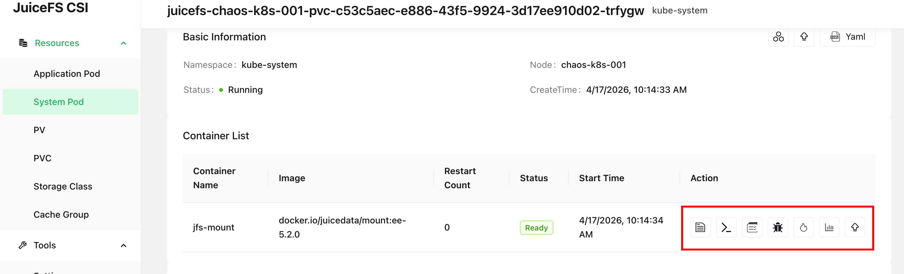
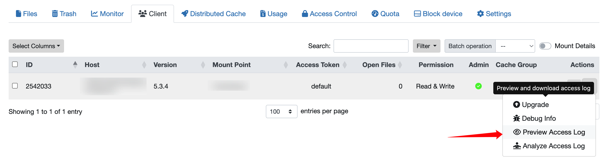

阅读本章以了解如何对 JuiceFS CSI 驱动进行问题排查。不论面临何种错误，排查过程都需要你熟悉 CSI 驱动的各个组件及其作用，因此继续阅读前，请确保你已了解 [JuiceFS CSI 驱动架构](../introduction.md#architecture)。

## 排查工具 {#tools}

### CSI 控制台 {#csi-dashboard}

Dashboard 将 CSI 场景下各种排查操作汇集在网页 UI 上，使用起来非常方便，是我们最推荐的排查方式。请阅读[「CSI Dashboard」](../guide/dashboard.md)。

### kubectl 插件 {#kubectl-plugin}

对于不方便使用 [CSI Dashboard](../guide/dashboard.md) 的环境，JuiceFS 额外提供了一个 kubectl 插件，可以通过命令行在 Kubernetes 集群中进行问题排查。

#### 安装 {#kubectl-jfs-plugin-install}

一键安装脚本适用于 Linux 和 macOS 系统，会根据你的硬件架构自动下载安装最新版插件。

```shell
# 默认安装到 /usr/local/bin
curl -sSL https://d.juicefs.com/kubectl-jfs-install | sh -
```

如果环境中已经安装了 [krew](https://github.com/kubernetes-sigs/krew)，也可以使用 `krew` 来安装：

```shell
kubectl krew update
kubectl krew install jfs
```

安装完毕以后，运行 `kubectl jfs` 就能打印使用说明：

```shell
$ kubectl jfs
tool for juicefs debug in kubernetes

Usage:
  kubectl-jfs [command]

Available Commands:
  accesslog   Collect access logs from the Mount Pod
  completion  Generate the autocompletion script for the specified shell
  debug       Debug a pod, PV, or PVC that is using JuiceFS
  help        Help about any command
  mount       Show the Mount Pod of JuiceFS
  pod         Show pods using a JuiceFS PVC
  pv          Show JuiceFS PVs
  pvc         Show JuiceFS PVCs
  upgrade     Upgrade the Mount Pod smoothly
  warmup      Warm up a subpath of a JuiceFS Mount Pod

Flags:
  -A, --all-namespaces                 If present, list the requested object(s) across all namespaces. The namespace in the current context is ignored, even if specified with --namespace.
      --as string                      Username to impersonate for the operation. The user can be a regular user or a service account in a namespace.
      --as-group stringArray           Group to impersonate for the operation. This flag can be repeated to specify multiple groups.
      --as-uid string                  UID to impersonate for the operation.
      --cache-dir string               Default cache directory (default: "/root/.kube/cache")
      --certificate-authority string   Path to a cert file for the certificate authority
      --client-certificate string      Path to a client certificate file for TLS
      --client-key string              Path to a client key file for TLS
      --cluster string                 The name of the kubeconfig cluster to use
      --context string                 The name of the kubeconfig context to use
      --disable-compression            If true, opt out of response compression for all requests to the server.
  -h, --help                           Help for kubectl-jfs
      --insecure-skip-tls-verify       If true, the server's certificate will not be checked for validity. This will make your HTTPS connections insecure.
      --kubeconfig string              Path to the kubeconfig file to use for CLI requests.
  -m, --mount-namespace string         Namespace of JuiceFS CSI Driver (default: "kube-system")
  -n, --namespace string               If present, the namespace scope for this CLI request
      --request-timeout string         The length of time to wait before giving up on a single server request. Non-zero values should contain a corresponding time unit (e.g., 1s, 2m, or 3h). A value of zero means don't time out requests. (Default: "0")
  -s, --server string                  The address and port of the Kubernetes API server
      --tls-server-name string         Server name to use for server certificate validation. If it is not provided, the hostname used to contact the server is used.
      --token string                   Bearer token for authentication to the API server
      --user string                    The name of the kubeconfig user to use
  -v, --version                        Version for kubectl-jfs
```

#### 使用 {#kubectl-jfs-plugin-usage}

```shell
# 快速列出所有使用 JuiceFS PV 的应用 pod
$ kubectl jfs po
NAME                       NAMESPACE  MOUNT PODS                                             STATUS             AGE
cn-wrong-7b7577678d-7j8dc  default    juicefs-cn-hangzhou.10.0.1.84-ce-static-handle-qhuuvh  CrashLoopBackOff   10d
image-wrong                default    juicefs-cn-hangzhou.10.0.1.84-ce-static-handle-qhuuvh  ImagePullBackOff   10d
multi-mount-pod            default    juicefs-cn-hangzhou.10.0.1.84-ce-another-ilkzmy,       Running            11d
                                      juicefs-cn-hangzhou.10.0.1.84-ce-static-handle-qhuuvh
normal-664f8b8846-ntfzk    default    juicefs-cn-hangzhou.10.0.1.84-ce-static-handle-qhuuvh  Running            11d
pending                    default    <none>                                                 Pending            11d
res-err                    default    <none>                                                 Pending            11d
terminating                default    <none>                                                 Terminating        10d
wrong                      default    juicefs-cn-hangzhou.10.0.1.84-wrong-nvblwj             ContainerCreating  10d

# 快速列出所有 JuiceFS Mount Pod。默认 Mount Pod 在 kube-system 下，可以用 -m 参数指定 Mount Pod 所在命名空间
$ kubectl jfs mount
NAME                                                   NAMESPACE    APP PODS                            STATUS   CSI NODE                AGE
juicefs-cn-hangzhou.10.0.1.84-ce-another-ilkzmy        kube-system  default/multi-mount-pod             Running  juicefs-csi-node-v6pq5  11d
juicefs-cn-hangzhou.10.0.1.84-ce-static-handle-qhuuvh  kube-system  default/cn-wrong-7b7577678d-7j8dc,  Running  juicefs-csi-node-v6pq5  11d
                                                                    default/image-wrong,
                                                                    default/multi-mount-pod,
                                                                    default/normal-664f8b8846-ntfzk
juicefs-cn-hangzhou.10.0.1.84-wrong-nvblwj             kube-system  default/wrong                       Running  juicefs-csi-node-v6pq5  10d

# 快速列出所有 JuiceFS PV / PVC
$ kubectl jfs pv
$ kubectl jfs pvc
```

对于有问题的应用 Pod、PVC、PV，还可以使用以下功能进行初步诊断，JuiceFS plugin 会提示下一步的排查方向：

```shell
# 诊断应用 pod
$ kubectl jfs debug pod wrong
Name:        wrong
Namespace:   default
Start Time:  Mon, 24 Jun 2024 15:15:52 +0800
Status:      ContainerCreating
Node:
  Name:    cn-hangzhou.10.0.1.84
  Status:  Ready
CSI Node:
  Name:       juicefs-csi-node-v6pq5
  Namespace:  kube-system
  Status:     Ready
PVCs:
  Name   Status  PersistentVolume
  ----   ------  ----------------
  wrong  Bound   wrong
Mount Pods:
  Name                                        Namespace    Status
  ----                                        ---------    ------
  juicefs-cn-hangzhou.10.0.1.84-wrong-nvblwj  kube-system  Error
Failed Reason:
  Mount pod [juicefs-cn-hangzhou.10.0.1.84-wrong-nvblwj] is not ready, please check its log.

# 诊断 JuiceFS PVC
$ kubectl jfs debug pvc <pvcName>
$ kubectl jfs debug pv <pvName>
```

另外，还提供了快速获取 Mount Pod 访问日志以及快速预热缓存的功能：

```shell
# 获取 Mount Pod 访问日志：kubectl jfs accesslog <pod-name> -m <mount-namespace>
$ kubectl jfs accesslog juicefs-cn-hangzhou.10.0.1.84-ce-static-handle-qhuuvh
2024.07.05 14:09:57.392403 [uid:0,gid:0,pid:201] open (9223372032559808513): OK [fh:25] <0.000054>
#

# 预热缓存：kubectl jfs warmup <pod-name> <subpath> -m <mount-namespace>
$ kubectl jfs warmup juicefs-cn-hangzhou.10.0.1.84-ce-static-handle-qhuuvh
2024/07/05 14:10:52.628976 juicefs[207] <INFO>: Successfully warmed up 2 files (1090721713 bytes) [warmup.go:226]
```

### 诊断脚本（不推荐） {#csi-doctor}

:::note
由于已经有功能更为强大的 [kubectl 插件](#kubectl-plugin)，本小节介绍的脚本已经不再推荐使用。
:::

推荐使用诊断脚本 [`csi-doctor.sh`](https://github.com/juicedata/juicefs-csi-driver/blob/master/scripts/csi-doctor.sh) 来收集日志及相关信息，本章所介绍的排查手段中，大部分采集信息的命令，都在脚本中进行了集成，使用起来更为便捷。

在集群中任意一台可以执行 `kubectl` 的节点上，安装诊断脚本：

```shell
wget https://raw.githubusercontent.com/juicedata/juicefs-csi-driver/master/scripts/csi-doctor.sh
chmod a+x csi-doctor.sh
```

如果在你的运行环境中，kubectl 被重命名（比方说需要管理多个 Kubernetes 集群时，常常用不同 alias 来调用不同集群的 kubectl），或者并未放在 `PATH` 下，你也可以方便地修改脚步，将 `$kbctl` 变量替换为实际需要运行的 kubectl：

```shell
# 假设面对两个不同集群，kubectl 分别被别名为 kubectl_1 / kubectl_2
KBCTL=kubectl_1 ./csi-doctor.sh debug my-app-pod -n default
KBCTL=kubectl_2 ./csi-doctor.sh debug my-app-pod -n default
```

诊断脚本中最为常用的功能，就是方便地获取 Mount Pod 相关信息。假设应用 Pod 为 `default` 命名空间下的 `my-app-pod`：

```shell
# 获取指定应用 Pod 所用的 Mount Pod
$ ./csi-doctor.sh get-mount my-app-pod
kube-system juicefs-ubuntu-node-2-pvc-b94bd312-f5f7-4f46-afdb-2d1bc20371b5-whrrym

# 获取使用指定 Mount Pod 的所有应用 Pod
$ ./csi-doctor.sh get-app juicefs-ubuntu-node-2-pvc-b94bd312-f5f7-4f46-afdb-2d1bc20371b5-whrrym
default my-app-pod
```

在你熟读了[「基础问题排查原则」](#basic-principles)后，还可以使用 `csi-doctor.sh debug` 命令，来快速收集组件版本和日志信息。各类常见问题，均能在命令输出中找到排查线索：

```shell
./csi-doctor.sh debug my-app-pod -n default
```

运行上方命令，检查打印出来的丰富排查信息，用下方介绍的排查原则来进行诊断。同时，该命令控制输出内容的规模，你可以根据所使用的 JuiceFS 版本，方便地拷贝并发送给开源社区，或者 Juicedata 团队，进行后续排查。

## 基础问题排查原则 {#basic-principles}

在 JuiceFS CSI 驱动中，常见错误有两种：一种是 PV 创建失败，属于 CSI Controller 的职责；另一种是应用 Pod 创建失败，属于 CSI Node 和 Mount Pod 的职责。

### PV 创建失败

在[「动态配置」](../guide/pv.md#dynamic-provisioning)下，PVC 创建之后，CSI Controller 会同时配合 kubelet 自动创建 PV。在此期间，CSI Controller 会在 JuiceFS 文件系统中创建以 PV ID 为名的子目录（如果不希望以 PV ID 命名子目录，可以通过 [`pathPattern`](../guide/configurations.md#using-path-pattern) 来调整）。

#### 查看 PVC 事件

一般而言，如果创建子目录失败，CSI Controller 会将错误结果存在 PVC 事件中：

```shell {7}
$ kubectl describe pvc dynamic-ce
...
Events:
  Type     Reason       Age                From               Message
  ----     ------       ----               ----               -------
  Normal   Scheduled    27s                default-scheduler  Successfully assigned default/juicefs-app to cluster-0003
  Warning  FailedMount  11s (x6 over 27s)  kubelet            MountVolume.SetUp failed for volume "juicefs-pv" : rpc error: code = Internal desc = Could not mount juicefs: juicefs auth error: Failed to fetch configuration for volume 'juicefs-pv', the token or volume is invalid.
```

#### 检查 CSI Controller {#check-csi-controller}

若 PVC 事件中并无错误信息，我们需要检查 CSI Controller 容器是否存活，以及是否存在异常日志：

```shell
# 检查 CSI Controller 是否存活
$ kubectl -n kube-system get po -l app=juicefs-csi-controller
NAME                       READY   STATUS    RESTARTS   AGE
juicefs-csi-controller-0   3/3     Running   0          8d

# 检查 CSI Controller 日志是否存在异常信息
$ kubectl -n kube-system logs juicefs-csi-controller-0 juicefs-plugin
```

### 应用 Pod 创建失败

在 CSI 驱动的架构下，JuiceFS 客户端运行在 Mount Pod 中。因此每一个应用 Pod 都伴随着一个对应的 Mount Pod。

CSI Node 会负责创建 Mount Pod 并在其中挂载 JuiceFS 文件系统，最终将挂载点 bind 到应用 Pod 内。因此如果应用 Pod 创建失败，既可能是 CSI Node 的问题，也可能是 Mount Pod 的问题，需要逐一排查。

#### 查看应用 Pod 事件

若挂载期间有报错，报错信息往往出现在应用 Pod 事件中：

```shell {7}
$ kubectl describe po dynamic-ce-1
...
Events:
  Type     Reason       Age               From               Message
  ----     ------       ----              ----               -------
  Normal   Scheduled    53s               default-scheduler  Successfully assigned default/ce-static-1 to ubuntu-node-2
  Warning  FailedMount  4s (x3 over 37s)  kubelet            MountVolume.SetUp failed for volume "ce-static" : rpc error: code = Internal desc = Could not mount juicefs: juicefs status 16s timed out
```

通过应用 Pod 事件确认创建失败的原因与 JuiceFS 有关以后，可以按照下面的步骤逐一排查。

#### 检查 CSI Node {#check-csi-node}

首先，我们需要检查应用 Pod 所在节点的 CSI Node 容器是否存活，以及是否存在异常日志：

```shell
# 提前将应用 pod 信息存为环境变量
APP_NS=default  # 应用所在的 Kubernetes 命名空间
APP_POD_NAME=example-app-xxx-xxx

# 通过应用 pod 找到节点名
NODE_NAME=$(kubectl -n $APP_NS get po $APP_POD_NAME -o jsonpath='{.spec.nodeName}')

# 打印出所有 CSI Node pods
kubectl -n kube-system get po -l app=juicefs-csi-node

# 打印应用 pod 所在节点的 CSI Node pod
kubectl -n kube-system get po -l app=juicefs-csi-node --field-selector spec.nodeName=$NODE_NAME

# 将下方 $CSI_NODE_POD 替换为上一条命令获取到的 CSI Node pod 名称，检查日志，确认有无异常
kubectl -n kube-system logs $CSI_NODE_POD -c juicefs-plugin
```

或者直接用一行命令打印出应用 Pod 对应的 CSI Node Pod 日志（需要设置好 `APP_NS` 和 `APP_POD_NAME` 环境变量）：

```shell
kubectl -n kube-system logs $(kubectl -n kube-system get po -o jsonpath='{..metadata.name}' -l app=juicefs-csi-node --field-selector spec.nodeName=$(kubectl get po -o jsonpath='{.spec.nodeName}' -n $APP_NS $APP_POD_NAME)) -c juicefs-plugin
```

#### 检查 Mount Pod {#check-mount-pod}

如果 CSI Node 一切正常，则需要检查 Mount Pod 是否存在异常。

你可以方便地通过 [`kubectl jfs`](#kubectl-plugin) 插件来快速定位到应用 Pod 对应的 Mount Pod：

```shell
$ kubectl jfs po --all-namespaces
NAME               NAMESPACE    MOUNT PODS               STATUS   AGE
juicefs-app        default      juicefs-k8s-001-pvc-xxx  Running  6s
```

根据上方打印出来的 Mount Pod 名称，用 `kubectl describe` 和 `kubectl logs --all-containers` 命令查看容器事件和日志，进行深入排查。

如果你需要脱离脚本、直接用 kubectl 进行排查，我们也准备了一系列快捷命令，帮你方便地获取信息：

```shell
# 通过 App Pod 反查 Mount Pod，可以通过下方命令先提取 Pod UID
# 注意替换最后的 juicefs-app 为实际应用 Pod 名称
k get po -n default -ojsonpath='{..metadata.uid}{"\n"}' juicefs-app
# 复制上一条命令打印的 UID，然后在结果中搜索，UID 匹配的记录，就是该应用 Pod 所关联的 Mount Pod
kubectl get pods -o=custom-columns=NAME:.metadata.name,ANNOTATIONS:.metadata.annotations -l app.kubernetes.io/name=juicefs-mount -n kube-system|grep UID

# 定位到 Mount Pod 以后，查看 Events 和日志
kubectl -n kube-system describe [Mount Pod Name]
kubectl -n kube-system logs --all-containers [Mount Pod Name]

# 如果有需要，还可以直接用下方命令打印所有 Mount Pod 错误日志
kubectl -n kube-system logs -l app.kubernetes.io/name=juicefs-mount | grep -v "<WARNING>" | grep -v "<INFO>"
```

#### 排查 Mount Pod {#debug-mount-pod}

一个处于 `CrashLoopBackOff` 状态的容器是无法进行交互式排查的，此时可以使用 `kubectl debug` 命令，创建一个可交互排查的副本：

```shell
kubectl -n <namespace> debug <mount-pod> -it  --copy-to=jfs-mount-debug --container=jfs-mount --image=<mount-image> -- bash
```

在上方示范中，`<mount-image>` 设置为该 Mount Pod 的镜像，这样一来，`debug` 命令会创建一个一模一样的专供交互式排查的容器，你可以在这个环境中尝试复现、排查问题。

排查完毕以后，记得清理环境：

```shell
kubectl -n <namespace> delete po jfs-mount-debug
```

### 性能问题

如果使用 CSI 驱动时，各组件均无异常，但却遇到了性能问题，则需要用到本节介绍的排查方法。

#### 查看实时统计数据以及访问日志 {#accesslog-and-stats}

JuiceFS 文件系统的根目录下有一些提供特殊功能的隐藏文件，假设挂载点为 `/jfs`：

* `cat /jfs/.accesslog` 实时打印文件系统的访问日志，用于分析应用程序对文件系统的访问模式，详见[「访问日志（社区版）」](https://juicefs.com/docs/zh/community/fault_diagnosis_and_analysis#access-log)和[「访问日志（云服务）」](https://juicefs.com/docs/zh/cloud/administration/fault_diagnosis_and_analysis#oplog)
* `juicefs stats -l 1 /jfs` 打印文件系统的实时统计数据，当 JuiceFS 性能不佳时，可以通过实时统计数据判断问题所在。详见[「实时统计数据（社区版）」](https://juicefs.com/docs/zh/community/performance_evaluation_guide/#juicefs-stats)和[「实时统计数据（云服务）」](https://juicefs.com/docs/zh/cloud/administration/fault_diagnosis_and_analysis#stats)

如果已经安装了 CSI Dashboard，则可直接通过网页功能采集日志和 `stats` 信息：



对于 JuiceFS 企业版用户，如果并未安装 CSI Dashboard，也可以直接通过控制台进入文件系统的客户端列表页，点击最右侧对应的按钮直接采集和下载日志：



如果无法通过网页功能完成上述功能，还可以使用 [`kubectl jfs accesslog`](#kubectl-plugin) 命令来提取访问日志。

JuiceFS 挂载点的性能是一个单独的话题，请额外参考以下内容：

* CSI 驱动问题排查案例：[读性能差](./troubleshooting-cases.md#bad-read-performance)
* 访问日志：[社区版](https://juicefs.com/docs/zh/community/fault_diagnosis_and_analysis#access-log)、[云服务](https://juicefs.com/docs/zh/cloud/administration/fault_diagnosis_and_analysis#oplog)
* 实时统计数据：[社区版](https://juicefs.com/docs/zh/community/performance_evaluation_guide/#juicefs-stats)、[云服务](https://juicefs.com/docs/zh/cloud/administration/fault_diagnosis_and_analysis#stats)
