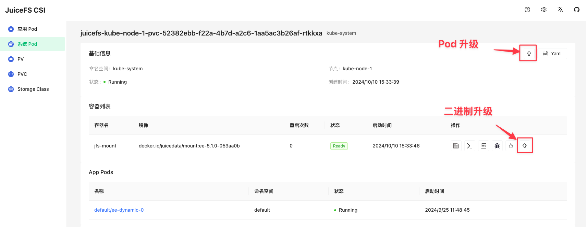

升级 JuiceFS 客户端（也就是 Mount 镜像），以享受到最新特性和问题修复，具体请参考社区版和企业版的发布说明：

* [社区版客户端发布说明](https://github.com/juicedata/juicefs/releases)
* [企业版客户端发布说明](https://juicefs.com/docs/zh/cloud/release)

JuiceFS CSI 是解耦架构，驱动自身的组件和 Mount Pod（或者 Sidecar）完全独立运行，因此升级 Mount 镜像包含 2 个阶段：

1. 修改 CSI 驱动的 ConfigMap 配置，更新 Mount 镜像。对于尚不支持 ConfigMap 的旧版 CSI 驱动，则需要更新环境变量、重启 CSI 驱动组件。
1. 更新集群内的 JuiceFS 挂载点，这一步根据场景和版本不同，支持平滑升级和重启应用两种升级方式：
   - [平滑升级](#smooth-upgrade)：仅适用于 Mount Pod 场景，配合 CSI 驱动 v0.25.0 及以上版本，并且对当前运行的 JuiceFS 客户端版本有一定要求：社区版 1.2.1 及以上，企业版 5.1.0 及以上。这种方法可以实现不重建应用 Pod 升级已经创建好的 Mount Pod，是我们最推荐的升级方式
   - [重启应用升级](#downtime-upgrade)：这种方法必须重建应用 Pod 才能升级 Mount 镜像，适用于旧版 CSI 驱动。并且如果你的集群使用 Sidecar 模式挂载 JuiceFS，这种模式并不支持平滑升级，必须用重建应用 Pod 的方式来升级

## 阶段一：修改配置、更新 Mount 镜像 {#update-mount-image}

首先确定希望升级的版本，在 [Docker Hub](https://hub.docker.com/r/juicedata/mount/tags) 找到新版 Mount Pod 容器镜像的标签，然后根据环境情况选择以下任意一种合适的方式来更新配置。

### 通过 CSI Dashboard 更新 Mount 镜像 {#update-mount-image-csi-dashboard}

如果集群内已经安装 [CSI Dashboard](../guide/dashboard.md)，那么直接通过 Web UI 更新配置，是最为便捷的方式。

点击左侧边栏「工具（Tools）」→「设置（Setting）」，会进入图形化表单编辑 ConfigMap 页面，右上角点击编辑（Edit），就能直接修改社区版或者云服务版 Mount 镜像：


修改保存以后，阶段一的修改配置工作便已经完成。如果你正在运行的 JuiceFS 客户端版本足够新（社区版 1.2.1 及以上，企业版 5.1.0 及以上），那么直接点击右上角「立即生效（Apply）」就能发起平滑升级了，读者可以不必继续阅读下方的「阶段二」部分，直接在 CSI Dashboard 通过网页操作即可。

如果集群内正在运行的客户端版本尚不支持平滑升级，请继续阅读下方「阶段二」板块，选取合适的方式更新挂载点。

### 通过 ConfigMap 更新 Mount 镜像 {#update-mount-image-configmap}

如果集群中已经安装 CSI Dashboard，请优先使用上一小节介绍的方式，通过网页 UI 操作，更便捷且不易出错。如果无条件使用 CSI Dashboard，可以运行类似下方命令，手动编辑 ConfigMap：

```shell
# 命名空间请根据实际情况修改
kubectl -n kube-system edit cm juicefs-csi-driver-config
```

编辑 YAML 中的对应字段，编辑文本的时候，请额外注意 YAML 层级关系，缩进未对齐会导致报错。

```YAML {9-10}
apiVersion: v1
kind: ConfigMap
metadata:
  name: juicefs-csi-driver-config
  namespace: kube-system
data:
  config.yaml: |
    mountPodPatch:
      - eeMountImage: "juicedata/mount:ee-5.3.8-fc708b6"
        ceMountImage: "juicedata/mount:ce-v1.3.1"
```

保存退出后，保险起见，查看 CSI Node 的日志来确保 ConfigMap 中没有 YAML 格式错误，或者拼写错误：

```shell
# 命名空间请根据实际情况修改
kubectl -n kube-system logs juicefs-csi-node-xxx --tail 100 -f
```

ConfigMap 重新加载，会显示类似下方日志：

```
"config file updated, reload config" logger="config" config file="/etc/config/config.yaml"
```

如果加载出错，则会出现类似以下日志，此时需要重新检查 ConfigMap，仔细对照我们的 [YAML 示范](../guide/configurations.md#configmap)，核对是否有拼写错误或者 YAML 格式错误。

```
"fail to reload config" err="error converting YAML to JSON: yaml: line 2: mapping values are not allowed in this context" logger="config"
```

### 通过环境变量更新 Mount 镜像（不推荐） {#update-mount-image-csi-env}

CSI 驱动通过 `JUICEFS_CE_MOUNT_IMAGE` 和 `JUICEFS_EE_MOUNT_IMAGE` 这两个环境变量来控制默认的 Mount 镜像，在 ConfigMap 或者其他配置缺失的时候，环境变量会作为缺省默认值发挥作用，因此对于尚不支持 ConfigMap 的旧版 CSI 驱动（v0.24 之前的版本），需要更新 CSI 驱动中的这两个环境变量，并且重启 CSI Node 和 CSI Controller 这两个组件。

:::tip
覆盖 Mount 镜像后，注意：

* 已有的 Mount Pod 不会受影响，需要随着应用 Pod 滚动升级或者删除 Mount Pod 重建，才会采用新的镜像
* 每次 CSI 驱动发布新版的时候，都会例行用当前最新稳定版 Mount 镜像作为这个环境变量的值，因此[升级 CSI 驱动](./upgrade-csi-driver.md)时，默认会连带升级到 Mount 镜像的最新稳定版。但如果你在 Values 里覆盖了 Mount 镜像，那么这就是固定的配置了，继续升级 CSI 驱动，也不会引入连带的 Mount 镜像升级

:::

如果你用 Helm 安装 CSI 驱动，修改环境变量非常简单，在 Values 中定义即可：

```yaml name="values-mycluster.yaml"
defaultMountImage:
  # 社区版
  ce: "juicedata/mount:ce-v1.3.1"
  # 企业版
  ee: "juicedata/mount:ee-5.3.8-fc708b6"
```

更新完毕以后，用 Helm 更新安装，这个字段会被渲染写入 CSI Node 和 CSI Controller 的定义中，并直接重启：

```shell
helm upgrade juicefs-csi-driver juicefs/juicefs-csi-driver -n kube-system -f ./values-mycluster.yaml
```

如果 CSI 驱动并不是用 Helm 安装，而是 Kubectl 直接安装，那么需要手动更新 CSI 驱动的组件中设置环境变量：

```shell
# 社区版
kubectl -n kube-system set env daemonset/juicefs-csi-node -c juicefs-plugin JUICEFS_CE_MOUNT_IMAGE=juicedata/mount:ce-v1.3.1
kubectl -n kube-system set env statefulset/juicefs-csi-controller -c juicefs-plugin JUICEFS_CE_MOUNT_IMAGE=juicedata/mount:ce-v1.3.1

# 企业版
kubectl -n kube-system set env daemonset/juicefs-csi-node -c juicefs-plugin JUICEFS_EE_MOUNT_IMAGE=juicedata/mount:ee-5.3.8-fc708b6
kubectl -n kube-system set env statefulset/juicefs-csi-controller -c juicefs-plugin JUICEFS_EE_MOUNT_IMAGE=juicedata/mount:ee-5.3.8-fc708b6
```

修改完毕以后，别忘了将这些配置同时加入 `k8s.yaml`，避免下次安装时配置丢失。正因为 Kubectl 的安装方式管理配置不方便，所以建议在生产集群采用 [Helm 安装方式](../getting_started.md#helm)，建议安排[迁移到 Helm](./upgrade-csi-driver.md#migrate-to-helm)。

### 在 StorageClass 中更新 Mount 镜像（不推荐） {#update-mount-image-sc}

从 v0.24 开始，CSI 驱动支持在 [ConfigMap](#update-mount-image-configmap) 中定制 Mount Pod 镜像，将所有相关配置汇集于一处，非常便捷，因此本小节所介绍的方式已经不再推荐使用。

CSI 驱动允许在 StorageClass 中覆盖配置，如果你需要为不同应用配置不同的 Mount Pod 镜像，那就需要创建多个 StorageClass，为每个 StorageClass 单独指定所使用的 Mount Pod 镜像。

```yaml {11}
apiVersion: storage.k8s.io/v1
kind: StorageClass
metadata:
  name: juicefs-sc
provisioner: csi.juicefs.com
parameters:
  csi.storage.k8s.io/provisioner-secret-name: juicefs-secret
  csi.storage.k8s.io/provisioner-secret-namespace: default
  csi.storage.k8s.io/node-publish-secret-name: juicefs-secret
  csi.storage.k8s.io/node-publish-secret-namespace: default
  juicefs/mount-image: juicedata/mount:ce-v1.3.1
```

配置完成后，在不同的 PVC 中，通过 `storageClassName` 指定不同的 StorageClass，便能为不同的应用设置不同的 Mount Pod 镜像了。

### 在 PV 定义中更新 Mount 镜像（不推荐）

从 v0.24 开始，CSI 驱动支持在 [ConfigMap](#update-mount-image-configmap) 中定制 Mount Pod 镜像，将所有相关配置汇集于一处，非常便捷，因此本小节所介绍的方式已经不再推荐使用。

对于[「静态配置」](../guide/pv.md#static-provisioning)用法，可以在 PV 定义中配置 Mount Pod 镜像：

```yaml {22}
apiVersion: v1
kind: PersistentVolume
metadata:
  name: juicefs-pv
  labels:
    juicefs-name: ten-pb-fs
spec:
  capacity:
    storage: 10Pi
  volumeMode: Filesystem
  accessModes:
    - ReadWriteMany
  persistentVolumeReclaimPolicy: Retain
  csi:
    driver: csi.juicefs.com
    volumeHandle: juicefs-pv
    fsType: juicefs
    nodePublishSecretRef:
      name: juicefs-secret
      namespace: default
    volumeAttributes:
      juicefs/mount-image: juicedata/mount:ce-v1.3.1
```

## 阶段二：升级挂载点 {#upgrade-mount-point}

### 平滑升级 Mount Pod <VersionAdd>0.25.0</VersionAdd> {#smooth-upgrade}

CSI 驱动 0.25.0 及以上版本支持 Mount Pod 的平滑升级（Sidecar 和进程挂载模式不支持该特性），即在业务不停服的情况下升级 Mount Pod。由于平滑升级实际上利用了 JuiceFS 客户端自身的平滑重启能力，因此该特性还额外允许 Mount Pod 平滑重启与恢复，详见[自动恢复](../guide/configurations.md#automatic-mount-point-recovery)。

操作平滑升级之前，务必确保 Mount Pod 的 YAML 定义中，**不允许**在 `preStop` 中配置了 `umount`，例如：

```yaml
# 如果含有类似的配置，则无法进行平滑升级
preStop:
  exec:
    command:
    - sh
    - -c
    - +e
    - umount -l ${MOUNT_POINT}; rmdir ${MOUNT_POINT}; exit 0
```

平滑升级要求 Mount Pod 的 `preStop` 不可配置 `umount ${MOUNT_POINT}` 操作，请务必确保 [CSI ConfigMap](./../guide/configurations.md#configmap) 中未配置 `umount`。对于已经配置好 `umount` 的集群，必须先修改配置、去除相关 `preStop` 代码，用重建业务 Pod 的方式滚动更新完毕，后续才支持平滑升级功能。

平滑升级 Mount Pod 有两种升级方式：「Pod 重建升级」和「二进制升级」。区别在于：

- Pod 重建升级：Mount Pod 会重建，Mount Pod 的最低版本要求为 1.2.1（社区版）或 5.1.0（企业版）；
- 二进制升级：Mount Pod 不重建，只升级其中的二进制，不可变更其它配置，且升级完成后在 Mount Pod 的 YAML 中看到的依然是原来的镜像。Mount Pod 的最低版本要求为 1.2.0（社区版）或 5.0.0（企业版）。

两种升级方式均为平滑升级，业务可不停服，请根据实际情况选择。

平滑升级可以在 [CSI 控制台](./troubleshooting.md#csi-dashboard)或者 [JuiceFS kubectl 插件](./troubleshooting.md#kubectl-plugin)中触发，根据你的场景在下方小节中选择合适的方式。

#### CSI 控制台中触发平滑升级 {#smooth-upgrade-via-csi-dashboard}

CSI 控制台不仅支持图形化管理 ConfigMap，相比纯文本编辑 YAML 方便非常多、不容易出错。并且保存配置以后，可以直接通过 CSI 控制台触发平滑升级。


在设置页面直接触发升级，会默认采用 Mount Pod 重建的升级形式。如果需要二进制更新的方式升级，那么先在 Mount Pod 的详情页，有两个升级按钮，分别是「Pod 重建升级」和「二进制升级」：



点击对应功能按钮，即可触发 Mount Pod 的平滑升级。

#### Kubectl 插件中触发平滑升级 {#smooth-upgrade-via-kubectl-plugin}

Kubectl 插件的最低版本要求为 0.3.0，如果版本过低，请重新[安装](./troubleshooting.md#kubectl-plugin)。

```shell
# Mount Pod 重建升级
kubectl jfs upgrade juicefs-kube-node-1-pvc-52382ebb-f22a-4b7d-a2c6-1aa5ac3b26af-ebngyg --recreate

# 二进制升级
kubectl jfs upgrade juicefs-kube-node-1-pvc-52382ebb-f22a-4b7d-a2c6-1aa5ac3b26af-ebngyg
```

### 重启业务 Pod 触发挂载点升级 {#downtime-upgrade}

如果你的使用环境并不满足上方[「平滑升级」](#smooth-upgrade)的前提，或者正在使用 Sidecar 方式挂载，那么需要重建业务 Pod 来触发 Mount Pod 或者 Sidecar 的升级。

具体操作也很简单：挂载了 JuiceFS PV 的业务 Pod，都进行滚动重建（注意并不是容器重启），与之关联的 Mount Pod（或者 Sidecar）就会伴随重建。

由于业务 Pod 需要重启、中断服务，请妥善安排运维时间窗口。

### 重建 Mount Pod 触发挂载点升级（不推荐） {#downtime-upgrade-delete-mount-pod}

:::warning
如果打算用直接删除重建 Mount Pod 的方式来触发升级，请务必确认 CSI 驱动版本至少为 v0.24，否则就算删除 Mount Pod，重建后的 Mount Pod 依然会用旧版镜像创建，达不到升级的目的。
:::

如果因故无法享受平滑升级，同时业务 Pod 也不能轻易重建，那么在满足特定条件的情况下，可以直接删除重建 Mount Pod，来触发使用新的镜像升级 Mount Pod。该操作可能会导致挂载点短暂无法访问。

操作之前请确认：

* 业务 Pod 中配置了[「挂载点自动恢复」](../guide/configurations.md#automatic-mount-point-recovery)，否则 Mount Pod 重建后，业务 Pod 内的挂载点会永久丢失；
* 接上一点，如果业务 Pod 并未配置 `mountPropagation`，但已经在使用 CSI 驱动 v0.25 及以上版本，且配合 1.2.1（社区版）或 5.1.0（企业版）及以上版本的 JuiceFS 客户端，那么在 CSI Node 正常运行的前提下，就算没有 `mountPropagation`，理论上重建 Mount Pod，挂载点也能自动恢复服务。但是由于该方式风险较大，生产环境中不建议这么做。

### 进程挂载模式升级 JuiceFS 客户端（不推荐）

:::warning
强烈建议升级 JuiceFS CSI 驱动至 v0.10 及以后版本，此处介绍的客户端升级方法仅作为展示用途，不建议在生产环境中长期使用。
:::

如果你在使用进程挂载模式，或者仅仅是难以升级到 v0.10 之后的版本，但又需要使用新版 JuiceFS 进行挂载，那么也可以通过以下方法，在不升级 CSI 驱动的前提下，单独升级 CSI Node Service 中的 JuiceFS 客户端。

由于这是在 CSI Node Service 容器中临时升级 JuiceFS 客户端，完全是临时解决方案，可想而知，如果 CSI Node Service 的 Pod 发生了重建，又或是新增了节点，都需要再次执行该升级过程。

1. 使用以下脚本将 `juicefs-csi-node` Pod 中的 `juicefs` 客户端替换为新版：

   ```bash
   #!/bin/bash

   # 运行前请替换为正确路径
   KUBECTL=/path/to/kubectl
   JUICEFS_BIN=/path/to/new/juicefs

   $KUBECTL -n kube-system get pods | grep juicefs-csi-node | awk '{print $1}' | \
       xargs -L 1 -P 10 -I'{}' \
       $KUBECTL -n kube-system cp $JUICEFS_BIN '{}':/tmp/juicefs -c juicefs-plugin

   $KUBECTL -n kube-system get pods | grep juicefs-csi-node | awk '{print $1}' | \
       xargs -L 1 -P 10 -I'{}' \
       $KUBECTL -n kube-system exec -i '{}' -c juicefs-plugin -- \
       chmod a+x /tmp/juicefs && mv /tmp/juicefs /bin/juicefs
   ```

2. 将应用逐个重新启动，或 kill 掉已存在的 Pod。
