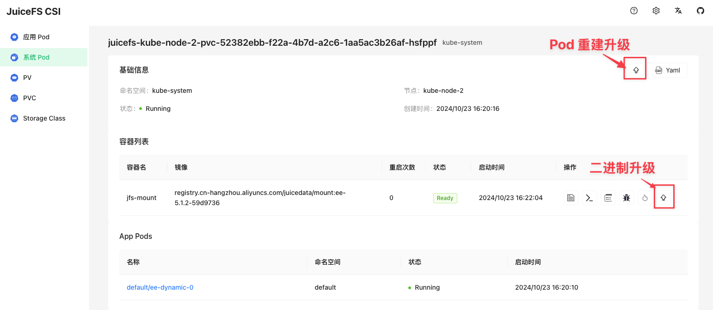

我们推荐你定期升级 JuiceFS 客户端，以享受到最新特性和问题修复，请参考[「社区版客户端发布说明」](https://github.com/juicedata/juicefs/releases)或[「云服务客户端发布说明」](https://juicefs.com/docs/zh/cloud/release)了解更多版本信息。

事实上，[「升级 JuiceFS CSI 驱动」](./upgrade-csi-driver.md)也会带来客户端更新，这是因为每次 CSI 驱动更新发版，都会例行在配置中采用最新版的 [Mount Pod 镜像](../guide/custom-image.md#ce-ee-separation)，但如果你希望提前使用最新版的 Mount Pod，可以用本章介绍的方法单独升级 JuiceFS 客户端。

## 升级 Mount Pod 容器镜像 {#upgrade-mount-pod-image}

目前有两种升级 Mount Pod 容器镜像的方法：

- [平滑升级 Mount Pod](#smooth-upgrade)：这种方法可以实现不重建应用 pod 升级 Mount Pod
- [修改 Mount Pod 镜像配置](../guide/custom-image.md#overwrite-mount-pod-image)：这种方法必须重建应用 pod 才能升级 Mount Pod

参考[文档](../guide/custom-image.md#ce-ee-separation)在 Docker Hub 找到新版 Mount Pod 容器镜像的标签，然后根据你使用的 CSI 驱动版本和运行模式，选择不同的升级方法：

|                               | 0.25.0 及以上版本       | 0.25.0 以前的版本       |
|:-----------------------------:|:-----------------------:|:-----------------------:|
| **容器挂载（Mount Pod）模式** | 平滑升级 Mount Pod      | 修改 Mount Pod 镜像配置 |
| **Sidecar 模式**              | 修改 Mount Pod 镜像配置 | 修改 Mount Pod 镜像配置 |

注意，覆盖 Mount Pod 容器镜像后，JuiceFS 客户端将不会随着升级 CSI 驱动而升级。

### 平滑升级 Mount Pod <VersionAdd>0.25.0</VersionAdd> {#smooth-upgrade}

JuiceFS CSI 驱动 0.25.0 及以上版本支持 Mount Pod 的平滑升级，即在业务不停服的情况下升级 Mount Pod。

:::tip
平滑升级仅适用于容器挂载（Mount Pod）模式
:::

:::warning 平滑升级要求
平滑升级要求 Mount Pod 的 `preStop` 不可配置 `umount ${MOUNT_POINT}` 操作，请务必确保 [CSI ConfigMap](./../guide/configurations.md#configmap) 中未配置 `umount`。
:::

平滑升级 Mount Pod 有两种升级方式：「Pod 升级」和「二进制升级」。区别在于：

- Pod 升级：Mount Pod 会重建，Mount Pod 的最低版本要求为 1.2.1（社区版）或 5.1.0（企业版）；
- 二进制升级：Mount Pod 不重建，只升级其中的二进制，Mount Pod 的最低版本要求为 1.2.0（社区版）或 5.0.0（企业版）。

两种升级方式均为平滑升级，业务可不停服，请根据实际情况选择。

平滑升级只可以在 [CSI 控制台](./troubleshooting.md#csi-dashboard)或者 [JuiceFS kubectl 插件](./troubleshooting.md#kubectl-plugin)中触发。

#### CSI 控制台中触发平滑升级 {#smooth-upgrade-via-csi-dashboard}

1. 在 CSI 控制台中，点击右上角的「配置」按钮，更新并保存 Mount Pod 需要升级的新镜像版本：

   :::tip
   相比手动修改 [CSI ConfigMap 配置](./../guide/configurations.md#configmap)，在 CSI 控制台上修改会立即生效。
   :::

   

2. 在 Mount Pod 的详情页，有两个升级按钮，分别是「Pod 升级」和「二进制升级」：

   

3. 点击升级按钮，即可触发 Mount Pod 的平滑升级：

   

#### kubectl 插件中触发平滑升级 {#smooth-upgrade-via-kubectl-plugin}

:::tip
JuiceFS kubectl 插件的最低版本要求为 0.3.0
:::

1. 使用 kubectl 在 [CSI ConfigMap 配置](./../guide/configurations.md#configmap)中更新 Mount Pod 所需要升级的镜像版本：

   ```yaml
   apiVersion: v1
   kind: ConfigMap
   data:
      config.yaml: |
         mountPodPatch:
            - ceMountImage: juicedata/mount:ce-v1.2.0
              eeMountImage: juicedata/mount:ee-5.1.1-ca439c2
   ```

2. 使用 JuiceFS kubectl 插件触发 Mount Pod 的平滑升级：

   ```bash
   # Pod 升级
   kubectl jfs upgrade juicefs-kube-node-1-pvc-52382ebb-f22a-4b7d-a2c6-1aa5ac3b26af-ebngyg --recreate

   # 二进制升级
   kubectl jfs upgrade juicefs-kube-node-1-pvc-52382ebb-f22a-4b7d-a2c6-1aa5ac3b26af-ebngyg
   ```

## 临时升级 JuiceFS 客户端（不推荐）

:::warning
强烈建议升级 JuiceFS CSI 驱动至 v0.10 及以后版本，此处介绍的客户端升级方法仅作为展示用途，不建议在生产环境中长期使用。
:::

如果你在使用进程挂载模式，或者仅仅是难以升级到 v0.10 之后的版本，但又需要使用新版 JuiceFS 进行挂载，那么也可以通过以下方法，在不升级 CSI 驱动的前提下，单独升级 CSI Node Service 中的 JuiceFS 客户端。

由于这是在 CSI Node Service 容器中临时升级 JuiceFS 客户端，完全是临时解决方案，可想而知，如果 CSI Node Service 的 Pod 发生了重建，又或是新增了节点，都需要再次执行该升级过程。

1. 使用以下脚本将 `juicefs-csi-node` pod 中的 `juicefs` 客户端替换为新版：

   ```bash
   #!/bin/bash

   # 运行前请替换为正确路径
   KUBECTL=/path/to/kubectl
   JUICEFS_BIN=/path/to/new/juicefs

   $KUBECTL -n kube-system get pods | grep juicefs-csi-node | awk '{print $1}' | \
       xargs -L 1 -P 10 -I'{}' \
       $KUBECTL -n kube-system cp $JUICEFS_BIN '{}':/tmp/juicefs -c juicefs-plugin

   $KUBECTL -n kube-system get pods | grep juicefs-csi-node | awk '{print $1}' | \
       xargs -L 1 -P 10 -I'{}' \
       $KUBECTL -n kube-system exec -i '{}' -c juicefs-plugin -- \
       chmod a+x /tmp/juicefs && mv /tmp/juicefs /bin/juicefs
   ```

2. 将应用逐个重新启动，或 kill 掉已存在的 pod。
