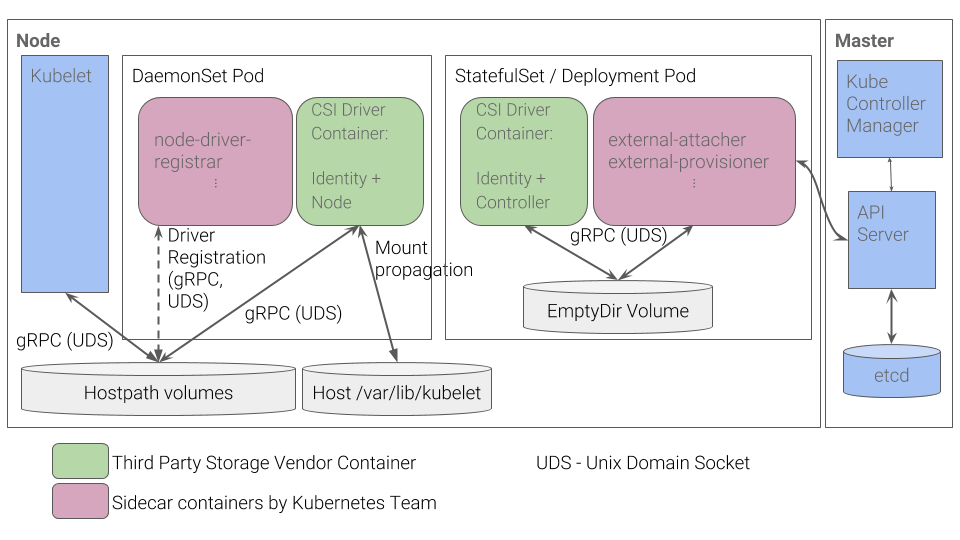

# JuiceFS CSI 工作原理

本文介绍 JuiceFS CSI Driver 在 Kubernetes 中如何工作。

## 目前的实现

JuiceFS CSI Driver 遵照 [CSI规范v1.0](https://github.com/container-storage-interface/spec/blob/release-1.0/spec.md) 实现。

### 技术架构

如下，JuiceFS CSI Driver 采用了典型的 CSI 架构。

```txt
                             CO "Master" Host
+-------------------------------------------+
|                                           |
|  +------------+           +------------+  |
|  |     CO     |   gRPC    | Controller |  |
|  |            +----------->   Plugin   |  |
|  +------------+           +------------+  |
|                                           |
+-------------------------------------------+

                            CO "Node" Host(s)
+-------------------------------------------+
|                                           |
|  +------------+           +------------+  |
|  |     CO     |   gRPC    |    Node    |  |
|  |            +----------->   Plugin   |  |
|  +------------+           +------------+  |
|                                           |
+-------------------------------------------+
图1：Plugin 在集群的所有节点上运行：一个集中的
Controller 插件在 CO 主控主机上可用，Node 插件在所有节点上可用。
```

* JuiceFS CSI Driver 中的控制器插件只是一个占位符，因为挂载 JuiceFS 时不需要 attach/detach。
* Node 插件由 [DaemonSet](https://kubernetes.io/docs/concepts/workloads/controllers/daemonset/) 控制，确保所有节点运行 JuiceFS CSI Driver 程序的副本。

### 卷的生命周期

JuiceFS CSI Driver 中的卷的生命周期比较简单，目前 CSI 实现了CreateVolume、DeleteVolume、[NodePublishVolume](https://github.com/container-storage-interface/spec/blob/v0.3.0/spec.md#nodepublishvolume) 和 [NodeUnpublishVolume](https://github.com/container-storage-interface/spec/blob/v0.3.0/spec.md#nodeunpublishvolume)  接口。

```txt
       +-+  +-+
       |X|  | |
       +++  +^+
        |    |
   Node |    | Node
Publish |    | Unpublish
 Volume |    | Volume
    +---v----+---+
    | PUBLISHED  |
    +------------+
```

### 与 Kubernetes 的通信

> Kubernetes 对 CSI Volume Driver 的打包和部署有最小规模的规定。详见[最低要求（为Kubernetes开发和部署CSI Driver ）](https://kubernetes-csi.github.io/docs/introduction.html#minimum-requirements-for-developing-and-deploying-a-csi-driver-for-kubernetes)。

JuiceFS CSI Driver 实现了一组最小的所需 gRPC 调用，以满足这些要求。它使用 Unix 域套接字与 [Kubernetes CSI sidecar容器](https://kubernetes-csi.github.io/docs/sidecar-containers.html) 进行交互，该容器封装了所有 Kubernetes 特定代码。所以 CSI Driver 实际上是与协调器无关的。

### 在 Kubernetes 中部署

根据 [Kubernetes 设计文件中的 CSI Volume 插件](https://github.com/kubernetes/community/blob/master/contributors/design-proposals/storage/container-storage-interface.md#recommended-mechanism-for-deploying-csi-drivers-on-kubernetes) 中推荐的机制部署该驱动程序。



请注意，JuiceFS CSI Driver 程序中不使用  `external-attacher` 和 `external-provisioner`。

### 注册驱动程序

JuiceFS CSI Driver 使用 [node-driver-registrar](https://kubernetes-csi.github.io/docs/node-driver-registrar.html#csi-node-driver-registrar) sidecar 容器进行注册。

当 `--mode=node-register` 时，驱动程序被注册到节点上的 kubelet。这就是 JuiceFS CSI Driver 程序的注册方式。

sidecar 容器从 CSI 端点获取驱动信息（使用 NodeGetInfo），并将其注册给该节点上的 kubelet。

```shell
$ journalctl -u kubelet -f
May 25 19:27:42 iZuf65o45s4xllq6ghmvkhZ kubelet[1458]: I0525 19:27:42.360149    1458 csi_plugin.go:111] kubernetes.io/csi: Trying to register a new plugin with name: csi.juicefs.com endpoint: /var/lib/kubelet/plugins/csi.juicefs.com/csi.sock versions: 0.2.0,0.3.0
May 25 19:27:42 iZuf65o45s4xllq6ghmvkhZ kubelet[1458]: I0525 19:27:42.360204    1458 csi_plugin.go:119] kubernetes.io/csi: Register new plugin with name: csi.juicefs.com at endpoint: /var/lib/kubelet/plugins/csi.juicefs.com/csi.sock
```

### 创建卷

卷可以在挂载前或在 Kubernetes 中第一次挂载时创建，详情请阅读 [basic example](https://github.com/juicedata/juicefs-csi-driver/tree/master/examples/basic)。

Kubernetes 将进行以下操作。

* 创建 PV
* 创建 PVC
    * PV 与 PVC 绑定

### 使用卷

JuiceFS CSI Driver 不需要 attachment。当挂载卷的 Pod 被放置（调度）在一个节点上时，Node 插件会 publish 卷。

* 创建 Pod
  * 在节点上放置（调度）的Pod
    * 当`---driver-requires-attachment=false`时，卷的 attach 将被跳过。
    * NodePublishVolume 被调用

### 结束使用卷

JuiceFS CSI Driver 也不需要 detachment。当挂载卷的 Pod 从一个节点上删除时，节点插件会 unpublish 卷。

* Pod 被删除
  * 调用 NodeUnpublishVolume
  * 当`--driver-requires-attachment=false`时，卷的 detach 就没有必要了。

### 删除卷

> 删除卷不属于 JuiceFS CSI Driver 的范围。

当相关资源被删除时，Kubernetes 将采取以下行动。

* 删除 PVC
  * 从 PVC 上解除 PV 的绑定
  * PV 被删除

当 PV 被删除时，文件系统不会被销毁。

## CSI spec v1.x 的下一步

### 已废弃

```go
-  // NodeGetId is being deprecated in favor of NodeGetInfo and will be
-  // removed in CSI 1.0. Existing drivers, however, may depend on this
-  // RPC call and hence this RPC call MUST be implemented by the CSI
-  // plugin prior to v1.0.
...
-  // Prior to CSI 1.0 - CSI plugins MUST implement both NodeGetId and
-  // NodeGetInfo RPC calls.
```

### 新功能

* [Volume Expansion](https://github.com/container-storage-interface/spec/blob/master/spec.md#controllerexpandvolume): 允许在线或离线卷的扩容。
* `VolumeContentSource` 中的新信息 `VolumeSource`：包含现有源卷的身份信息。
* `ValidateVolumeCapabilitiesResponse` 中的新信息 `Confirmed`：提供由插件验证的卷的上下文。
* `ControllerServiceCapability`的新值
  * `CLONE_VOLUME`：表示 SP 支持 ControllerPublishVolume.readonly。
  * `PUBLISH_READONLY`：表示 SP 支持 ControllerPublishVolume.readonly 字段。
  * `EXPAND_VOLUME`：详见 [VolumeExpansion] 。
* `NodeGetVolumeStatsRequest` 和 `NodeGetVolumeStatsResponse` 的新信息 `VolumeUsage`：提供指定卷的可用/总/使用的统计。

### 变化

一些接口名称改变了，例如：`GetId` => `GetVolumeId`，`GetVolumeAttributes` => `GetVolumeContext`，等等。

### Kubernetes 的兼容性

[CSI 在 Kubernetes v1.13 中被提升为 GA](https://kubernetes.io/blog/2019/01/15/container-storage-interface-ga/)

> * Kubernetes 现在与 CSI spec v1.0 和 v0.3 兼容（而不是 CSI spec v0.2）。
>  * CSI spec v0.3.0 和 v1.0.0 之间有一些突破性的变化，但 Kubernetes v1.13 支持这两个版本，因此任何一个版本都可以与 Kubernetes v1.13 兼容。
>  * 请注意，随着 CSI 1.0 API 的发布，对使用 0.3 和旧版 CSI API 的 CSI Driver 程序的支持已被废弃，并计划在 Kubernetes v1.15 中删除。
>  * CSI spec v0.2 和 v0.3 之间没有突破性的变化，所以 v0.2 的驱动程序也应该与 Kubernetes v1.10.0+ 一起使用。
>  * CSI spec v0.1 和 v0.2 之间有突破性的变化，因此在与 Kubernetes v1.10.0+ 使用之前，实施 CSI 0.1 的非常老的驱动程序必须更新为至少兼容 0.2。
