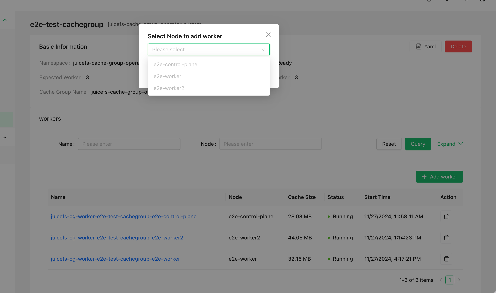

企业版用户可以使用「缓存组 Operator」来创建和管理[分布式缓存集群](https://juicefs.com/docs/zh/cloud/guide/distributed-cache)。相比于其它部署方式，缓存组 Operator 在使用上更为便捷（支持 GUI 和 CLI 两种交互方式），同时还支持异构节点不同配置、平滑加减节点、自动清理缓存等高级功能。

## 安装缓存组 Operator {#install-cache-group-operator}

安装 Helm，然后加入 JuiceFS 官方仓库。

```shell
helm repo add juicefs https://juicedata.github.io/charts/
helm repo update
```

安装之前，阅读 [`values.yaml`](https://raw.githubusercontent.com/juicedata/charts/refs/heads/main/charts/juicefs-cache-group-operator/values.yaml) 了解各个配置项，该文件包含了所有的默认配置，如果需要修改配置，请在本地创建另一份 values（以下且称 `values-mycuster.yaml`），并把需要修改的部分加入其中。如果需要在多个 Kubernetes 集群部署 Operator，就创建多个 values 文件，来区分不同的集群配置。

```shell
# 根据需要修改 values-mycluster.yaml
helm upgrade --install juicefs-cache-group-operator juicefs/juicefs-cache-group-operator -n juicefs-cache-group --create-namespace -f values-mycluster.yaml
```

可以使用 `kubectl wait` 等待 Operator 准备就绪：

```shell
kubectl wait -n juicefs-cache-group --for=condition=Available=true --timeout=120s deployment/juicefs-cache-group-operator
```

缓存组 Operator 安装完毕便可以开始创建及管理缓存组，以下章节介绍的操作通过 CSI Dashboard（0.25.3 及以上版本）和 `kubectl` 均可完成，选择你喜好的使用方式即可。为了简化文档示例，后续仅介绍基于 `kubectl` 的操作方法。



## 创建缓存组 {#create-cache-group}

参考以下示例将缓存组配置保存为一个 YAML 文件（例如 `juicefs-cache-group.yaml`），这个示例会在所有设置了 `juicefs.io/cg-worker: "true"` 标签的节点中部署分布式缓存（当然你也可以设置任意的标签）。关于更多配置项的说明请参考[「缓存组配置项」](#cache-group-configs)小节。

```yaml name="juicefs-cache-group.yaml"
apiVersion: v1
kind: Secret
metadata:
  name: juicefs-secret
  namespace: juicefs-cache-group
type: Opaque
stringData:
  name: juicefs-xx
  token: xx
  access-key: xx
  secret-key: xx
---
apiVersion: juicefs.io/v1
kind: CacheGroup
metadata:
  name: cachegroup-sample
spec:
  secretRef:
    name: juicefs-secret
  worker:
    template:
      nodeSelector:
        juicefs.io/cg-worker: "true"
      image: juicedata/mount:ee-5.1.1-1faf43b
      opts:
        - cache-size=204800
        - free-space-ratio=0.01
        - group-weight=100
      resources:
        requests:
          cpu: 100m
          memory: 128Mi
        limits:
          cpu: 1
          memory: 1Gi
```

然后通过 `kubectl apply` 命令创建缓存组：

```shell
kubectl apply -f juicefs-cache-group.yaml
```

如果 Kubernetes 节点还没有设置 `juicefs.io/cg-worker: "true"` 标签，需要加上这个标签：

```shell
kubectl label node node1 juicefs.io/cg-worker=true
```

## 获取缓存组状态 {#get-cache-group-status}

通过以下命令获取缓存组状态，确认缓存组已经处于「Ready」状态：

```sh
$ kubectl get cachegroups
NAME                CACHE GROUP NAME                        PHASE   READY   AGE
cachegroup-sample   juicefs-cache-group-cachegroup-sample   Ready   1/1     10s
```

## 使用缓存组 {#use-cache-group}

完成以上步骤以后，便已经在 K8s 中启动了一个 JuiceFS 分布式缓存集群，其缓存组名为 `juicefs-cache-group-cachegroup-sample`。为了让应用程序的 JuiceFS 客户端使用该缓存集群，需要让 JuiceFS 客户端加入这个缓存组，并添加 `--no-sharing` 挂载参数，这样一来，应用程序的 JuiceFS 客户端虽然加入了缓存组，但却不参与缓存数据的构建，避免了客户端频繁创建、销毁所导致的缓存数据不稳定。

以动态配置为例，按照下方示范修改挂载参数即可，有关如何调整挂载配置的介绍详见[「挂载参数」](../guide/configurations.md#mount-options)。

```yaml {6-7}
apiVersion: storage.k8s.io/v1
kind: StorageClass
metadata:
  name: juicefs-sc
mountOptions:
  - cache-group=juicefs-cache-group-cachegroup-sample
  - no-sharing
```

## 增删缓存节点 {#add-and-delete-cache-node}

缓存组 Operator 支持平滑增删缓存节点，确保调整过程中不会对缓存命中率造成太大影响。

在[「创建缓存组」](#create-cache-group)的示例中，要求 Kubernetes 节点必须有 `juicefs.io/cg-worker: "true"` 这个标签，因此增删缓存节点所需的操作就是给 Kubernetes 节点增删对应的标签。例如通过 `kubectl` 命令增加或删除节点：

```sh
# 增加节点
kubectl label node node1 juicefs.io/cg-worker=true
kubectl label node node2 juicefs.io/cg-worker=true

# 删除节点
kubectl label node node1 juicefs.io/cg-worker-
```

当节点发生变更时，缓存组 Operator 会以平滑的形式增删节点，具体逻辑如下：

- 当新增节点时，缓存组 Operator 会自动创建新的 Worker Pod，并添加 [`group-backup`](https://juicefs.com/docs/zh/cloud/guide/distributed-cache#group-backup) 挂载参数。如果新的 Worker Pod 接收到应用请求，并且发现缓存未命中，这个 Worker Pod 会将请求转发给其它缓存节点，确保缓存可以命中。默认 10 分钟后，`group-backup` 挂载参数会被移除掉，可以通过 `spec.backupDuration` 来控制默认时间：

  ```yaml {6}
  apiVersion: juicefs.io/v1
  kind: CacheGroup
  metadata:
    name: cachegroup-sample
  spec:
    backupDuration: 10m
  ```

- 当移除节点时，缓存组 Operator 会先尝试将节点上的缓存数据迁移到其它节点，然后再删除节点。最长等待时间默认为 1 小时，可以通过 `spec.waitingDeletedMaxDuration` 来控制默认时间：

  ```yaml {6}
  apiVersion: juicefs.io/v1
  kind: CacheGroup
  metadata:
    name: cachegroup-sample
  spec:
    waitingDeletedMaxDuration: 1h
  ```

## 缓存组配置项 {#cache-group-configs}

缓存组支持的所有配置项可以在[这里](https://github.com/juicedata/juicefs-cache-group-operator/blob/main/config/samples/v1_cachegroup.yaml)找到完整示范。

### 更新策略 {#update-strategy}

更新缓存组的配置时，可以通过 `spec.updateStrategy` 字段来指定缓存组下面的 worker 节点的更新策略。

目前支持的策略有：

- `RollingUpdate`（默认）：这是默认的更新策略。使用 `RollingUpdate` 更新策略时，在更新缓存组模板后，老的 Worker Pod 将被终止，并且自动创建新的 Worker Pod, 每次更新的数量遵循 `spec.updateStrategy.rollingUpdate.maxUnavailable` 的配置，默认为 1。
- `OnDelete`：使用 `OnDelete` 更新策略时，在更新缓存组模板后，只有当你手动删除旧的 Worker Pod 时，新的 Worker Pod 才会被创建。

```yaml {6-9}
apiVersion: juicefs.io/v1
kind: CacheGroup
metadata:
  name: cachegroup-sample
spec:
  updateStrategy:
    type: RollingUpdate
    rollingUpdate:
      maxUnavailable: 1
```

### 缓存目录 {#cache-directory}

缓存目录可以通过 `spec.worker.template.cacheDirs` 字段来设置，支持的类型有 `HostPath` 和 `PVC`。

```yaml {12-16}
apiVersion: juicefs.io/v1
kind: CacheGroup
metadata:
  name: cachegroup-sample
  namespace: default
spec:
  worker:
    template:
      nodeSelector:
        juicefs.io/cg-worker: "true"
      image: juicedata/mount:ee-5.1.1-1faf43b
      cacheDirs:
        - type: HostPath
          path: /var/jfsCache-0
        - type: PVC
          name: juicefs-cache-pvc
```

### 为不同节点指定不同配置 {#specify-different-configurations-for-different-nodes}

缓存节点可能存在异构的配置（例如缓存盘的大小不一样），此时可以通过 `spec.worker.overwrite` 字段来为不同的节点指定不同的配置：

```yaml {17-29}
apiVersion: juicefs.io/v1
kind: CacheGroup
metadata:
  name: cachegroup-sample
spec:
  worker:
    template:
      nodeSelector:
        juicefs.io/cg-worker: "true"
      image: juicedata/mount:ee-5.1.1-1faf43b
      hostNetwork: true
      cacheDirs:
        - path: /var/jfsCache-0
          type: HostPath
      opts:
        - group-weight=100
    overwrite:
      - nodes:
          - k8s-03
        # 也可以使用 nodeSelector
        # nodeSelector:
        #   kubernetes.io/hostname: k8s-02
        opts:
          - group-weight=50
        cacheDirs:
        - path: /var/jfsCache-1
          type: HostPath
        - path: /var/jfsCache-2
          type: HostPath
```

### 挂载参数 {#mount-options}

挂载参数可以通过 `spec.worker.template.opts` 字段来设置，参考[文档](https://juicefs.com/docs/zh/cloud/reference/commands_reference/#mount)了解所有挂载参数。

```yaml {12-13}
apiVersion: juicefs.io/v1
kind: CacheGroup
metadata:
  name: cachegroup-sample
  namespace: default
spec:
  worker:
    template:
      nodeSelector:
        juicefs.io/cg-worker: "true"
      image: juicedata/mount:ee-5.1.1-1faf43b
      opts:
        - group-weight=100
```

### 缓存组名称 {#cache-group-name}

缓存组 Operator 默认生成的缓存组名称格式为 `${NAMESPACE}-${NAME}`，如果你想自定义缓存组名称可以通过 `spec.cacheGroup` 字段来设置：

```yaml {6}
apiVersion: juicefs.io/v1
kind: CacheGroup
metadata:
  name: cachegroup-sample
spec:
  cacheGroup: jfscachegroup
```

### 删除节点时清理缓存 {#clean-cache-when-deleteing-a-node}

当删除一个节点时，可以通过 `spec.cleanCache` 字段来指定是否清理缓存：

```yaml {6}
apiVersion: juicefs.io/v1
kind: CacheGroup
metadata:
  name: cachegroup-sample
spec:
  cleanCache: true
```

## 删除缓存组 {#delete-cache-group}

使用以下命令删除缓存组，缓存集群下的所有 Worker 节点将被删除：

```sh
kubectl delete cachegroup cachegroup-sample
```
