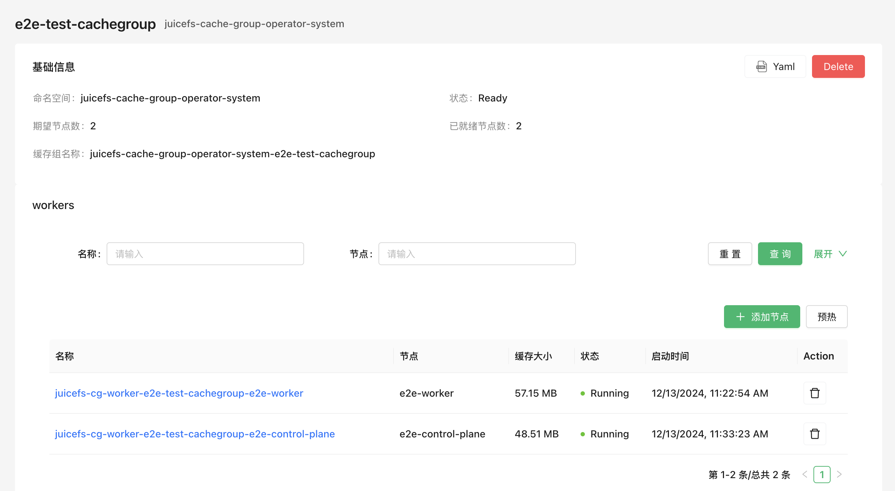

JuiceFS 为企业版用户开发了一个 JuiceFS Cache Group Operator 用来创建和管理缓存组集群。

相比于其他部署方式，支持了异构节点不同配置、平滑加减节点、自动清理缓存等功能。

### 安装 Operator

```sh
helm repo add juicefs https://juicedata.github.io/charts/
helm repo update

wget https://raw.githubusercontent.com/juicedata/charts/refs/heads/main/charts/juicefs-cache-group-operator/values.yaml

# 可根据需要修改 values.yaml
helm upgrade --install juicefs-cache-group-operator juicefs/juicefs-cache-group-operator -n juicefs-cache-group --create-namespace -f values.yaml
```

您可以使用 kubectl wait 等待 Operator 准备就绪：

```sh
kubectl wait -n juicefs-cache-group --for=condition=Available=true --timeout=120s deployment/juicefs-cache-group-operator
```

### 创建一个缓存组集群

参考 [配置项](#config) 了解更多细节。

```yaml
apiVersion: v1
kind: Secret
metadata:
  name: juicefs-secret
  namespace: juicefs-cache-group
type: Opaque
stringData:
  name: juicefs-xx
  token: xx
  access-key: xx
  secret-key: xx
---
apiVersion: juicefs.io/v1
kind: CacheGroup
metadata:
  name: cachegroup-sample
spec:
  secretRef:
    name: juicefs-secret
  worker:
    template:
      nodeSelector:
        juicefs.io/cg-worker: "true"
      image: juicedata/mount:ee-5.1.1-1faf43b
      opts:
        - group-weight=100
      resources:
        requests:
          cpu: 100m
          memory: 128Mi
        limits:
          cpu: 1
          memory: 1Gi
```

### 获取缓存组状态

```sh
➜  kubectl get cachegroups
NAME                CACHE GROUP NAME                        PHASE   READY   AGE
cachegroup-sample   juicefs-cache-group-cachegroup-sample   Ready   1/1     10s
```

### 使用缓存组

上方示范便是在集群中启动了 JuiceFS 缓存集群，其缓存组名为 `juicefs-cache-group-cachegroup-sample`，那么为了让应用程序的 JuiceFS 客户端使用该缓存集群，需要让他们一并加入这个缓存组，并额外添加 `--no-sharing` 这个挂载参数，这样一来，应用程序的 JuiceFS 客户端虽然加入了缓存组，但却不参与缓存数据的构建，避免了客户端频繁创建、销毁所导致的缓存数据不稳定。

以动态配置为例，按照下方示范修改挂载参数即可，关于在 `mountOptions` 调整挂载配置，详见[「挂载参数」](../guide/configurations.md#mount-options)。

```yaml {6-7}
apiVersion: storage.k8s.io/v1
kind: StorageClass
metadata:
  name: juicefs-sc
mountOptions:
  - cache-group=juicefs-cache-group-cachegroup-sample
  - no-sharing
```

### 增删节点

可以通过 kubectl 对节点增删对应的标签来增删节点。

例如 缓存组的配置的 nodeSelector 为 `juicefs.io/cg-worker: "true"`

```yaml {9}
apiVersion: juicefs.io/v1
kind: CacheGroup
metadata:
  name: cachegroup-sample
spec:
  worker:
    template:
      nodeSelector:
        juicefs.io/cg-worker: "true"
```

可以通过 kubectl 命令增加或删除节点：

```sh
# 增加节点
kubectl label node node1 juicefs.io/cg-worker=true
kubectl label node node2 juicefs.io/cg-worker=true

# 删除节点
kubectl label node node1 juicefs.io/cg-worker-
```

当节点发生变更时，Operator 会以平滑的形式增删节点。

- 当新增节点时，Operator 会自动创建新的 Worker Pod，并添加 `group-backup` 参数，客户端会将未命中的请求转发给其他节点来“帮忙”，达到平滑增加节点的目的。默认 10 分钟后，此参数会被移除掉。可以通过 `spec.backupDuration` 来控制默认时间。
  
  ```yaml {6}
  apiVersion: juicefs.io/v1
  kind: CacheGroup
  metadata:
    name: cachegroup-sample
  spec:
    backupDuration: 10m
  ```

- 当移除节点时，Operator 会先尝试将节点上的缓存数据迁移到其他节点上，然后再删除节点。最长等待时间默认为 1h，可以通过 `spec.waitingDeletedMaxDuration` 来控制默认时间。

  ```yaml {6}
  apiVersion: juicefs.io/v1
  kind: CacheGroup
  metadata:
    name: cachegroup-sample
  spec:
    waitingDeletedMaxDuration: 1h
  ```

### 配置项 {#config}

支持的配置项，可以在[这里](https://github.com/juicedata/juicefs-cache-group-operator/blob/main/config/samples/v1_cachegroup.yaml)找到完整示范。

#### 升级策略

更新缓存组的配置时，可以通过 `spec.updateStrategy` 字段来指定缓存组下面的 worker 节点的更新策略。

目前支持的策略有：

- `OnDelete`：使用 `OnDelete` 更新策略时，在更新缓存组模板后，只有当你手动删除旧的 Worker Pod 时，新的 Worker Pod 才会被创建。

- `RollingUpdate`：这是默认的更新策略。使用 `RollingUpdate` 更新策略时，在更新缓存组模板后，老的 Worker Pod 将被终止，并且自动创建新的 Worker Pod, 每次更新的数量遵循 `spec.updateStrategy.rollingUpdate.maxUnavailable` 的配置，默认为 1。

```yaml {6-9}
apiVersion: juicefs.io/v1
kind: CacheGroup
metadata:
  name: cachegroup-sample
spec:
  updateStrategy:
    type: RollingUpdate
    rollingUpdate:
      maxUnavailable: 1
```

#### 缓存目录

缓存目录可以通过 `spec.worker.template.cacheDirs` 字段来指定，支持的类型有 `HostPath` 和 `PVC`。

```yaml {12-16}
apiVersion: juicefs.io/v1
kind: CacheGroup
metadata:
  name: cachegroup-sample
  namespace: default
spec:
  worker:
    template:
      nodeSelector:
        juicefs.io/cg-worker: "true"
      image: juicedata/mount:ee-5.1.1-1faf43b
      cacheDirs:
        - type: HostPath
          path: /var/jfsCache-0
        - type: PVC
          name: juicefs-cache-pvc

```

#### 为不同节点指定不同配置

可以通过 `spec.worker.overwrite` 字段来为不同的节点覆盖不同的配置

```yaml {17-29}
apiVersion: juicefs.io/v1
kind: CacheGroup
metadata:
  name: cachegroup-sample
spec:
  worker:
    template:
      nodeSelector:
        juicefs.io/cg-worker: "true"
      image: juicedata/mount:ee-5.1.1-1faf43b
      hostNetwork: true
      cacheDirs:
        - path: /var/jfsCache-0
          type: HostPath
      opts:
        - group-weight=100
    overwrite:
      - nodes:
          - k8s-03
        # or use nodeSelector
        # nodeSelector:
        #   kubernetes.io/hostname: k8s-02
        opts:
          - group-weight=50
        cacheDirs:
        - path: /var/jfsCache-1
          type: HostPath
        - path: /var/jfsCache-2
          type: HostPath
```

#### 挂载参数

挂载参数可以通过 `spec.worker.template.opts` 字段来指定。

参考文档 [云服务](https://juicefs.com/docs/zh/cloud/reference/commands_reference/#mount) 来了解支持的挂载的参数。

```yaml {12-13}
apiVersion: juicefs.io/v1
kind: CacheGroup
metadata:
  name: cachegroup-sample
  namespace: default
spec:
  worker:
    template:
      nodeSelector:
        juicefs.io/cg-worker: "true"
      image: juicedata/mount:ee-5.1.1-1faf43b
      opts:
        - group-weight=100
```

#### 缓存组名称

Operator 默认的缓存组名称为 `${NAMESPACE}-${NAME}` 形式，如果你想自定义可以通过 `spec.cacheGroup` 字段来指定。

```yaml {6}
apiVersion: juicefs.io/v1
kind: CacheGroup
metadata:
  name: cachegroup-sample
spec:
  cacheGroup: jfscachegroup
```

#### 下线节点时清理缓存

当节点下线时，可以通过 `spec.cleanCache` 字段来指定是否清理缓存。

```yaml {6}
apiVersion: juicefs.io/v1
kind: CacheGroup
metadata:
  name: cachegroup-sample
spec:
  cleanCache: true
```

### 通过 CSI Dashboard 来管理缓存组集群

在 CSI dashboard v0.25.3 之后，可以通过 CSI dashboard 来管理缓存组集群。



### 删除缓存组集群

删除后，缓存组集群下的所有 Worker 节点将被删除。

```sh
kubectl delete cachegroup cachegroup-sample
```
