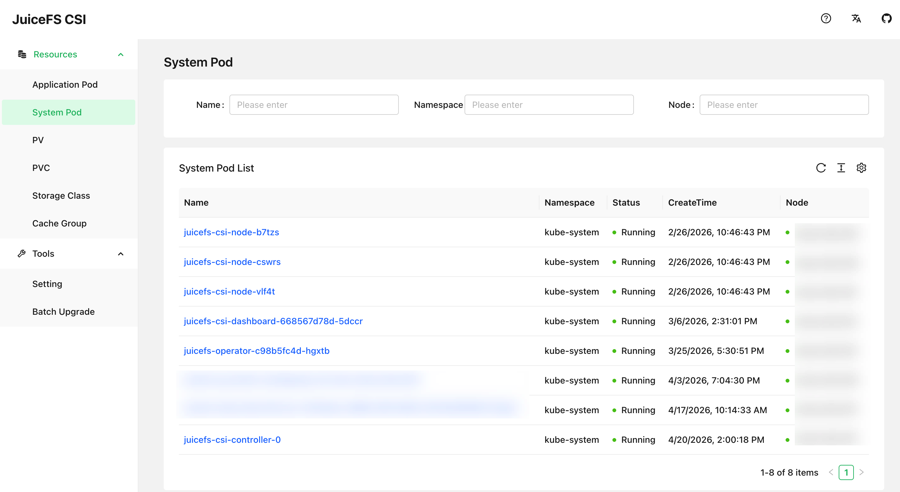

CSI Dashboard 是 CSI 驱动提供的网页图形化管理界面，能够实现强大的管理和排查功能，推荐所有 CSI 驱动用户安装。

* 罗列所有 JuiceFS 的 PV、PVC、Mount Pod，和应用 Pod 的对应关系一目了然，不需要用 `kubectl` 命令手动提取信息
* 在图形化表单中管理 ConfigMap 中的[各种 Mount Pod 配置](./configurations.md)，从此摆脱 YAML 字段不熟悉、缩进没对齐的烦恼
* 预览 Mount Pod 的日志，或者挂载点下的文件系统访问日志
* 对 Mount Pod 中的挂载点进行排查，预览性能指标、提取 DEBUG 信息等



## 安装

安装 CSI 驱动时，默认会一同安装 CSI 控制台（CSI Dashboard）：

```YAML title="values.yaml"
dashboard:
  enabled: true
```

用 [Helm](../getting_started.md#helm) 安装完毕以后，可以用下方命令查看 Dashboard Pod 状态：

```shell
kubectl get po -n kube-system -l app=juicefs-csi-dashboard
```

## 服务暴露

CSI Dashboard 是一个网页图形化界面，因此还需要用合适的办法进行服务暴露，一般考虑用宿主机端口或者 Ingress 两种办法。

### 宿主机端口（NodePort） {#expose-via-node-port}

需要启用 hostNetwork，令 CSI Dashboard 直接监听在宿主机端口，并且固定在特定节点上：

```YAML title="values-mycluster" {3}
dashboard:
  enabled: true
  hostNetwork: true
  nodeSelector:
    kubernetes.io/hostname: csi-dashboard-node-name
```

用 Helm 更新安装后，CSI Dashboard 会重启并监听宿主机的 8088 端口，如果网络互通并且安全组允许，则可直接通过浏览器访问该宿主机的对应端口。但是考虑到一般内网节点 IP 无法直接访问，可以考虑用这种方式将端口映射到本机：

```shell
ssh -L 8088:localhost:8088 csi-dashboard-node-name
```

通过 SSH 端口转发的方式访问 CSI Dashboard，也并非长久之计，因此对于 JuiceFS 企业版的私有部署客户，如果内网互通，更推荐通过 JuiceFS Web 控制台建立代理访问机制：

进入控制台右上角设置页面，下拉找到代理访问规则，点击右侧的添加按钮。按照文字输入框的示范，正确填写 CSI Dashboard 的访问地址。


图中涉及的字段，除了 CSI Dashboard 的访问地址需要修改，其余可以直接复制粘贴下方代码块中的文本：

```
# Location
/dashboard/

# Rewrite
^/dashboard/(.*)$ /$1 break

# Note
CSI Dashboard
```

保存以后，便可以直接通过 JuiceFS Web 控制台顶栏的「代理」按钮直接跳转访问 CSI Dashboard。

### Ingress

在 CSI 驱动默认的 [Helm Values](https://github.com/juicedata/charts/blob/main/charts/juicefs-csi-driver/values.yaml) 中，已经预留了 CSI Dashboard 相关的 Ingress 配置：

```YAML title="values-mycluster.yaml"
dashboard:
  ...
  ingress:
    enabled: false
    className: "nginx"
    annotations: {}
    # kubernetes.io/ingress.class: nginx
    # kubernetes.io/tls-acme: "true"
    hosts:
    - host: ""
      paths:
      - path: /
        pathType: ImplementationSpecific
    tls: []
```

请在你的集群配置中自行填充 Ingress 配置，然后就可以通过域名访问 CSI Dashboard。

### 添加认证

对于企业版私有部署客户，我们推荐将 CSI Dashboard 设置成[通过 JuiceFS Web 控制台](#expose-via-node-port) 访问，并且妥善设置安全组拦截规则，防止用户直接通过 CSI Dashboard 所在的 NodePort 访问。如果已经按照该策略配置，那么访问 CSI Dashboard 就必须通过 Web 控制台认证，因此 CSI Dashboard 不需要额外的认证。

如果无条件配置代理访问，也可以为 CSI Dashboard 启用账密访问：

```YAML title="values-mycluster.yaml"
dashboard:
  ...
  auth:
    enabled: false
    # Set existingSecret to indicate whether to use an existing secret. If it is empty, a corresponding secret will be created according to the plain text configuration.
    existingSecret: ""
    username: admin
    password: admin
```

## 通过 CSI Dashboard 管理 ConfigMap {#manage-cm-in-dashboard}

[CSI ConfigMap](./configurations.md#configmap) 既可以通过 Helm Values 来管理，也可以通过 CSI Dashboard 来管理，但必须在两者中选其一。我们推荐通过 CSI Dashboard 来管理，避免编辑 YAML 时容易出现拼错、缩进错误等问题。

如果当前你的集群仍在通过 Values 管理 ConfigMap，可以按照下方步骤切换成用 CSI Dashboard 进行纳管的模式。

在一切操作之前，先备份好当前 ConfigMap，可以参考下方命令：

```shell
kubectl -n kube-system get cm -oyaml juicefs-csi-driver-config > juicefs-csi-driver-config-bak.yaml
```

在集群专属的 Values 中进行如下设置：

```YAML title="mycluster-values.yaml" {3-4}
globalConfig:
  enabled: true
  # 首次安装会渲染并应用 ConfigMap，但是后续 helm upgrade 则不再更新 ConfigMap
  manageByHelm: false
```

然后运行 Helm 命令更新配置：

```shell
helm upgrade --install juicefs-csi-driver juicefs/juicefs-csi-driver -n kube-system -f ./values-mycluster.yaml
```

更新完毕以后，访问 CSI Dashboard，点击左侧边栏的「工具（Tools）- 设置（Settings）」按钮，核实 ConfigMap 中的内容是否顺利显示在 CSI Dashboard 网页中。


