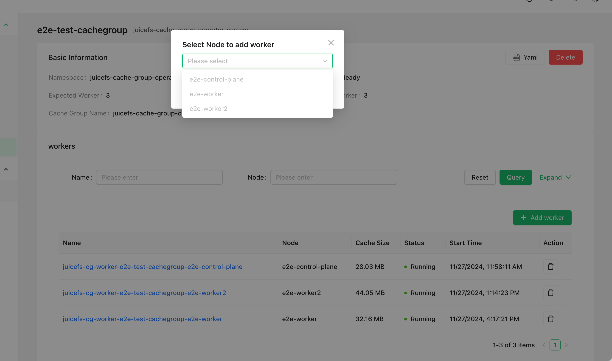

JuiceFS 提供了一个 [Operator](https://kubernetes.io/zh-cn/docs/concepts/extend-kubernetes/operator)，它是一个专为 Kubernetes 环境设计的控制器，用于自动化管理 JuiceFS 的分布式缓存集群、缓存预热和数据同步等功能，以便在容器环境中更轻易的使用 JuiceFS。

## 安装 JuiceFS Operator {#install-juicefs-operator}

安装 Helm，然后加入 JuiceFS 官方仓库。

```shell
helm repo add juicefs https://juicedata.github.io/charts/
helm repo update
```

安装之前，阅读 [`values.yaml`](https://raw.githubusercontent.com/juicedata/charts/refs/heads/main/charts/juicefs-operator/values.yaml) 了解各个配置项，该文件包含了所有的默认配置，如果需要修改配置，请在本地创建另一份 values（以下且称 `values-mycluster.yaml`），并把需要修改的部分加入其中。如果需要在多个 Kubernetes 集群部署 Operator，就创建多个 values 文件，来区分不同的集群配置。

```shell
# 根据需要修改 values-mycluster.yaml
helm upgrade --install juicefs-operator juicefs/juicefs-operator -n juicefs-operator --create-namespace -f values-mycluster.yaml
```

可以使用 `kubectl wait` 等待 Operator 准备就绪：

```shell
kubectl wait -n juicefs-operator --for=condition=Available=true --timeout=120s deployment/juicefs-operator
```

## 更新 JuiceFS Operator {#update-juicefs-operator}

如果需要更新 Operator，可以使用以下命令：

```shell
helm repo update
helm upgrade juicefs-operator juicefs/juicefs-operator -n juicefs-operator --reuse-values
```

:::note

由于 Helm 的限制，更新时并不会一起更新 CRD，因此请在更新 Operator 之后，手动更新 CRD：

```shell
export CHART_VERSION=$(helm show chart juicefs/juicefs-operator | grep appVersion | awk '{print $2}')
kubectl apply -f https://raw.githubusercontent.com/juicedata/juicefs-operator/refs/tags/v${CHART_VERSION}/dist/crd.yaml
```

:::

## 缓存组集群 {#cache-group}

企业版用户可以使用「JuiceFS Operator」来创建和管理[分布式缓存集群](https://juicefs.com/docs/zh/cloud/guide/distributed-cache)。相比于其它部署方式，Operator 在使用上更为便捷（支持 GUI 和 CLI 两种交互方式），同时还支持异构节点不同配置、平滑加减节点、自动清理缓存等高级功能。

以下章节介绍的操作通过 CSI Dashboard（0.25.3 及以上版本）和 `kubectl` 均可完成，选择你喜好的使用方式即可。为了简化文档示例，后续仅介绍基于 `kubectl` 的操作方法。



### 创建缓存组 {#create-cache-group}

参考以下示例将缓存组配置保存为一个 YAML 文件（例如 `juicefs-cache-group.yaml`），这个示例会在所有设置了 `juicefs.io/cg-worker: "true"` 标签的节点中部署分布式缓存（当然你也可以设置任意的标签）。关于更多配置项的说明请参考[「缓存组配置项」](#cache-group-configs)小节。

```yaml name="juicefs-cache-group.yaml"
apiVersion: v1
kind: Secret
metadata:
  name: juicefs-secret
  namespace: juicefs-cache-group
type: Opaque
stringData:
  name: juicefs-xx
  token: xx
  access-key: xx
  secret-key: xx
  # envs: '{"BASE_URL": "http://<IP or HOST>/static"}'
---
apiVersion: juicefs.io/v1
kind: CacheGroup
metadata:
  name: cachegroup-sample
  namespace: juicefs-cache-group
spec:
  secretRef:
    name: juicefs-secret
  cacheGroup: juicefs-cache-group-cachegroup-sample # 自定义缓存组名称，默认为 `${NAMESPACE}-${NAME}`
  worker:
    template:
      nodeSelector:
        juicefs.io/cg-worker: "true"
      image: juicedata/mount:ee-5.1.1-1faf43b
      opts:
        - cache-size=204800
        - free-space-ratio=0.01
        - group-weight=100
      cacheDirs:
        - type: HostPath
          path: /mnt/cache
      resources:
        requests:
          cpu: 100m
          memory: 128Mi
        limits:
          cpu: 1
          memory: 1Gi
```

然后通过 `kubectl apply` 命令创建缓存组：

```shell
kubectl apply -f juicefs-cache-group.yaml
```

如果 Kubernetes 节点还没有设置 `juicefs.io/cg-worker: "true"` 标签，需要加上这个标签：

```shell
kubectl label node node1 juicefs.io/cg-worker=true
```

### 获取缓存组状态 {#get-cache-group-status}

通过以下命令获取缓存组状态，确认缓存组已经处于「Ready」状态：

```sh
kubectl get cachegroups -n juicefs-cache-group
NAME                CACHE GROUP                              PHASE   BACK UP   WAITING DELETED   READY   AGE
cachegroup-sample   juicefs-cache-group-cachegroup-sample   Ready   <none>    <none>            1/1     10s
```

### 使用缓存组 {#use-cache-group}

完成以上步骤以后，便已经在 K8s 中启动了一个 JuiceFS 分布式缓存集群，其缓存组名为 `juicefs-cache-group-cachegroup-sample`。为了让应用程序的 JuiceFS 客户端使用该缓存集群，需要让 JuiceFS 客户端加入这个缓存组，并添加 `--no-sharing` 挂载参数，这样一来，应用程序的 JuiceFS 客户端虽然加入了缓存组，但却不参与缓存数据的构建，避免了客户端频繁创建、销毁所导致的缓存数据不稳定。

以动态配置为例，按照下方示范修改挂载参数即可，有关如何调整挂载配置的介绍详见[「挂载参数」](../guide/configurations.md#mount-options)。

```yaml {6-7}
apiVersion: storage.k8s.io/v1
kind: StorageClass
metadata:
  name: juicefs-sc
mountOptions:
  - cache-group=juicefs-cache-group-cachegroup-sample
  - no-sharing
```

### 增删缓存节点 {#add-and-delete-cache-node}

缓存组 Operator 支持平滑增删缓存节点，确保调整过程中不会对缓存命中率造成太大影响。

在[「创建缓存组」](#create-cache-group)的示例中，要求 Kubernetes 节点必须有 `juicefs.io/cg-worker: "true"` 这个标签，因此增删缓存节点所需的操作就是给 Kubernetes 节点增删对应的标签。例如通过 `kubectl` 命令增加或删除节点：

```sh
# 增加节点
kubectl label node node1 juicefs.io/cg-worker=true
kubectl label node node2 juicefs.io/cg-worker=true

# 删除节点
kubectl label node node1 juicefs.io/cg-worker-
```

当节点发生变更时，缓存组 Operator 会以平滑的形式增删节点，具体逻辑如下：

- 当新增节点时，缓存组 Operator 会自动创建新的 Worker Pod，并添加 [`group-backup`](https://juicefs.com/docs/zh/cloud/guide/distributed-cache#group-backup) 挂载参数。如果新的 Worker Pod 接收到应用请求，并且发现缓存未命中，这个 Worker Pod 会将请求转发给其它缓存节点，确保缓存可以命中。默认 10 分钟后，`group-backup` 挂载参数会被移除掉，可以通过 `spec.backupDuration` 来控制默认时间：

  ```yaml {7}
  apiVersion: juicefs.io/v1
  kind: CacheGroup
  metadata:
    name: cachegroup-sample
    namespace: juicefs-cache-group
  spec:
    backupDuration: 10m
  ```

- 当移除节点时，缓存组 Operator 会先尝试将节点上的缓存数据迁移到其它节点，然后再删除节点。最长等待时间默认为 1 小时，可以通过 `spec.waitingDeletedMaxDuration` 来控制默认时间：

  ```yaml {7}
  apiVersion: juicefs.io/v1
  kind: CacheGroup
  metadata:
    name: cachegroup-sample
    namespace: juicefs-cache-group
  spec:
    waitingDeletedMaxDuration: 1h
  ```

### 缓存组配置项 {#cache-group-configs}

缓存组支持的所有配置项可以在[这里](https://github.com/juicedata/juicefs-operator/blob/main/config/samples/v1_cachegroup.yaml)找到完整示范。

### 指定 Worker 副本数 <VersionAdd>0.6.0</VersionAdd> {#worker-replicas}

你可以通过设置 `spec.replicas` 字段来指定缓存组 worker 的副本数：

:::note

1. Worker 管理模式不可切换：`replicas` 必须在创建 CacheGroup 时设置；已有 CacheGroup 如果没有该字段，之后不能新增；创建时设置后也不能再取消。但可以修改它的数值来扩缩容。
2. 使用此种方式须确保 Pod IP 可以固定，并且缓存盘可以跟随 Pod 迁移到其他节点，否则可能会导致缓存穿透。
3. `worker.overwrite` 字段将不适用于此模式，即不能为不同的节点指定不同的配置。

:::

```yaml
apiVersion: juicefs.io/v1
kind: CacheGroup
metadata:
  name: cachegroup-sample
  namespace: juicefs-cache-group
spec:
  replicas: 3    # 指定创建 3 个 worker 副本
  worker:
    template:
      nodeSelector:
        juicefs.io/cg-worker: "true"
      image: juicedata/mount:ee-5.1.1-1faf43b
      opts:
        - cache-size=204800
        - free-space-ratio=0.01
        - group-weight=100
      cacheDirs:
        - type: VolumeClaimTemplates
          volumeClaimTemplate:
            metadata:
              name: jfs-cache
            spec:
              accessModes:
              - ReadWriteOnce
              resources:
                requests:
                  storage: 20Gi
              storageClassName: <your-storage-class-name>
```

通过这种方式，你可以精确控制缓存组中 worker 的数量，而不是依赖于节点标签的数量。

### 亲和性与反亲和性 <VersionAdd>0.7.2</VersionAdd> {#affinity-and-anti-affinity}

默认情况下，缓存组 Operator 会将 worker 部署在所有符合 `nodeSelector` 的节点上。不遵循节点和 Pod 之间的亲和性与反亲和性规则。

从 `v0.7.2` 版本开始，缓存组 Operator 支持通过 `spec.enableScheduling` 字段来启用调度功能。

例如将缓存组部署在不同的 zone 上。

:::note

只会处理 `requiredDuringSchedulingIgnoredDuringExecution` 规则。

:::

```yaml {9-21}
apiVersion: juicefs.io/v1
kind: CacheGroup
metadata:
  name: cachegroup-sample
  namespace: juicefs-cache-group
spec:
  secretRef:
    name: cachegroup-sample-secret
  enableScheduling: true
  worker:
    template:
      affinity:
        podAntiAffinity:
          requiredDuringSchedulingIgnoredDuringExecution:
            - labelSelector:
                matchExpressions:
                  - key: juicefs.io/cache-group
                    operator: In
                    values:
                      - cachegroup-sample
              topologyKey: "topology.kubernetes.io/zone"
```

### 更新策略 {#update-strategy}

更新缓存组的配置时，可以通过 `spec.updateStrategy` 字段来指定缓存组下面的 worker 节点的更新策略。

目前支持的策略有：

- `RollingUpdate`（默认）：这是默认的更新策略。使用 `RollingUpdate` 更新策略时，在更新缓存组模板后，老的 Worker Pod 将被终止，并且自动创建新的 Worker Pod, 每次更新的数量遵循 `spec.updateStrategy.rollingUpdate.maxUnavailable` 的配置，默认为 1。
- `OnDelete`：使用 `OnDelete` 更新策略时，在更新缓存组模板后，只有当你手动删除旧的 Worker Pod 时，新的 Worker Pod 才会被创建。

```yaml {7-10}
apiVersion: juicefs.io/v1
kind: CacheGroup
metadata:
  name: cachegroup-sample
  namespace: juicefs-cache-group
spec:
  updateStrategy:
    type: RollingUpdate
    rollingUpdate:
      maxUnavailable: 1
```

### 缓存目录 {#cache-directory}

缓存目录可以通过 `spec.worker.template.cacheDirs` 字段来设置，支持的类型有 `HostPath`, `PVC`, `VolumeClaimTemplates` <VersionAdd>0.6.0</VersionAdd> 。

```yaml {12-16}
apiVersion: juicefs.io/v1
kind: CacheGroup
metadata:
  name: cachegroup-sample
  namespace: juicefs-cache-group
spec:
  worker:
    template:
      nodeSelector:
        juicefs.io/cg-worker: "true"
      image: juicedata/mount:ee-5.1.1-1faf43b
      cacheDirs:
        - type: HostPath
          path: /var/jfsCache-0
        - type: PVC
          name: juicefs-cache-pvc
        # v0.6.0 版本开始支持 VolumeClaimTemplates
        - type: VolumeClaimTemplates
          volumeClaimTemplate:
            metadata:
              name: jfs-cache
            spec:
              accessModes:
              - ReadWriteOnce
              resources:
                requests:
                  storage: 20Gi
              storageClassName: <your-storage-class-name>
```

### 为不同节点指定不同配置 {#specify-different-configurations-for-different-nodes}

缓存节点可能存在异构的配置（例如缓存盘的大小不一样），此时可以通过 `spec.worker.overwrite` 字段来为不同的节点指定不同的配置：

```yaml {18-30}
apiVersion: juicefs.io/v1
kind: CacheGroup
metadata:
  name: cachegroup-sample
  namespace: juicefs-cache-group
spec:
  worker:
    template:
      nodeSelector:
        juicefs.io/cg-worker: "true"
      image: juicedata/mount:ee-5.1.1-1faf43b
      hostNetwork: true
      cacheDirs:
        - path: /var/jfsCache-0
          type: HostPath
      opts:
        - group-weight=100
    overwrite:
      - nodes:
          - k8s-03
        # 也可以使用 nodeSelector
        # nodeSelector:
        #   kubernetes.io/hostname: k8s-02
        opts:
          - group-weight=50
        cacheDirs:
        - path: /var/jfsCache-1
          type: HostPath
        - path: /var/jfsCache-2
          type: HostPath
```

### 挂载参数 {#mount-options}

挂载参数可以通过 `spec.worker.template.opts` 字段来设置，参考[文档](https://juicefs.com/docs/zh/cloud/reference/commands_reference/#mount)了解所有挂载参数。

```yaml {12-13}
apiVersion: juicefs.io/v1
kind: CacheGroup
metadata:
  name: cachegroup-sample
  namespace: juicefs-cache-group
spec:
  worker:
    template:
      nodeSelector:
        juicefs.io/cg-worker: "true"
      image: juicedata/mount:ee-5.1.1-1faf43b
      opts:
        - group-weight=100
```

### 缓存组名称 {#cache-group-name}

缓存组 Operator 默认生成的缓存组名称格式为 `${NAMESPACE}-${NAME}`，如果你想自定义缓存组名称可以通过 `spec.cacheGroup` 字段来设置：

```yaml {7}
apiVersion: juicefs.io/v1
kind: CacheGroup
metadata:
  name: cachegroup-sample
  namespace: juicefs-cache-group
spec:
  cacheGroup: jfscachegroup
```

### 删除节点时清理缓存 {#clean-cache-when-deleteing-a-node}

当删除一个节点时，可以通过 `spec.cleanCache` 字段来指定是否清理缓存：

```yaml {7}
apiVersion: juicefs.io/v1
kind: CacheGroup
metadata:
  name: cachegroup-sample
  namespace: juicefs-cache-group
spec:
  cleanCache: true
```

### 删除缓存组 {#delete-cache-group}

使用以下命令删除缓存组，缓存集群下的所有 Worker 节点将被删除：

```sh
kubectl delete cachegroup cachegroup-sample -n juicefs-cache-group
```

## 预热缓存组 {#warmup-cache-group}

Operator 支持创建一个 WarmUp 资源来预热缓存组。

```yaml
apiVersion: juicefs.io/v1
kind: WarmUp
metadata:
  name: warmup-sample
  namespace: juicefs-cache-group
spec:
  cacheGroupName: cachegroup-sample
  # 不配置 targetsFrom 时，默认预热整个文件系统
  targetsFrom:
    files:
      - /a
      - /b
      - /c
  # juicefs warmup 命令参数，不需要包含开头的 "--"
  # 参考 https://juicefs.com/docs/zh/cloud/reference/command_reference/#warmup
  options:
    - threads=50
```

`spec.targetsFrom` 支持通过以下三种方式提供文件列表，每次只使用其中一种：

- `files`：直接在 WarmUp 资源中列出路径；
- `configMap`：填写包含文件列表的 ConfigMap 条目的 `name` 和 `key`；
- `filePath`：填写 JuiceFS 文件系统中已有文件列表的路径。

旧的 `spec.targets` 字段已废弃，请改用 `spec.targetsFrom.files`。

如果需要定期执行预热，把策略设置为 `Cron`：

```yaml
spec:
  policy:
    type: Cron
    cron:
      schedule: "*/5 * * * *"
      suspend: false
```

### 预热外部缓存组 <VersionAdd>0.8.1</VersionAdd> {#warmup-external-cache-group}

如果分布式缓存组并非由 CacheGroup 资源管理，可以通过 `spec.secretRef` 指定 JuiceFS 认证 Secret，同时必须显式设置 `spec.image`。WarmUp 资源和 Secret 必须位于同一命名空间；此时 `cacheGroupName` 直接填写要加入的分布式缓存组名称。

```yaml
apiVersion: juicefs.io/v1
kind: WarmUp
metadata:
  name: warmup-external
  namespace: juicefs-cache-group
spec:
  cacheGroupName: existing-cache-group
  secretRef:
    name: juicefs-secret
  image: juicedata/mount:ee-5.3.6-c8ec652
  mountOptions:
    - no-update
  targetsFrom:
    files:
      - /dataset
```

如果镜像位于私有仓库，可以通过 `spec.imagePullSecrets` 设置拉取凭据。认证 Secret 中通过 `configs` 声明的额外 Secret 也会挂载到 WarmUp 任务中。

## 数据同步 {#sync}

Operator 支持快速创建一个分布式 Sync 任务。

以下示例将 OSS 中的数据同步到 JuiceFS：

```yaml
apiVersion: juicefs.io/v1
kind: Sync
metadata:
  name: sync-test
  namespace: default
spec:
  # 期望的副本数量，默认为 1，即单机同步
  replicas: 3
  options:
    - debug
    - threads=10
  image: registry.cn-hangzhou.aliyuncs.com/juicedata/mount:ee-5.1.9-d809773
  from:
    external:
      uri: oss://sync-test.oss-cn-hangzhou.aliyuncs.com/sync-src-test/
      # 支持两种方式填写，value 和 valueFrom 二选一
      accessKey:
        value: accessKey
      secretKey:
        valueFrom:
          secretKeyRef:
            name: sync-test-secret
            key: secretKey
  to:
    juicefs:
      path: /sync-test/demo2/
      token:
        valueFrom:
          secretKeyRef:
            name: sync-test-secret
            key: token
      volumeName: sync-test
```

`from` 和 `to` 分别选择 `external`、`juicefs` 或 `juicefsCE` 中的一种端点类型。源和目标 URI 必须同时以 `/` 结尾，或同时不以 `/` 结尾。

v0.5.0 版本开始，支持社区版 JuiceFS 的数据同步

:::note
暂不支持社区版和企业版之间互相同步。
:::

```yaml {21-23}
apiVersion: juicefs.io/v1
kind: Sync
metadata:
  name: sync-ce-test
  namespace: default
spec:
  replicas: 3
  image: juicedata/mount:ce-v1.4.0
  from:
    external:
      uri: oss://sync-test.oss-cn-hangzhou.aliyuncs.com/sync-src-test/
      # 支持两种方式填写，value 和 valueFrom 二选一
      accessKey:
        value: accessKey
      secretKey:
        valueFrom:
          secretKeyRef:
            name: sync-test-secret
            key: secretKey
  to:
    juicefsCE:
      metaURL: redis://127.0.0.1/1
      path: /sync_test/
```

### 指定源文件并挂载额外存储 {#sync-files-and-volumes}

在源端点下设置 `filesFrom`，可以只同步指定路径。该字段和 WarmUp 一样支持 `files`、`configMap` 和 `filePath` 三种文件列表来源，但不能配置在目标端点。JuiceFS 企业版作为源端点时，`filesFrom` 要求客户端镜像版本不低于 5.1.10；社区版作为源端点时，要求不低于 1.3.0。

```yaml
spec:
  from:
    external:
      uri: oss://sync-test.oss-cn-hangzhou.aliyuncs.com/sync-src-test/
      filesFrom:
        files:
          - images/
          - videos/example.mp4
```

每个端点还支持通过 `extraVolumes` 把 ConfigMap、Secret、HostPath 或 PVC 挂载到 Sync Pod，可用于提供配置文件或访问本地 `file://` 端点。

### 配置 Sync Pod {#configure-sync-pods}

`resources` 可以同时配置 manager 和 worker Pod 的资源。从 0.8.0 开始，还可以通过 `managerResources` 和 `workerResources` 分别配置两类 Pod；如果同时设置，后两者会覆盖 `resources` 中对应 Pod 的配置。

通过 `env` 可以向 manager 和 worker 容器注入环境变量 <VersionAdd>0.8.3</VersionAdd>。

```yaml
spec:
  managerResources:
    requests:
      cpu: 1
      memory: 1Gi
  workerResources:
    requests:
      cpu: 2
      memory: 2Gi
  env:
    - name: HTTP_PROXY
      value: http://proxy.example.com:8080
```

更多支持的参数可参考 [示例](https://github.com/juicedata/juicefs-operator/blob/main/config/samples/v1_sync.yaml)

### 使用 Kerberos 访问 HDFS <VersionAdd>0.8.0</VersionAdd> {#sync-hdfs-kerberos}

当外部端点 URI 使用 `hdfs://` 协议时，可以设置 `krb5Principal`，并在 `krb5Keytab` 和 `krb5KeytabBase64` 中选择一种方式提供 keytab。每个字段都支持 `value` 或 `valueFrom`。两种 keytab 字段不能同时使用，Operator 也不支持 HDFS 到 HDFS 的同步。

```yaml
spec:
  from:
    external:
      uri: hdfs://namenode.example.com:8020/source/
      krb5Principal:
        value: user@EXAMPLE.COM
      krb5KeytabBase64:
        valueFrom:
          secretKeyRef:
            name: hdfs-credentials
            key: keytab-base64
```

### 同步进度 {#sync-progress}

可以通过 `kubectl get sync` 查看当前同步进度

```sh
➜  kubectl get sync -w
NAME         PHASE         REPLICAS   PROGRESS   AGE
sync-test    Preparing     3                    12s
sync-test    Progressing   3                    19s
sync-test    Progressing   3          7.40%     26s
sync-test    Progressing   3          45.50%    38s
sync-test    Completed     3          100%      50s
```

### 清理 {#sync-clean}

删除对应的 CRD 即可清理掉所有资源，也可以通过 `spec.ttlSecondsAfterFinished` 设置任务完成后自动清理。

## 定期数据同步 {#cron-sync}

Operator 支持创建一个 `CronSync` 资源来定时同步数据。

```yaml
apiVersion: juicefs.io/v1
kind: CronSync
metadata:
  name: cron-sync-test
  namespace: default
spec:
  # 暂停任务
  # 不会影响已经开始的任务
  suspend: false
  # 成功完成的任务保留数量，默认为 3
  successfulJobsHistoryLimit: 3
  # 失败的任务保留数量，默认为 1
  failedJobsHistoryLimit: 1
  # 并发性规则，默认为 Allow
  # - Allow: 允许同时运行多个任务
  # - Forbid: 禁止同时运行多个任务
  # - Replace: 如果有正在运行的任务，则替换掉
  concurrencyPolicy: Allow
  # 语法参考：https://zh.wikipedia.org/wiki/Cron
  schedule: "*/5 * * * *"
  syncTemplate:
    spec:
      replicas: 2
      from:
        ...
      to:
        ...
```
