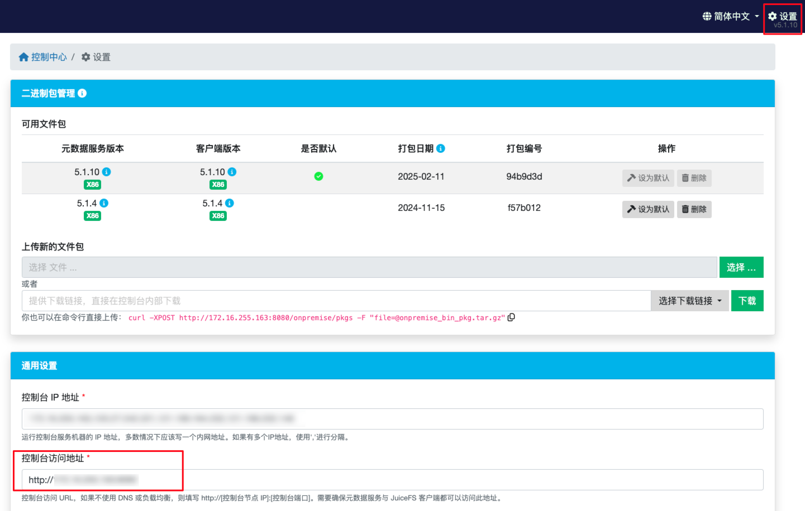

## 文件系统认证信息 {#volume-credentials}

在 JuiceFS CSI 驱动中，挂载文件系统所需的认证信息，均存在 Kubernetes Secret 中。所谓「认证信息」，在 JuiceFS 社区版和云服务有着不同的含义：

* 对于社区版而言，「认证信息」包含元数据引擎 URL、对象存储密钥，以及 [`juicefs format`](https://juicefs.com/docs/zh/community/command_reference#format) 命令所支持的其他参数。
* 对于云服务而言，「认证信息」包含文件系统名称、Token、对象存储密钥，以及 [`juicefs auth`](https://juicefs.com/docs/zh/cloud/reference/commands_reference/#auth) 命令所支持的其他参数。

虽然下方的示范中，Secret 都命名为了 `juicefs-secret`，但事实上命名是自定义的，你可以创建出多个 Secret，存储不同的文件系统认证信息，这样便可以在同一个 Kubernetes 集群中使用多个不同的文件系统。详见[「使用多个文件系统」](#multiple-volumes)。

:::tip

* 如果你已经在[用 Helm 管理 StorageClass](#helm-sc)，那么 Kubernetes Secret 其实已经一并创建，不需要再用 kubectl 单独创建和管理 Secret。
* 修改了文件系统认证信息后，还需要滚动升级或重启应用 Pod，CSI 驱动重新创建 Mount Pod，配置变更方能生效。
* Secret 中只存储文件系统认证信息（也就是社区版 `juicefs format` 和云服务 `juicefs auth` 命令所需的参数），并不支持填写挂载参数，如果你希望修改挂载参数，参考[「挂载参数」](./configurations.md#mount-options)。

:::

### 社区版 {#community-edition}

创建 Kubernetes Secret：

```yaml
apiVersion: v1
kind: Secret
metadata:
  name: juicefs-secret
  namespace: default
  labels:
    # 增加该标签以启用认证信息校验
    juicefs.com/validate-secret: "true"
type: Opaque
stringData:
  name: <JUICEFS_NAME>
  metaurl: <META_URL>
  storage: s3
  bucket: https://<BUCKET>.s3.<REGION>.amazonaws.com
  access-key: <ACCESS_KEY>
  secret-key: <SECRET_KEY>
  # 设置 Mount Pod 时区，默认为 UTC。
  # envs: "{TZ: Asia/Shanghai}"
  # 如需在 Mount Pod 中创建文件系统，也可以将更多 juicefs format 参数填入 format-options。
  # format-options: trash-days=1,block-size=4096
```

字段说明：

- `name`：JuiceFS 文件系统名称
- `metaurl`：元数据服务的访问 URL。更多信息参考[「如何设置元数据引擎」](https://juicefs.com/docs/zh/community/databases_for_metadata) 。
- `storage`：对象存储类型，比如 `s3`，`gs`，`oss`。更多信息参考[「如何设置对象存储」](https://juicefs.com/docs/zh/community/how_to_setup_object_storage) 。
- `bucket`：对象存储 Bucket URL。更多信息参考[「如何设置对象存储」](https://juicefs.com/docs/zh/community/how_to_setup_object_storage) 。
- `access-key`/`secret-key`：对象存储的认证信息
- `envs`：Mount Pod 的环境变量
- `format-options`：创建文件系统的选项，详见 [`juicefs format`](https://juicefs.com/docs/zh/community/command_reference#format)

如遇重复参数，比如 `access-key`，既可以在 `stringData.access-key`中填写，同时也可以在 `format-options` 下填写，此时 `format-options` 的参数优先级最高。

### 云服务 {#cloud-service}

操作之前，请先在 JuiceFS 云服务中[创建文件系统](https://juicefs.com/docs/zh/cloud/getting_started#create-file-system)。

创建 Kubernetes Secret：

```yaml
apiVersion: v1
kind: Secret
metadata:
  name: juicefs-secret
  namespace: default
  labels:
    # 增加该标签以启用认证信息校验
    juicefs.com/validate-secret: "true"
type: Opaque
stringData:
  name: ${JUICEFS_NAME}
  token: ${JUICEFS_TOKEN}
  access-key: ${ACCESS_KEY}
  secret-key: ${SECRET_KEY}
  # 设置 Mount Pod 时区，默认为 UTC。
  # envs: "{TZ: Asia/Shanghai}"
  # 如需指定更多认证参数，可以将 juicefs auth 命令参数填写至 format-options。
  # format-options: bucket2=xxx,access-key2=xxx,secret-key2=xxx
```

字段说明：

- `name`：JuiceFS 文件系统名称
- `token`：访问 JuiceFS 文件系统所需的 token。更多信息参考[访问令牌](https://juicefs.com/docs/zh/cloud/acl#access-token)。
- `access-key`/`secret-key`：对象存储的认证信息
- `envs`：Mount Pod 的环境变量
- `format-options`：云服务 [`juicefs auth`](https://juicefs.com/docs/zh/cloud/commands_reference#auth) 命令所使用的的参数，作用是认证，以及生成挂载的配置文件

如遇重复参数，比如 `access-key`，既可以在 `stringData.access-key`中填写，同时也可以在 `format-options` 下填写，此时 `format-options` 的参数优先级最高。

云服务的 `juicefs auth` 命令作用类似于社区版的 `juicefs format` 命令，因此字段名依然叫做 `format-options`，关于这点请继续阅读[格式化参数/认证参数](./configurations.md#format-options)。

### 企业版（私有部署） {#enterprise-edition}

JuiceFS Web 控制台负责着客户端的挂载认证、配置文件下发等工作。而在私有部署环境中，控制台的地址不再是 [https://juicefs.com/console](https://juicefs.com/console)，因此需要在文件系统认证信息中通过 `envs` 字段额外指定控制台地址。

```yaml {15-16}
apiVersion: v1
metadata:
  name: juicefs-secret
  namespace: default
  labels:
    # 增加该标签以启用认证信息校验
    juicefs.com/validate-secret: "true"
kind: Secret
type: Opaque
stringData:
  name: ${JUICEFS_NAME}
  token: ${JUICEFS_TOKEN}
  access-key: ${ACCESS_KEY}
  secret-key: ${SECRET_KEY}
  # 将下方 URL 替换为实际私有部署控制台访问地址
  envs: '{"BASE_URL": "http://console.example.com/static"}'
  # 如需指定更多认证参数，可以将 juicefs auth 命令参数填写至 format-options
  # format-options: bucket2=xxx,access-key2=xxx,secret-key2=xxx
```

字段说明：

- `name`：JuiceFS 文件系统名称
- `token`：访问 JuiceFS 文件系统所需的 token。更多信息参考[访问令牌](https://juicefs.com/docs/zh/cloud/acl#access-token)。
- `access-key`/`secret-key`：对象存储的认证信息
- `envs`：Mount Pod 的环境变量，在私有部署中需要额外填写 `BASE_URL` 指向实际控制台地址，如果你不清楚如何填写，可以打开 JuiceFS 私有控制台，点击右上角「设置」按钮，然后直接使用页面中展示的「控制台访问地址」：

  

- `format-options`：云服务 [`juicefs auth`](https://juicefs.com/docs/zh/cloud/commands_reference#auth) 命令所使用的的参数，作用是认证，以及生成挂载的配置文件。该选项仅在 v0.13.3 及以上可用

### 使用多个文件系统 {#multiple-volumes}

Secret 是可以自由命名的，你可以自由创建多个 Secret，每一个都采用不同的命名，甚至放在不同的命名空间，来使用多个 JuiceFS 文件系统，或者在不同命名空间下使用同一个文件系统。

```yaml {4-5,11-12}
---
apiVersion: v1
metadata:
  name: vol-secret-1
  namespace: default
kind: Secret
...
---
apiVersion: v1
metadata:
  name: vol-secret-2
  namespace: kube-system
kind: Secret
...
```

创建好这些认证信息以后，取决于你是静态还是动态配置，还需要在 PV 或者 StorageClass 中正确引用这些认证信息，才能正确挂载。以上方创建好的认证信息为例，静态和动态配置示范如下。

静态配置（如果你尚不清楚什么是静态配置，先阅读[「静态配置」](#static-provisioning)）：

:::warning
使用静态配置方式，必须注意让 `volumeHandle` 保持唯一，否则将会出现 `timed out waiting for the condition` 错误，详见 [PVC 异常](https://juicefs.com/docs/zh/csi/troubleshooting-cases/#pvc-error)中的「`volumeHandle` 冲突，导致 PVC 创建失败」一小节。

为了防止此类错误的发生，建议开启 [Validating webhook](./configurations.md#validating-webhook)。
:::

```yaml {10-11,14-15,25,28-29}
---
apiVersion: v1
kind: PersistentVolume
metadata:
  name: vol-1
spec:
  ...
  csi:
    driver: csi.juicefs.com
    # 该字段必须全局唯一，建议直接设置为 PV 名称
    volumeHandle: vol-1
    fsType: juicefs
    nodePublishSecretRef:
      name: vol-secret-1
      namespace: default
---
apiVersion: v1
kind: PersistentVolume
metadata:
  name: vol-2
spec:
  ...
  csi:
    driver: csi.juicefs.com
    volumeHandle: vol-2
    fsType: juicefs
    nodePublishSecretRef:
      name: vol-secret-2
      namespace: kube-system
```

动态配置（如果你尚不清楚什么是动态配置，先阅读[「动态配置」](#dynamic-provisioning)）：

```yaml {8-11,19-22}
---
apiVersion: storage.k8s.io/v1
kind: StorageClass
metadata:
  name: vol-1
provisioner: csi.juicefs.com
parameters:
  csi.storage.k8s.io/provisioner-secret-name: vol-1
  csi.storage.k8s.io/provisioner-secret-namespace: default
  csi.storage.k8s.io/node-publish-secret-name: vol-1
  csi.storage.k8s.io/node-publish-secret-namespace: default
---
apiVersion: storage.k8s.io/v1
kind: StorageClass
metadata:
  name: vol-2
provisioner: csi.juicefs.com
parameters:
  csi.storage.k8s.io/provisioner-secret-name: vol-2
  csi.storage.k8s.io/provisioner-secret-namespace: kube-system
  csi.storage.k8s.io/node-publish-secret-name: vol-2
  csi.storage.k8s.io/node-publish-secret-namespace: kube-system
```

### 为 Mount Pod 额外添加文件、环境变量 {#mount-pod-extra-files}

部分对象存储服务（比如 Google 云存储）在访问时需要提供额外的认证文件，这就需要你用创建单独的 Secret 保存这些文件，然后在认证信息（下方示范中的 `juicefs-secret`）中引用。这样一来，CSI 驱动便会将这些文件挂载进 Mount Pod，然后在 Mount Pod 中添加对应的环境变量，令 JuiceFS 挂载时使用该文件进行对象存储的认证。

除此外，如果希望单独为 Mount Pod 添加环境变量，也可以在认证信息的 `envs` 中声明。比方说使用 MinIO 时，可能需要为客户端设定 `MINIO_REGION` 环境变量。

下方以 Google 云存储为例，演示如何为 Mount Pod 额外添加文件、环境变量。

获取 Google 云存储所需要的[服务帐号密钥文件](https://cloud.google.com/docs/authentication/production#create_service_account)，需要先了解如何进行[身份验证](https://cloud.google.com/docs/authentication)和[授权](https://cloud.google.com/iam/docs/overview)。假设你已经获取到了密钥文件 `application_default_credentials.json`，用下方命令将该配置文件创建成 Kubernetes Secret：

```shell
kubectl create secret generic gc-secret \
  --from-file=application_default_credentials.json=application_default_credentials.json
```

运行上方命令，密钥文件就被保存在 `gc-secret` 中了，接下来需要在 `juicefs-secret` 中加以引用，让 CSI 驱动将该文件挂载到 Mount Pod 中，并添加相应的环境变量：

```yaml {8-11}
apiVersion: v1
kind: Secret
metadata:
  name: juicefs-secret
type: Opaque
stringData:
  ...
  # 在 configs 中填写 Secret 名称和挂载目录，将该 Secret 整体挂载进指定的目录
  configs: "{gc-secret: /root/.config/gcloud}"
  # 定义挂载认证所需的环境变量
  envs: "{GOOGLE_APPLICATION_CREDENTIALS: /root/.config/gcloud/application_default_credentials.json}"
```

添加完毕以后，新创建的 PV 便会使用此配置了，你可以[进入 Mount Pod 里](../administration/troubleshooting.md#check-mount-pod)，确认配置文件挂载正确，然后用 `env` 命令确认环境变量也设置成功。

## 静态配置 {#static-provisioning}

静态配置是最简单直接地在 Kubernetes 中使用 JuiceFS PV 的方式，如果按照下方示范创建，会直接挂载整个文件系统的根目录（如有需要，也可以参考[挂载子目录](./configurations.md#mount-subdirectory)）。阅读[「使用方式」](../introduction.md#usage)以了解「动态配置」与「静态配置」的区别。

创建所需的资源定义示范如下，字段含义请参考注释：

```yaml
apiVersion: v1
kind: PersistentVolume
metadata:
  name: juicefs-pv
  labels:
    juicefs-name: ten-pb-fs
spec:
  # 目前 JuiceFS CSI 驱动不支持给静态 PV 设置存储容量，填写任意有效值即可
  capacity:
    storage: 10Pi
  volumeMode: Filesystem
  accessModes:
    - ReadWriteMany
  persistentVolumeReclaimPolicy: Retain
  csi:
    # 在先前的安装步骤中，已经创建了名为 csi.juicefs.com 的 CSIDriver
    driver: csi.juicefs.com
    # volumeHandle 需要保证集群内唯一，因此一般直接用 PV 名即可
    volumeHandle: juicefs-pv
    fsType: juicefs
    # 在先前的步骤中已经创建好文件系统认证信息（Secret），在这里引用
    # 如果要在静态配置下使用不同的认证信息，甚至使用不同的 JuiceFS 文件系统，则需要创建不同的 Secret
    nodePublishSecretRef:
      name: juicefs-secret
      namespace: default
---
apiVersion: v1
kind: PersistentVolumeClaim
metadata:
  name: juicefs-pvc
  namespace: default
spec:
  accessModes:
    - ReadWriteMany
  volumeMode: Filesystem
  # 静态配置下必须指定 storageClassName 为空字符串
  # 代表该 PV 不采用任何 StorageClass，而是直接使用 selector 所指定的 PV
  storageClassName: ""
  # 由于目前 JuiceFS CSI 驱动不支持给静态 PV 设置存储容量，此处 requests.storage 填写任意小于 PV capacity 的有效值即可
  resources:
    requests:
      storage: 10Pi
  selector:
    matchLabels:
      juicefs-name: ten-pb-fs
```

创建应用 Pod，并在其中引用 PVC，示范：

```yaml
apiVersion: v1
kind: Pod
metadata:
  name: juicefs-app
  namespace: default
spec:
  containers:
  - args:
    - -c
    - while true; do echo $(date -u) >> /data/out.txt; sleep 5; done
    command:
    - /bin/sh
    image: centos
    name: app
    volumeMounts:
    - mountPath: /data
      name: data
      mountPropagation: HostToContainer
    resources:
      requests:
        cpu: 10m
  volumes:
  - name: data
    persistentVolumeClaim:
      claimName: juicefs-pvc
```

Pod 创建完成后，你就能在 JuiceFS 挂载点看到上方容器写入的 `out.txt` 了。在静态配置下，如果没有显式指定[挂载子目录](./configurations.md#mount-subdirectory)，文件系统的根目录将会被挂载进容器，因此如果对应用有数据隔离的要求，请挂载子目录，或者使用[动态配置](#dynamic-provisioning)。

## 创建 StorageClass {#create-storage-class}

[StorageClass](https://kubernetes.io/zh-cn/docs/concepts/storage/storage-classes)（存储类）里指定了创建 PV 所需的各类配置，你可以将其理解为动态配置下的「Profile」：不同的 StorageClass 就是不同的 Profile，可以在其中指定不同的文件系统认证信息、挂载配置，让动态配置下可以同时使用不同的文件系统，或者指定不同的挂载。因此如果你打算以[「动态配置」](#dynamic-provisioning)或[「通用临时卷」](#general-ephemeral-storage)的方式使用 JuiceFS CSI 驱动，那么你需要提前创建 StorageClass。

注意，StorageClass 仅仅是动态配置下用于创建 PV 的「模板」，也正因此，使用的时候必须注意：

* **在 StorageClass 中修改挂载配置，不影响已经创建的 PV。** 对于已有的 PV，需要直接[在 PV 级别调整挂载配置](./configurations.md#static-mount-options)，或者干脆删除 PVC 重建；
* 自 v0.24.3 开始，可以在 [ConfigMap](./configurations.md#configmap) 中使用 `matchStorageClassName` 来方便地选择已有 PVC，更推荐用这种方式来修改 StorageClass 相关配置。

### 通过 kubectl 创建 {#kubectl-sc}

大部分情况下，我们推荐用 Helm 安装和管理 CSI 驱动，但 StorageClass 除外，这是由于他和文件系统认证信息存在引用关系，而 `values.yaml` 往往不便用明文保存认证信息。因此对于 StorageClass 和 Secret，我们优先推荐用 kubectl 手动创建和管理。

在创建 StorageClass 之前，需要提前创建好[「文件系统认证信息」](#volume-credentials)，然后将相关信息按照下方示范填入对应字段。

```yaml
apiVersion: storage.k8s.io/v1
kind: StorageClass
metadata:
  name: juicefs-sc
provisioner: csi.juicefs.com
parameters:
  csi.storage.k8s.io/provisioner-secret-name: juicefs-secret
  csi.storage.k8s.io/provisioner-secret-namespace: default
  csi.storage.k8s.io/node-publish-secret-name: juicefs-secret
  csi.storage.k8s.io/node-publish-secret-namespace: default
reclaimPolicy: Retain
```

### 通过 Helm 创建 {#helm-sc}

:::tip

* 通过 Helm 创建 StorageClass，要求用户将认证信息明文填入 `values.yaml`，考虑到安全性，生产环境一般推荐[用 kubectl 创建](#kubectl-sc)。
* 如下方示范中 `backend` 字段所示，用 Helm 创建 StorageClass 时，文件系统认证信息也会一并创建，请在 Helm 里直接管理，无需再[单独创建文件系统认证信息](#volume-credentials)。

:::

JuiceFS 社区版和云服务的配置项略有不同，下方示范面向社区版，但你可以在 [Helm chart](https://github.com/juicedata/charts/blob/main/charts/juicefs-csi-driver/values.yaml#L122) 中找到全面示范。

```yaml title="values.yaml"
storageClasses:
- name: juicefs-sc
  enabled: true
  reclaimPolicy: Retain
  # JuiceFS 文件系统认证信息
  # 如果已经提前创建好文件系统，则只需填写 `name` 和 `metaurl` 这两项
  backend:
    name: "<name>"                # JuiceFS 文件系统名
    metaurl: "<meta-url>"         # 元数据引擎的 URL
    storage: "<storage-type>"     # 对象存储类型 (例如 s3、gcs、oss、cos)
    accessKey: "<access-key>"     # 对象存储的 Access Key
    secretKey: "<secret-key>"     # 对象存储的 Secret Key
    bucket: "<bucket>"            # 存储数据的桶路径
    # 设置 Mount Pod 时区，默认为 UTC。
    # envs: "{TZ: Asia/Shanghai}"
  mountPod:
    resources:                    # Mount Pod 的资源配置
      requests:
        cpu: "1"
        memory: "1Gi"
      limits:
        cpu: "5"
        memory: "5Gi"
```

## 动态配置 {#dynamic-provisioning}

阅读[「使用方式」](../introduction.md#usage)以了解什么是「动态配置」。动态配置方式会自动为你创建 PV，每一个 PV 会最终对应 JuiceFS 文件系统中的一个子目录，而创建 PV 的基础配置参数在 StorageClass 中定义，因此你需要先行[创建 StorageClass](#create-storage-class)。

创建 PVC 和应用 Pod，示范如下：

```yaml {14}
kubectl apply -f - <<EOF
apiVersion: v1
kind: PersistentVolumeClaim
metadata:
  name: juicefs-pvc
  namespace: default
spec:
  accessModes:
  - ReadWriteMany
  resources:
    requests:
      # 从 StorageClass 中申请 10GiB 存储容量
      storage: 10Gi
  storageClassName: juicefs-sc
---
apiVersion: v1
kind: Pod
metadata:
  name: juicefs-app
  namespace: default
spec:
  containers:
  - args:
    - -c
    - while true; do echo $(date -u) >> /data/out.txt; sleep 5; done
    command:
    - /bin/sh
    image: centos
    name: app
    volumeMounts:
    - mountPath: /data
      name: juicefs-pv
      # 必须配置好传播，以防 Mount Pod 异常以后，挂载点无法自动恢复
      mountPropagation: HostToContainer
  volumes:
  - name: juicefs-pv
    persistentVolumeClaim:
      claimName: juicefs-pvc
EOF
```

确认容器顺利创建运行后，可以钻进容器里确认数据正常写入 JuiceFS：

```shell
kubectl exec -ti juicefs-app -- tail -f /data/out.txt
```

挂载成功后，动态 PV 会在 JuiceFS 文件系统创建形如 `pvc-4f2e2384-61f2-4045-b4df-fbdabe496c1b` 的随机命名子目录，随机命名不方便人类辨认，因此推荐用高级初始化方式，来[配置更易读的 PV 目录名称](./configurations.md#using-path-pattern)。

## 使用通用临时卷 {#general-ephemeral-storage}

[通用临时卷](https://kubernetes.io/zh-cn/docs/concepts/storage/ephemeral-volumes/#generic-ephemeral-volumes)类似于 `emptyDir`，为每个 Pod 单独提供临时数据存放目录。当应用容器需要大容量，并且是每个 Pod 单独的临时存储时，可以考虑这样使用 JuiceFS CSI 驱动。

JuiceFS CSI 驱动的通用临时卷用法与「动态配置」类似，因此也需要先行[创建 StorageClass](#create-storage-class)。不过与「动态配置」不同，临时卷使用 `volumeClaimTemplate`，为每个 Pod 自动创建 PVC。

在 Pod 定义中声明使用通用临时卷：

```yaml {20-31}
apiVersion: v1
kind: Pod
metadata:
  name: juicefs-app
  namespace: default
spec:
  containers:
  - args:
    - -c
    - while true; do echo $(date -u) >> /data/out.txt; sleep 5; done
    command:
    - /bin/sh
    image: centos
    name: app
    volumeMounts:
    - mountPath: /data
      name: juicefs-pv
      mountPropagation: HostToContainer
  volumes:
  - name: juicefs-pv
    ephemeral:
      volumeClaimTemplate:
        metadata:
          labels:
            type: juicefs-ephemeral-volume
        spec:
          accessModes: [ "ReadWriteMany" ]
          storageClassName: "juicefs-sc"
          resources:
            requests:
              storage: 1Gi
```

:::note 注意
在回收策略方面，临时卷与动态配置一致，因此如果将[默认 PV 回收策略](./resource-optimization.md#reclaim-policy)设置为 `Retain`，那么临时存储将不再是临时存储，PV 需要手动释放。
:::
