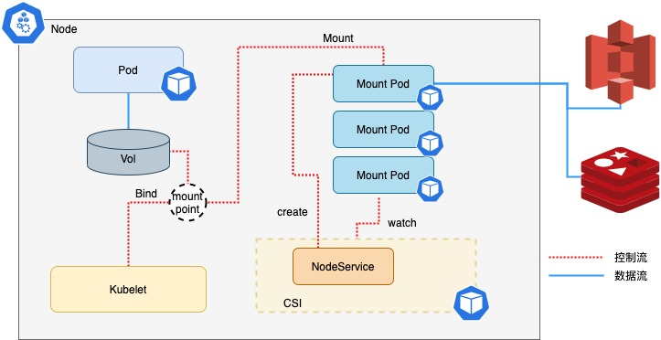

# JuiceFS CSI 驱动

[JuiceFS CSI 驱动](https://github.com/juicedata/juicefs-csi-driver)遵循 [CSI](https://github.com/container-storage-interface/spec/blob/master/spec.md) 规范，实现了容器编排系统与 JuiceFS 文件系统之间的接口，让 JuiceFS 文件系统以卷（Volume）的形式提供给 Pod 使用。

JuiceFS CSI 驱动会在你的集群中部署以下组件：JuiceFS CSI Controller（StatefulSet）以及 JuiceFS CSI Node Service（DaemonSet），你可以方便地用 `kubectl` 查看：

```shell
$ kubectl -n kube-system get pod -l app.kubernetes.io/name=juicefs-csi-driver
NAME                       READY   STATUS        RESTARTS   AGE
juicefs-csi-controller-0   2/2     Running       0          141d
juicefs-csi-node-8rd96     3/3     Running       0          141d
```

JuiceFS CSI 驱动的架构如图所示：



顺着架构图简单介绍一番 CSI 驱动的工作原理：JuiceFS CSI 驱动采用单独的 Mount Pod 来运行 JuiceFS 客户端，并由 Node Service 来管理 Mount Pod 的生命周期。这样的架构提供如下好处：

* 允许多个应用 Pod 共用 PV，当多个 Pod 共用 PV 时，不会新建 Mount Pod，而是对已有的 Mount Pod 做引用计数，计数归零时删除 Mount Pod。
* CSI 驱动组件与客户端解耦，方便 CSI 驱动自身的升级。详见[「升级」](./upgrade-csi-driver.md)。

以[「动态配置」](./examples/dynamic-provisioning.md)为例，创建 PV 和使用的流程大致如下：

* 用户创建 PVC（PersistentVolumeClaim）和使用其作为 Volume 的应用 Pod。
* CSI Node Service，也就是 JuiceFS CSI Driver 的 DaemonSet 组件，会负责创建 Mount Pod。
* CSI Controller，也就是 JuiceFS CSI Driver 的 StatefulSet 组件，会负责将 PVC 目录在 JuiceFS 文件系统中初始化。
* Mount Pod 启动，执行 JuiceFS 客户端挂载，将 PV 对应的 JuiceFS 子目录挂载到容器内的 `/jfs/[pv-name]`，这个目录往往对应着宿主机的 `/var/lib/juicefs/volume/[pv-name]`。
* 应用 Pod 创建，与 PV 进行绑定，按照声明的路径挂载进容器。

因此在使用 JuiceFS CSI 驱动时，应用 Pod 总是与 Mount Pod 一起存在：

```
default       app-web-xxx            1/1     Running        0            1d
kube-system   juicefs-host-pvc-xxx   1/1     Running        0            1d
```

阅读以下文章深入了解 CSI 驱动的架构设计：

* [JuiceFS CSI Driver v0.10 全新架构解读](https://juicefs.com/zh-cn/blog/engineering/juicefs-csi-driver-v010)
* [JuiceFS CSI Driver 架构设计详解](https://juicefs.com/zh-cn/blog/engineering/juicefs-csi-driver-arch-design)
